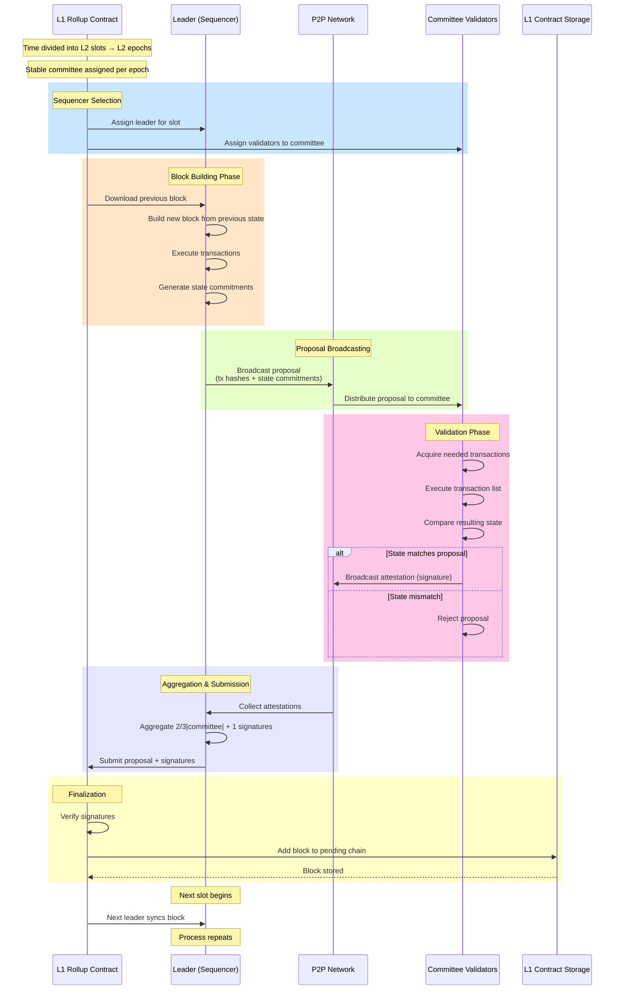
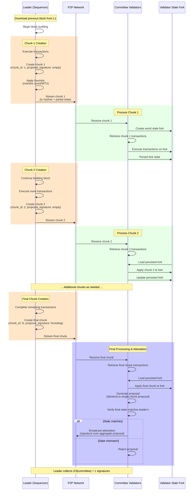

# Intro

This document captures the design of what is meant by "miniblocks", and the implications. I would prefer the term "building in chunks", for reasons that will be made clear.

At its core, miniblocks affords the user a better UX by offering earlier guarantees that a transaction will be finalized. This benefit can be traded off against other costs, such as frequency of posting to L1.

This gives us a new tool to manage the requirements that:

- When running at 10 TPS, the L1 gas to propose an L2 block divided by the number of transactions in the L2 block SHOULD be less than 500 gas
- The P50 delay experienced by a user between submitting a valid transaction to the aztec network and receiving any "meaningful guarantee" that the transaction will be finalized SHOULD be less than X seconds

**NOTE** what constitutes a "meaningful guarantee", and what the value is MUST be defined. As will be seen, several options exist for the guarantee, none of which have explicit latency requirements.

This document presents several designs which build on each other, each with a summary of required changes, dependencies, and timeline estimations:

- step 1: building in chunks
- step 2: checkpointed chunks
- step 3: improving "app latency"
- step 4: better economic guarantees

# The current system

Time is chunked into discrete periods, known as L2 slots, which are grouped into L2 epochs, during which time the rollup contract has prescribed a stable committee of attesters which are sampled from all active validators. The rollup contract also assigns a "leader" from the committee to each slot. This process is known as "sequencer selection".

Presently, the leader downloads the previous block from L1, builds their block from it, and broadcasts a "proposal" on the p2p network to the other validators on the committee (also known as "replicas"). The proposal includes a list of the transaction hashes which were executed against the previous state, and commitments to the resulting state. The validators acquire the transactions as needed, then execute the list of transactions, then compare the resulting state; if it matches that sent by the leader, they broadcast a signature over the proposal, also known as an "attestation".

The leader submits the proposal and $\dfrac{2}{3}|committee| + 1$ signatures to the L1 rollup contract. The signatures are verified by the rollup contract, and the block (derived from the proposal) is added to the "pending chain" on the rollup contract's storage. The next leader syncs the block, and repeats the process.

## Some known issues

It is currently unknown how long it will actually take to get blob transactions included in L1. Furthermore, there's a tension between waiting until the last viable moment for sending the L1 tx, so the proposer has more time to include more L2 txs in the block, and sending the L1 tx as early as possible in the L2 slot, to maximize chances for inclusion.

The load places on the p2p system is also quite bursty: it is not until the leader has fully executed their block and sent around their proposal that replicas have any idea what transactions need including, and it is not guaranteed that they have those transactions ahead of time, so they must aggressively request the transactions from their peers.

The first guarantee exposed to the user is the block proposal on L1, which is roughly the duration of a slot (presently 36 seconds). This means that on average, a user must wait around 36 + 18 = 54 seconds, since they will have likely submitted in the middle of slot `n`, for inclusion in slot `n+1`. This guarantee is quite strong- if the block is not finalized, then the currently suggested slashing parameters would slash the entire committee for 17% of their deposit. If it costs $10K to be a validator, and there are 48 validators in the committee, that is an ~$80K guarantee.

It is also the case that if a leader builds their block and doesn't submit it to L1 for any reason, that work was wasted as the proposer does not accrue any fees. This means we could provide a user with a slightly earlier softer confirmation of inclusion for their tx, when all attestations are collected but before the block lands in L1, since the proposer is incentivized that the block makes it to L1.

# Building in Chunks

Instead of the leader waiting until they have completed their block, they could stream "chunks" of a block as it is created. This is somewhat similar to the slices described in the "rotor" of [solana's alpenglow](https://drive.google.com/file/d/1y_7ddr8oNOknTQYHzXeeMD2ProQ0WjMs/view).

In effect, instead of gossiping full "proposals" we gossip "chunks". Chunks are identical to the current proposal, except they have two additional fields.

- chunk sequence number
- proposal signature

The "proposal signature" would only be included in the final chunk, and is simply the a signature over the proposal produced from aggregating all the chunks. So "proposals" are never gossiped, but they are recreated by leaders/replicas, and signed over.

The chunks are still signed by the leader so that replicas may be sure they are indeed from the leader.

The leader may choose how to break up their proposal into chunks- it may be based on mana consumed, or number of transactions, or some other heuristic; in the alpenglow paper, a shred is capped at the MTU of 1500 bytes.

When replicas receive the first chunk, they create a fork of world state, retrieve the associated transactions, and execute them, then _persist this fork_; they apply subsequent chunks against it. When a chunk marked as "final" is received, they produce an aggregate proposal, which is _identical_ to what would be produced if the leader had sent everything in one large chunk (i.e. the status quo), and broadcast their signature over this aggregated proposal.

This is good as it stands because it would reduce how bursty the demands on p2p are, as CPU and network load is spread more evenly over the slot, which is **expected to have knock-on benefits for system throughput**. In particular, if chunks are propagated frequently enough, validators could be executing chunk N as the proposer is simultaneously preparing and executing chunk N+1, leading to more effective compute time available in the slot. In an extreme, we could see this as the proposer "streaming" the tx hashes to be included in the block to the validators.

In addition, since the final signatures are the same, **it requires no changes to L1**.

## The guarantee

We can define a new point on the gradient of finality, which is when a transaction appears in a _chunk_. **NOTE**, we can do this today, just on the final/only chunk. There is also _no monetary guarantee_ (i.e. implemented slashing rule) that seeing a transaction in a chunk means it will actually be posted to L1, and subsequently finalized, **apart from the loss of fees/rewards**.

We **could** choose then to slash a leader who disseminates a chunk, but doesn't propose the final block to L1; the guarantee here would be much lower, since only the leader could be slashed: assuming 17%, that is $1,700; this, however, is perceived as too risky, as an honest proposer could make a best effort to publish the block, but have it fail to be included on L1 in time.

Instead, we will only slash for equivocation on the chunks themselves, for example, if a leader attempts to distribute two distinct chunks with the same sequence number.

Thus, the guarantee here is "if a transaction appears in a chunk for a slot, then if a block is added to L1 for that slot, the transaction will appear in the block, or else a correct proposer forgoes the fees/rewards for that block, and a malicious proposer may additionally be slashed".

## Overview

## Edge cases

Replicas will still need to collect transactions that they are missing as soon as they receive the chunk.

Further, if they receive a chunk out of order, they need to request/response it. This is likely mitigated by the super-node work on p2p, where we will effectively have a fast and nearly direct link between all committee members.

Also, validators will need to ensure that:

- they receive exactly one chunk distinct for each chunk sequence number
- the sequence numbers have no gaps
- one the final sequence number has an proposal signature

## Rough design

The block builder class would need to be extended to emit chunks as it builds the block. Over in the sequencer, we would need to listen to chunks getting emitted, and broadcast them.

In a sense, the sequencer doesn't really need to know/care very much about the fact that it is distributing chunks. It will be broadcasting chunks "in the background" as it is building the block, and when the block is complete, it broadcasts a slightly different chunk. So the general flow will be largely unchanged, just with an additional hook to react to `onChunkEmitted`.

On the validator side, it needs to maintain a fork for each slot, which gets opened when the first chunk is received, and closed when the last chunk is received or the slot passes. Interestingly, they should be able to `buildBlock` using the transactions specified in the chunk, supplying the fork they have stored; the ability to supply a "self-managed" fork to the block builder already exists. There are some optimizations that could be made to avoid wasted work here.

On the p2p side, we need to be able to request/response for specific proposals/chunks, so that the validator can recover from out-of-order transmissions or restarts, etc.

Last, we need to update the node and client interface to be aware of this new "chunked"/"pre-confirmed"/"pre-pending" state of a transaction.

## Timelines

- update block builder to emit chunks: 1-2 days
- update sequencer to emit the proper "final chunk": 1-2 days
- update p2p to transmit chunks and allow req/resp: 1-2 days
- update validator client to hold forks/chunks per slot and recreate proposals out of chunks: 2-3 days
- update slashing conditions: 1-2 days
- add new tx state: 2-4 days

Total: 8-15 days times 1.5 for distractions/hangups = 12-21 days so ~4 weeks to production

# Signed/Checkpointed Chunks

We could strengthen the guarantee by having the committee produce attestations for each chunk.

This creates two new properties:

- a new point of guarantee about the transaction availability from the viewpoint of the committee
- any individual chunk may be submitted by the proposer, which reduces the operational risk on the part of the proposer associated with "trying to get one last chunk"

The tradeoff here is more noise on the p2p layer, as we are gossiping attestations for each chunk, instead of only for the last one.

In this case, the guarantee is slightly stronger:

"If a transaction appears in a chunk for a slot, and `2f+1` attestations for that chunk have been observed, then the committee has the transaction data and the transaction is valid from the perspective of the committee within the context of the block being built, and the leader _could_ submit the block to L1. If a block is added to L1 for that slot, the transaction will appear in the block, or else a correct proposer forgoes the fees/rewards for that block, and a malicious proposer may additionally be slashed".

Building on above, this requires changes to the chunk that is gossiped. A special "final" chunk is no longer needed, and each validator would produce a proposal attestation aggregated from each chunk it receives. P2P needs to track attestations per chunk now (rather than per slot), and the sequencer needs to hang on to each aggregate block, such that when it hits its deadline for submission, it can select the biggest block for which it has sufficient attestations.

The node also would need to be aggregating on its P2P layer for chunks, such that the status can be properly served.

## Timeline

This likely adds 2 days of work to the above estimate, pretty evenly distributed across the stack.

So final estimate comes to 10-17 days x 1.5 = 15-25 days so ~5 weeks to production

# Improving "app latency"

A KPI which is distinct from "user perceived latency", is the delay between when Transaction B can build on the state root resulting from Transaction A.

Presently, this delay is exactly the time between blocks; even with chunks described above, this is not improved, since although a user might receive a certificate that a transaction is in a chunk, the archiver will not serve that resulting state until it lands on L1 as a block.

It is be possible to update the archiver to store an "intra-slot chain", which only includes L2 guarantees, and allow users to submit transactions against this.

This could also improve system throughput, as committee members have effectively "built ahead" of L1: their archive is already up-to-date when the block lands on L1, so they do not need to spend time at the beginning of their slot downloading and applying state diffs.

Expanding on the above, the archiver needs to be integrated into the block builder, and subscribe to `onChunkEmitted` events.

Further, the archiver needs to be notified when a particular chunk has sufficient attestations to be submitted to L1.

Thus we refactor the archiver to store multiple tips:

- chunk emitted
- chunk may be submitted
- chunk submitted (i.e. pending chain)
- chunk proven (i.e. proven chain)

Users may direct transaction submissions against a particular tip by specifying a state root correspondent to **a chunk**.

In effect then, chunks would supersede L2 blocks, and one `propose` to the rollup contract would accept a range of chunks. Similarly, nodes would need to be able to extract all of the chunks from a `propose`.

This could likely be done without _major_ changes to circuits/blobs.

As the blobs just contain a list of transaction effects, if the CALLDATA contained a list of chunks with state roots, then in the naive case, a node could:

- see the expected state root of chunk 1
- apply effects until the resulting state root matches
- then it knows that was chunk 1, move on to reconstructing chunk 2

Changes _would_ arise in circuits due to us no longer being able to assume that an epoch has 32 blocks. To that end, we would likely need to place a cap on both the rollup instance and in the circuits on the number of chunks per block. This would drive up the cost to prove an epoch, as we have multiplied the max number of "block" root rollups that need to be proven.

## Timeline

Assuming the circuit/blob changes are minor, and the L1 changes are not larger than expected

- 1-2 weeks confirm scope of L1/circuit changes and properly design.
- 2-3 weeks for refactoring and expanding the archiver
- 1-2 weeks for L1 changes

Total: 4-7 weeks x 1.5 = 6-10 weeks to production.

So conservative estimate to get all of the above to production is ~3 person-months.

# Better economic guarantees

To bring the economic guarantee of the committee to the chunk, we would need to be able to slash the committee if a chunk receives attestations but does not land on L1.

To do this, we would need to relax the requirement a block/chunk built by the leader in slot 1, must land on L1 in slot 1, and may be submitted by someone other than the proposer.

As it stands, this would require that the leader broadcasts their signature over each aggrated proposal with each chunk, to allow _anyone_ who gathers signatures to submit the chunk in some slot.

However, this requires that multiple blocks may be submitted to the rollup in a slot, as a malicious replica may attempt to submit a block early to avoid the inclusion of a transaction. So the rollup would need to become aware of chunk numbers, and allow a proposal of a chunk as long as it was larger than the largest observed for this slot.

On the other hand, there is no incentive for any "honest but rational" replica to submit the proposal: they get none of the rewards. This would need to be changed to something like "the people who submitted the largest chunk for a slot share the rewards, unless one of those people was the leader, in which case they get all the rewards"

This is not a good candidate to inject a slashing rule over, since it will result in massively wasted work as multiple validators all try to propose the same/different chunks.

We arrive then at granting the ability for leaders to submit chunks from prior slots, as long as there was consensus on L2 that the chunk was valid. We would likely use an implementation of tendermint or hotstuff-2 to accomplish this.

In this way, we can slash all the _proposers_ in a committee (i.e. 32) if a checkpoint is locked, but not published, bringing the guarantee of the chunks to ~$54K, and their latency arbitrarily low (as low as the time to (re)execute a _single_ transaction, and collect signatures).

The guarantee then is something like:

"If a transaction appears in a chunk for a slot, and an honest committee member locks on it, that transaction _will_ be included on L1 be otherwise the committee (or just proposers) will be slashed".

## Timeline

Probably 3-6 person-months in addition to the above

## Disclaimer

The information set out herein is for discussion purposes only and does not represent any binding indication or commitment by Aztec Labs and its employees to take any action whatsoever, including relating to the structure and/or any potential operation of the Aztec protocol or the protocol roadmap. In particular: (i) nothing in these projects, requests, or comments is intended to create any contractual or other form of legal relationship with Aztec Labs or third parties who engage with this AztecProtocol GitHub account (including, without limitation, by responding to a conversation or submitting comments) (ii) by engaging with any conversation or request, the relevant persons are consenting to Aztec Labs’ use and publication of such engagement and related information on an open-source basis (and agree that Aztec Labs will not treat such engagement and related information as confidential), and (iii) Aztec Labs is not under any duty to consider any or all engagements, and that consideration of such engagements and any decision to award grants or other rewards for any such engagement is entirely at Aztec Labs’ sole discretion. Please do not rely on any information on this account for any purpose - the development, release, and timing of any products, features, or functionality remains subject to change and is currently entirely hypothetical. Nothing on this account should be treated as an offer to sell any security or any other asset by Aztec Labs or its affiliates, and you should not rely on any content or comments for advice of any kind, including legal, investment, financial, tax, or other professional advice.
