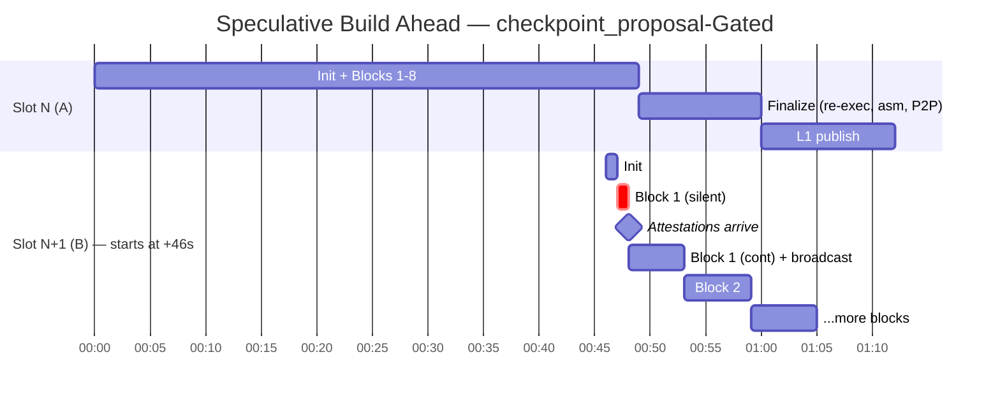
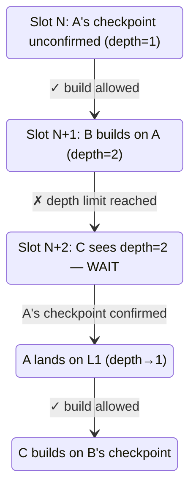
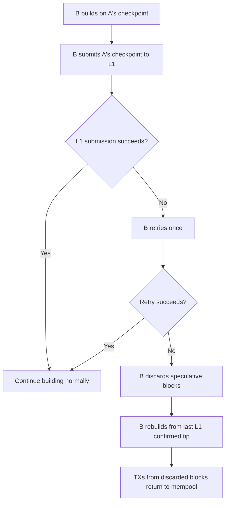

# Build Ahead - Proposer Pipelining

Last edited time: February 23, 2026
Tech Lead: Maddiaa0
Contributors: TBD

# Problem Statement & Executive Summary

Today, each 72s slot has a large **dead zone** where no blocks are built. After the proposer finishes building, the slot is consumed by checkpoint finalization (validator re-execution, attestation collection, assembly) and predominantly L1 publishing. The next proposer doesn't start building until the current slot is nearly over.

With 6s blocks, the dead zone is at least **24 seconds out of every 72** — that's 33% of the slot with no block production. 8 blocks are produced per slot despite 72s of wall-clock time. The following analysis is based on 6s block durations.

KPIs: we are trying to reduce **user-perceived latency** (time from TX submission to "proposed chain" visibility) by up to 12s and increase **effective chain throughput** from 8 blocks per slot to 10 blocks per slot (+25% improvement).

The solution: allow the next slot's proposer to begin building blocks as soon as the predecessor's checkpoint data appears on P2P — before it lands on L1. The next proposer builds and broadcasts blocks during what is currently dead time, and anyone can submit the predecessor's checkpoint to L1 (the next proposer is incentivized to do so because their own blocks depend on it). All blocks B builds during the overlap go into B's checkpoint for B's slot.

# Functional Interface

From a user's perspective, nothing changes — transactions are submitted the same way, and the "proposed chain" tip is still the authoritative view of pending state. The improvement is that the gap between consecutive block building windows shrinks, so transactions are picked up sooner.

From a validator's perspective, the sequencer state machine gains a new trigger: upon observing the predecessor's checkpoint data on P2P, it can begin block building even if the predecessor's slot hasn't formally ended. The existing 12s early build start (slot - 12s) is kept as a **fallback** if the checkpoint trigger doesn't fire.

At the moment validator's have a single view of L1, the crux of this propsal creates a second view. Validators should accept proposals / blocks on a proposer schedule that is slightly ahead of l1's proposer schedule. This allows the next proposer to begin producing blocks while the previous proposer attempts to land their checkpoint on l1.

The new views are:
- proposer view
- checkpoint submission view

Proposer view is T seconds ahead of the checkpoint submission view. A key decision to be made during this proposal is how extreme is T. Where T should be chosen to maximize the amount of time checkpoint submission has on L1, but minimize the roll back distance in result of checkpoint submission being missed.

From the L1 contract's perspective, this can be implemented without any changes. However at the end; I would like to propose a small modification that would give proposer's greater assurances that they will be able to build ontop of the previous checkpoint -- by increasing the duration of checkpoint submission.

With an extreme T, the slots could overlap as so, whilst proposer A is in its checkpoint submission phase, proposer B is broadcasting blocks across the p2p network.

```mermaid
gantt
    title Pipeline
    dateFormat X
    axisFormat %s

    section Block Building
    Proposer A :pA, 0, 1
    Proposer B :pB, after pA 1, 2
    Proposer C :pC, after pB 2, 3
    Proposer D :pD, after pC 3,4

    section Checkpoint Submission
    Proposer A :pCA, after pA, 2
    Proposer B :pCB, after pCA 2, 3
    Proposer C :pCC, after pCB 3, 4
```


# Technical Design

## Current Slot Timing (the problem)

Using the timetable formula with 6s block duration:

```
timeReservedAtEnd = blockDuration(6) + assembleTime(1) + 2×p2pTime(2) + l1PublishingTime(12) = 23s
timeAvailableForBlocks = slotDuration(72) - initOffset(1) - timeReservedAtEnd(23) = 48s
numberOfBlocks = floor(48/6) = 8 blocks per slot
```

**Slot N timeline** (buildStart = slotStart - 12):

```mermaid
gantt
    title Slot N Timeline (72s slot, 6s blocks)
    dateFormat s
    axisFormat %S

    section Building
    Init           :init, 0, 1s
    Block 1        :blk1, 1, 6s
    Block 2        :blk2, after blk1, 6s
    Block 3        :blk3, after blk2, 6s
    Block 4        :blk4, after blk3, 6s
    Block 5        :blk5, after blk4, 6s
    Block 6        :blk6, after blk5, 6s
    Block 7        :blk7, after blk6, 6s
    Block 8        :blk8, after blk7, 6s

    section Finalization
    Re-execution   :reexec, after blk8, 6s
    Assembly       :asm, after reexec, 1s
    P2P broadcast  :bcast, after asm, 2s
    Attestations   :att, after bcast, 2s

    section Publishing
    L1 publish     :l1, after att, 12s

    section Dead Zone
    Idle           :crit, after l1, 12s
```



Converting to slot-relative timestamps:

| Event | Time (relative to slotStart) |
|---|---|
| Build start (early build) | -12s |
| Init done | -11s |
| Block 1: building | -11s to -5s |
| Block 2: building | -5s to +1s |
| ... | ... |
| Block 8: building | +31s to +37s |
| **Last block built** | **+37s** |
| Validator re-execution | +37s to +43s |
| Checkpoint assembly | +43s to +44s |
| P2P broadcast (checkpoint_proposal) | +44s to +46s |
| P2P attestation return | +46s to +48s |
| **checkpoint_proposal on P2P** | **+46s** |
| **Attestations collected** | **+48s** |
| L1 publishing | +48s to +60s |
| Idle (nothing happening) | +60s to +72s |

**Dead zone (no blocks being built):**
- Last block built at slotStart + 37
- Next proposer starts building (current) at slotStart + 61 (= next buildStart + 1)
- **Dead zone: 24 seconds (33% of slot)**

This is the core problem. A third of every slot is overhead, with 24 seconds where no blocks are being produced. This is visualised well in https://aztecprotocol.github.io/benchmark-page-data/misc/tx-latency-explorer/.

## High Level Protocol

We modify the sequencer state machine and the L1 rollup contract to enable **cross-slot pipelining**: the next proposer begins building blocks as soon as the predecessor's checkpoint data appears on P2P — before it lands on L1. Anyone can submit the predecessor's checkpoint to L1 (already supported by `ProposeLib.sol`); the L1 contract change is only about **slot validation** to accept submissions after the slot boundary.

If the predecessor's checkpoint doesn't appear on P2P, a **mid-slot liveness timeout** fires: a globally agreed, configurable timeout after which honest nodes start accepting proposals from the next proposer. See [Mid-Slot Liveness Timeout](#mid-slot-liveness-timeout).

All blocks that B builds during the overlap period go into **B's checkpoint** for slot N+1.

### Build Trigger: Checkpoint_proposal-Gated

The next proposer starts building (locally, **not broadcasting**) as soon as the `checkpoint_proposal` is received. Blocks are only **broadcast after attestations arrive**.

**B starts building at: slotStart + 47** (checkpoint_proposal at +46, plus 1s init)
**B starts broadcasting at: slotStart + 48** (when attestations collected)

Below demonstrates what happens when build ahead time is 24 seconds, and not the entire slot duration.



B builds silently for ~2s before attestations arrive. Once confirmed, B broadcasts everything it's built. If attestations never arrive (invalid checkpoint), B discards silently — nothing was broadcast.

| Metric | Current | Speculative Build Ahead |
|---|---|---|
| Dead zone | 24s (33%) | 10s (14%) |
| Blocks per slot | 8 | 10 |
| Latency improvement | — | ~14s |
| Throughput improvement | — | +25% |


## Speculative Depth Limit

To bound reorg risk during sustained L1 congestion, we limit the speculative chain to **max 2 unconfirmed checkpoints**. The depth is tracked by the gap between the `proposed` and `checkpointed` **checkpoint numbers** (not block numbers). With 8+ blocks per checkpoint, a block-number-based gap would be misleading — the meaningful unit of speculative state is the checkpoint.



When depth = 2, the next proposer waits for at least one checkpoint to land on L1 before building. This reintroduces some dead time, but only when proposer's cannot land blocks for 1m+.

## TX Deduplication

Before snapshotting the TX pool, the next proposer filters out any transactions already included in the predecessor's checkpoint. The checkpoint data is available locally since the next proposer has already re-executed it to build on top of it.

## Inbox Lag

The existing inbox lag configuration value (which allows the inbox to be 1-2 checkpoints behind) already accommodates speculative building. When B builds on A's unconfirmed checkpoint, B's view of the L1 inbox may be behind the actual L1 state — but this is within the tolerance already configured. No new design is needed for inbox synchronization.

## Same-Proposer Optimization

When the same validator is proposer for consecutive slots (which the current selection algorithm allows), we skip the overlap ceremony entirely. The proposer already has the state and can continue building continuously across the slot boundary. No checkpoint trigger, no re-sync, no P2P round-trip.

## Epoch Boundary Behavior

When the overlap spans an epoch boundary (last slot of epoch N → first slot of epoch N+1), the committee rotates. The old committee's attestations **remain valid** — the L1 contract can verify signatures from the old committee regardless of rotation. No re-validation by the new committee is required.

This means the overlap across epoch boundaries works identically to mid-epoch overlaps. The next proposer builds on the predecessor's attested checkpoint exactly as they would in any other slot transition.

## Mid-Slot Liveness Timeout

If the current proposer is unresponsive — no block proposals or checkpoint data appear on P2P — the network should not wait for the full slot to elapse. A **globally agreed, configurable timeout** fires mid-slot: if no proposals from the current proposer are observed by this deadline, honest nodes start accepting proposals from the next proposer.

The next proposer builds from the **last confirmed state** (the most recent L1-confirmed tip). This is equivalent to the current system's behavior when a proposer is offline, but triggered earlier within the slot rather than waiting for the slot boundary.

The exact timeout value is TBD and will be tuned via testing. It should be long enough to avoid false positives (slow proposers) but short enough to recover meaningful build time.

## Empty Slot / Offline Proposer

If the predecessor produces no checkpoint and the mid-slot liveness timeout fires, the next proposer builds from the last confirmed state. If neither mechanism triggers (no checkpoint, no timeout — e.g., the proposer produced blocks but failed during attestation), the next proposer falls back to current behavior: wait for the slot to end, then build from the last confirmed state.

## Drawbacks

1. **Soft reorgs at the speculative boundary.** When speculative blocks are discarded (L1 submission failure), users who saw TX effects on the proposed chain experience a reorg. However, this risk is equivalent to the existing system's reorg behavior at the proposed→checkpointed boundary — it just manifests at a different point (across slots rather than within a slot). This is not a new class of risk, though the window is slightly wider.

2. **Coordinated upgrade required.** The L1 contract changes are a hard fork.

## Latency Analysis

**Current system** (6s blocks, 72s slots, no Build Ahead):

| Stage | Duration |
|-------|----------|
| TX submission → P2P to proposer | ~2s |
| Wait for block window | 0–24s dead zone (avg ~12s) |
| Block execution | ~2–6s |
| Block visible on proposed chain (P2P propagation + validator re-execution) | ~4–8s |
| **Total** | **~8–40s, avg ~24s** |

**With Build Ahead** (speculative trigger):

| Stage | Duration |
|-------|----------|
| TX submission → P2P to proposer | ~2s |
| Wait for block window | 0–10s dead zone (avg ~5s) |
| Block execution | ~2–6s |
| Block visible on proposed chain (P2P propagation + validator re-execution) | ~4–8s |
| **Total** | **~8–26s, avg ~17s** |

The worst-case latency drops from ~40s to ~26-28s. Average latency drops from ~24s to ~17-18s.

// TODO: check the above

## Observability Needs

We need monitoring for:

- **Speculative depth**: how often does depth reach 2? This indicates L1 congestion or faulty proposers ahead.
- **Speculative block discards**: how often does the retry-then-discard path fire? This directly impacts user experience (soft reorgs).
- **Overlap utilization**: how much of the dead zone is actually recovered? Measures the real-world latency gain.
- **Build Ahead trigger**: how often does B trigger on checkpoint_proposal vs fallback (early build)?
- **Next-proposer L1 submissions**: how often does the next proposer land the predecessor's checkpoint vs the predecessor landing it themselves?
- **Silent discard rate** (speculative mode only): how often does B build speculatively then discard because attestations didn't arrive?

# Open Questions

- **Reorg UX:** When speculative blocks are discarded, users experience a soft reorg (equivalent to the existing proposed→checkpointed boundary reorg). How should this be surfaced? Options range from explicit reorg events to silent rebuild. Needs further thought.

- **Mid-slot liveness timeout value:** The exact timeout value needs to be determined through testing. Too short risks false positives (penalizing slow-but-honest proposers); too long wastes build time.

# Implementation Notes

- **Timetable adjustment is a sliding window:** The extended build window from Build Ahead is not a change to the timetable formula itself. B dynamically computes its block count based on when the checkpoint trigger fires. The formula `timeAvailableForBlocks = slotDuration - initOffset - timeReservedAtEnd` remains correct for each proposer's own slot; the overlap simply means B starts populating its window earlier.

# Test Plan

The mechanism should be testable via the existing multi-validator test infrastructure. Key scenarios:

- **Happy path**: Proposer A broadcasts checkpoint_proposal, B starts building silently, attestations arrive, B broadcasts blocks, B submits A's checkpoint.
- **Speculative discard**: A's checkpoint_proposal arrives but attestations never reach quorum. B discards silently, no P2P broadcast.
- **Failure path**: A's checkpoint fails L1 submission, B retries, retry fails, B discards and rebuilds.
- **Depth limit**: Three consecutive proposers where the first two checkpoints don't land on L1 — third proposer should wait.
- **Epoch boundary**: Overlap spanning committee rotation — old committee attestations accepted without re-validation.
- **Same proposer**: Consecutive slots with the same proposer — overlap is skipped.
- **Mid-slot liveness timeout**: Predecessor produces no proposals — liveness timeout fires, next proposer builds from confirmed state.
- **Empty slot**: Predecessor offline — next proposer falls back to current behavior.
- **Throughput**: Measure actual block count per slot with Build Ahead enabled vs disabled.

# Rollout Plan

This **requires** a coordinated rollout - creating a second proposer view will require all nodes to run compatible versions such that they are building along the correct tip.

# Future Work (Out of Scope)

- **Relay Handoff evolution:** Fully decouple building from L1 submission. The predecessor never submits to L1, gaining the full publishing window for additional block building. Natural evolution if this design proves effective. (L2 Consensus / distinct batching roles c-train has discussed)

- **Speculative proving:** How will the proving client take advantage of this pipelining?

# Potential Improvement: L1 contract changes

If proposer A misses their checkpoint submission slot (on purpose / being out priced), proposer B will have spent some time building on a chain that will be pruned, even though the attestation's gathered have given them a high confidence in their validity.

If a proposer A misses their slot, I propose allowing it's submission for longer than the current deadline. Giving up to two l1 submission slots for each proposer. In this proposal, the proposerA must face a rather extreme penalty for missing their slot, either by a slashing, loosing a % of their rewards to the late proposal submitter - or both.

## L1 Submission Handoff

The predecessor attempts L1 submission during their slot as normal. At the **slot boundary**, the predecessor stops trying. After the slot boundary, anyone can submit the predecessor's checkpoint to L1 — the current `ProposeLib.sol` already allows any address to submit. The incentive for the next proposer to submit is indirect: B needs A's checkpoint on L1 to make B's own blocks valid, but also should yield some of proposer A's block rewards.

Any node reconstructs the checkpoint from P2P data — the `checkpoint_proposal` message and the collected attestations. No special handoff protocol is needed.

The slot boundary handoff avoids races: during the slot, A submits; after the slot boundary, others take over.

## Failure Handling

If the predecessor's checkpoint fails to land on L1, the next proposer retries once. If the retry also fails:

1. The next proposer discards all speculative blocks built on top of the failed checkpoint
2. The next proposer rebuilds from the last L1-confirmed tip
3. Transactions from discarded blocks return to the mempool



## L1 Contract Changes

The current `ProposeLib.sol` already allows **any address** to submit a checkpoint — there is no proposer validation on the submitter. This design preserves that property.

The only L1 contract change required is **slot validation**: today the contract requires `slot == currentSlot`. For Build Ahead, the contract must also accept `slot == currentSlot - 1` after the slot boundary has elapsed. This allows a checkpoint from slot N to be submitted during slot N+1's window.

Pseudocode for the slot validation change:

```solidity
// In ProposeLib — slot validation (proposer validation unchanged: anyone can submit)
function validateSlot(uint256 checkpointSlot) {
    uint256 currentSlot = getCurrentSlot();

    if (checkpointSlot == currentSlot) {
        // Normal: checkpoint submitted during its own slot
        return;
    }

    if (checkpointSlot == currentSlot - 1 && block.timestamp > getSlotEnd(checkpointSlot)) {
        // Build Ahead: checkpoint from previous slot submitted after that slot elapsed
        return;
    }

    revert("Invalid slot for checkpoint submission");
}
```

The reward goes to the original proposer at proof time (not submission time), so anyone submitting a checkpoint is spending gas altruistically — or in their own interest to keep the chain moving because their blocks depend on it.

### Open Questions
- **Reward economics:** Rewards are distributed at **proof arrival time**, not at checkpoint submission time. This means the submitter of the L1 checkpoint doesn't automatically get the reward — the proof associates the reward with the original proposer. The incentive for B to submit A's checkpoint is indirect (B needs A's checkpoint on L1 to make B's own blocks valid). The exact reward mechanism and incentive alignment needs formal analysis but is deferred from this design.

### Rollout plan
- Can only be performed as part of a large network upgrad

We will have to make some changes + do some analysis to work out how much of the rewards should be given to the submitter.

# ADR - Architecture Design Record

These ADRs are branches in conversations I had with various LLMs, keeping in style with lasse's proposal I think they are useful to include.

## ADR-001: Speculative Trigger (checkpoint_proposal-gated)

**Status**: Proposed

**Decision**: The next proposer starts building (silently) when the predecessor's `checkpoint_proposal` is received, but only broadcasts after attestations are collected.

This recovers an additional ~2s compared to the conservative trigger by starting during the attestation round-trip. B builds locally without broadcasting, avoiding P2P pollution if the checkpoint turns out to be invalid.

If attestations never arrive (rare: requires >1/3 committee failure), B silently discards and falls back to the conservative trigger or the early build fallback. No wasted network resources.

Recovers ~14s of dead time. Dead zone shrinks from 24s (33%) to 10s (14%). With 72s slots, both conservative and speculative modes yield 10 blocks/slot — the 2s difference does not cross a block boundary. The speculative mode's advantage is the slightly smaller dead zone.

The trade-off is moderate additional complexity: the sequencer must decouple block building from block broadcasting, maintaining a local buffer of un-broadcast blocks.

## ADR-002: Speculative Building on Individual Block Proposals

**Status**: Rejected

**Decision**: We will NOT build on individual un-attested block proposals.

The most aggressive approach: the next proposer starts building as soon as they see individual `block_proposal` messages from the predecessor, without waiting for the full checkpoint. This provides the lowest latency — building starts as soon as the first block proposal lands.

However, it carries the highest reorg risk (building on un-attested state), requires complex state management if individual blocks are invalidated, and validators might reject the next proposer's blocks if they reference state from un-attested predecessor blocks. The complexity is not justified given that Build Ahead already recovers most of the dead time.

## ADR-003: P2P Reconstruction vs Explicit Handoff

**Status**: Accepted

**Decision**: The next proposer reconstructs the predecessor's checkpoint from P2P gossipsub data. No explicit handoff protocol between proposers.

Two options were considered:

1. **Explicit handoff**: The predecessor packages checkpoint + attestations and sends them to the next proposer via a direct P2P message.
2. **P2P reconstruction**: The next proposer collects the `checkpoint_proposal` and `checkpoint_attestation` messages from gossipsub independently.

P2P reconstruction is simpler and more resilient. It requires no special coordination protocol, works even if the proposers don't know each other's identity in advance, and uses existing gossipsub infrastructure. Any node that has the attestations could theoretically submit.

## ADR-004: L1 Submission Race Avoidance

**Status**: Accepted

**Decision**: The predecessor stops L1 submission attempts at the slot boundary. The next proposer gains submission authority only after the slot boundary.

If both the predecessor and next proposer attempt to submit the same checkpoint concurrently, one transaction reverts and gas is wasted. Three options were considered:

1. Predecessor always tries, L1 deduplicates (wasteful)
2. Predecessor stops at slot boundary (clean handoff)
3. Next proposer broadcasts an "I'll handle it" signal (more coordination)

Option 2 is the simplest and eliminates races entirely. The predecessor has the full slot to submit. If they haven't landed it by the slot boundary, the next proposer takes over.

## ADR-005: Speculative Depth Limit

**Status**: Accepted

**Decision**: Max 2 unconfirmed checkpoints. At depth 2, the next proposer waits for one to confirm.

Without a depth limit, a string of L1 failures could produce an arbitrarily long speculative chain. When the first checkpoint finally fails permanently, the entire chain unwinds — a large reorg affecting many users.

Three options were considered:

1. **Max 1**: Conservative, only one unconfirmed checkpoint. Re-introduces dead time whenever L1 takes more than one slot to confirm.
2. **Max 2**: Covers transient L1 congestion (one extra slot of buffer) while bounding reorg risk.
3. **No limit**: Rely on the existing pruning mechanism. Risk of deep reorgs.

Max 2 provides a good balance. Depth is tracked locally using the gap between `proposed` and `checkpointed` **checkpoint numbers** (not block numbers — with 8+ blocks per checkpoint, block number gap would be misleading).

## ADR-006: Same-Proposer Consecutive Slots

**Status**: Accepted

**Decision**: When the same validator is proposer for consecutive slots, skip the overlap ceremony and continue building continuously.

The overlap protocol is unnecessary when the same proposer holds both slots. They already have the state.
