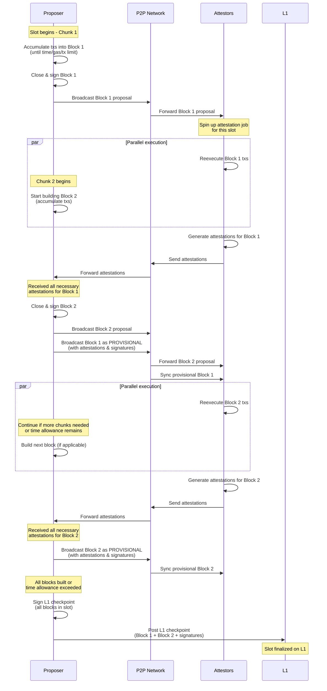

# Intro

Design for block-building under building in chunks.

# Block building

Proposers now partition their slot time into N chunks, where N is configurable and defaults to 2 initially. During the first chunk, they accumulate txs into a block until they hit a time, gas, or tx count limit. They then close that block, sign over it, and broadcast the block proposal across the p2p network.

While the proposer is waiting for the attestations for the initial block, they start production of the second block immediately. So while attestors reexecute the first block, the proposer is already producing the second one.

When the proposer receives all the necessary attestations for the first block, then it broadcasts the proposal for the second one, and broadcasts the initial block as **provisional**. We call the **provisional** chain the blocks that have been attested to but not yet published to L1 (we would also like better ideas for this name). Nodes will sync the provisional node for improved UX (see [_Improving "app latency"_](./dd.md)). Validators will then begin reexecution of this new block, while the proposer moves on to building the next block.

Once the proposer has built all blocks, or has exceeded its time allowance for the slot, it pushes all blocks in the slot to L1 as a **checkpoint**.

## Attestation jobs

When an attestor for a slot receives a block proposal for a fresh slot, it spins up a new _attestation job_ for that slot. This job maintains a persistent fork of world-state used for reexecuting txs of the block proposals for the slot. Note that an attestation job must hold off reexecuting a proposal until it has reexecuted all previous proposals in the given slot.

## Provisional blocks

A provisional block is equivalent to the data posted to L1. It contains a checkpoint header, block header, committee attestations, and the proposer signature over all data. Note that this proposer signature guarantees that it is the proposer who decides when a block within a slot is added to the provisional chain.

## L1 checkpoints

L1 checkpoints require a different proposer signature than that of the provisional blocks, or include a special end-of-slot marker. This ensures that only the proposer is allowed to close the current slot. Otherwise any node would be able to push the provisional chain to L1 early.

# Slashing conditions

We add two new slashing conditions related to building in chunks:

- A proposer that broadcasts via p2p two different block proposals for the same index within the same slot is slashed. This prevents the committee from attesting to two conflicting provisional chain heads. Note that this **breaks the high-availability setup** for proposers that run two simultaneous nodes.
- A proposer that uploads to L1 a subset of the provisional chain is slashed. This prevents proposers from having the free option to remove part of the provisional chain at their discretion.

Note that we do not to slash a sequencer if they fail to submit the L1 checkpoint altogether, since the sequencer may be honest but not be able to do so due to congestion.

# Staggered slots

In our current design, a proposer does not start building for their slot until they have synced the previous one from L1. This means that part of the slot time needs to be allocated to getting the L1 checkpointing tx mined, which reduces how much time is available for actual block building.

Instead, we can build the blocks for slot N during slot N-1, and we use slot N exclusively for publishing to L1, while the next proposer builds the blocks for slot N+1. This means we get much more time for publishing, which we'll need if we require more than one blob per checkpoint, and we are continuously building blocks, which enables higher TPS.

Note that, in the unhappy path in which a proposer fails to publish their L1 checkpoint, the block built by the following proposer is invalidated, so the provisional chain is reorged back by two slots. It should be possible for any node in the network to pick up the blocks produced for a given slot and upload to L1, but building that machinery is out of scope for the moment.
