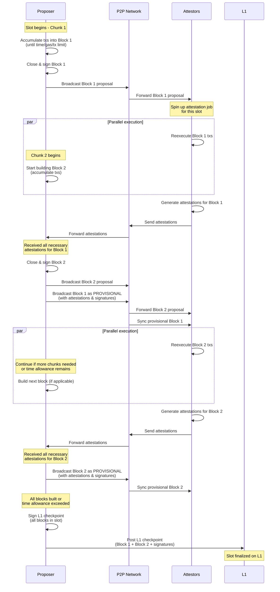

# Intro

Design for block-building under building in chunks.

# Block building

Proposers now partition their slot time into N chunks, where N is configurable and defaults to 2 initially. During the first chunk, they accumulate txs into a block until they hit a time, gas, or tx count limit. They then close that block, sign over it, and broadcast the block proposal across the p2p network.

As soon as the second chunk of time begins, the proposer starts production of the second block. Note that they do not wait for attestations for the first block here. So while attestors reexecute the first block, the proposer can be producing the second one. As soon as the proposer has finished creating every block proposal, it commits the proposal to its own archive and world state as **unattested**. This is a candidate block, and will be used as a starting point for building the next one.

When the proposer receives all the necessary attestations for the first block, then it broadcasts the proposal for the second one, and broadcasts the initial block as **provisional**. We call the **provisional** chain the blocks that have been attested to but not yet published to L1 (note that the name "provisional" itself is provisional). Validators will then begin reexecution of this new block, while the proposer moves on to building the next block.

Once the proposer has built all blocks, or has exceeded its time allowance for the slot, it pushes all blocks in the slot to L1 as a **checkpoint**.

## Attestations

When an attestor for a slot receives a block proposal for a fresh slot, it validates the checkpoint header and new block header, and starts reexecution using a world state fork. If reexecution and validation pass, the attestor signs the proposal and broadcasts it back, and commits its own fork as **unattested**, same as the proposer did. This unattested chain tip will be used for reexecution of the next block proposal.

Note that an attestor must hold off reexecuting a block proposal until it has reexecuted all previous proposals in the given slot. If a proposal for block N+1 within a slot arrives while the attestor unattested chain is not yet at block N, it should wait and not reject the proposal.

## Provisional blocks

A provisional block is equivalent to the data posted to L1. It contains a checkpoint header, block header, committee attestations, and the proposer signature over all data. Note that this proposer signature guarantees that it is the proposer who decides when a block within a slot is added to the provisional chain. Nodes verify this signature before accepting a new provisional block

Note that L1 checkpoints require a different proposer signature than that of the provisional blocks, or include a special end-of-slot marker. This ensures that only the proposer is allowed to close the current slot. Otherwise any node would be able to push the provisional chain to L1 early.

## Staggered slots

In our current design, a proposer does not start building for their slot until they have synced the previous one from L1. This means that part of the slot time needs to be allocated to getting the L1 checkpointing tx mined, which reduces how much time is available for actual block building.

Instead, we can build the blocks for slot N during slot N-1, and we use slot N exclusively for publishing to L1, while the next proposer builds the blocks for slot N+1. This means we get much more time for publishing, which we'll need if we require more than one blob per checkpoint, and we are continuously building blocks, which enables higher TPS.

Note that, in the unhappy path in which a proposer fails to publish their L1 checkpoint, the block built by the following proposer is invalidated, so the provisional chain is reorged back by two slots. It could be possible for any node in the network to pick up the blocks produced for a given slot and upload to L1 (see "better economic guarantees" in the [original design](../../attic/building-in-chunks/dd.md#better-economic-guarantees)), but building that machinery is out of scope for the moment.

As a design simplification, we can choose **not** to implement staggered slots, and just allocate time within the slot for L1 submission, like we do today.
