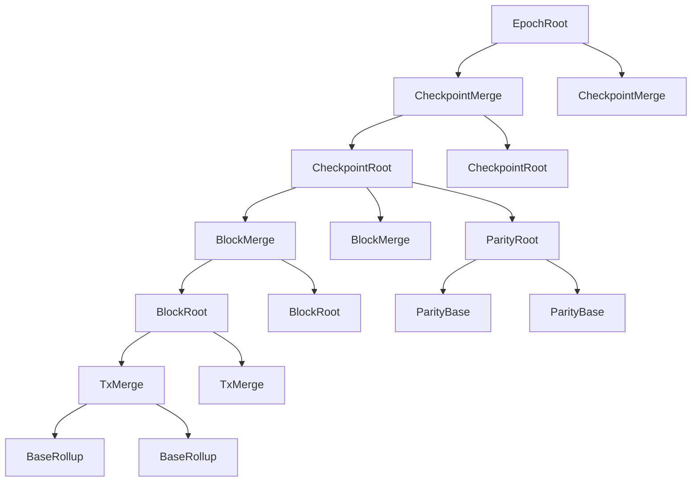

# Intro

This is a design document that covers the changes needed in circuits, types, and potentially L1 contracts to support v3 of "building in chunks".

The goal of this design is to promote _chunks_ into actual _blocks_, which get _checkpointed_ into L1 at regular intervals. This adds another level hierarchy in our block building: we now have multiple _chunks_, that are aggregated into _checkpoints_, which are aggregated into _epochs_. While we'd propose to refer to _chunks_ as _blocks_ directly, we'll keep using the term _chunk_ throughout this design document to avoid confusion with the current L2 blocks. But if we do adopt this design, an L2 _block_ will be what we list here as a _chunk_.

This design can also be seen as a stepping stone towards decoupling L2 block production from L1 txs in the future.

## Estimated effort

The design document for "building in chunks" estimates 5 weeks for chunking, without any circuit changes. We expect the following additional effort for the changes described here:

- Updates to block header and new checkpoint header: 1-2 weeks
- Changes to blob layout: 2-3 weeks
- Updated circuit topology: 3-5 weeks
- L1 changes: 1-2 weeks

Total is 7-12 weeks, on top of the 5 weeks, for **12-17 weeks total**.

### Incremental review efforts

While this proposal changes the rollup circuit topology, most of the logic for the new circuits comes from existing ones. The new `CheckpointRoot` and `CheckpointMerge` circuits are a mix-and-match from existing circuit logic, which should make an incremental review relatively easy, compared to a full re-audit. L1 changes are also small enough that should be simple to re-review.

## Spec

### Archive tree

Given _chunks_ are the new _blocks_, the archive tree now contains _chunk header hashes_. This means that all changes to the state root happen in the _chunks_, and _checkpoints_ are just a way of grouping them together (just like epochs are).

### Slots and timestamps

We keep the current definition of L2 slot as the timestamp range reserved for a given proposer, which means that now a single L2 slot can have multiple chunks (blocks). All chunks within a given checkpoint have a timestamp within that range, chosen by the proposer. Attestors should only attest to proposals with a timestamp within the time of the previous chunk (or slot start for the first chunk in the checkpoint) and the current time.

### Blob layout

Since each _checkpoint_ will contain multiple _chunks_, these have to be embedded into the blob somehow. Today the blob is a sequence of `TxEffect`s. Now, the blob should be a sequence of `TxEffect`s for a given chunk, then followed by the chunk header, then followed by the next list of `TxEffect`s followed by their chunk header, and so on. Appending the chunk header _after_ the txs in the blob is easier since the chunk header depends on its txs.

### Chunk header

Each _chunk_ header has the same format as a _block_ header today, except for the `ContentCommitment`. Today, the `ContentCommitment` contains the `inHash` and `outHash` (hashes of cross-chain messages) and the `blobHash`. These fields are only used for coordination to L1, so semantically they now belong to a _checkpoint_ and can be removed from the `ChunkHeader`.

```ts
/** First design for ChunkHeader (not final) */
class ChunkHeader {
  /** Snapshot of archive before the chunk is applied. */
  lastArchive: AppendOnlyTreeSnapshot;
  /** State reference. */
  state: StateReference;
  /** Global variables of an L2 chunk. */
  globalVariables: GlobalVariables;
  /** Total fees in the chunk, computed by the root rollup circuit */
  totalFees: Fr;
  /** Total mana used in the chunk, computed by the root rollup circuit */
  totalManaUsed: Fr;
}

class StateReference {
  l1ToL2MessageTree: AppendOnlyTreeSnapshot
  noteHashTree: AppendOnlyTreeSnapshot,
  nullifierTree: AppendOnlyTreeSnapshot,
  publicDataTree: AppendOnlyTreeSnapshot,
}
```

#### Committing to `TxEffects`

However, we still want a chunk header to be a commitment to the _entire_ contents of a chunk. Each `TxEffect` has several fields that are entered into the world state tree (nullifiers, note hashes, etc), and these are rightly committed to as part of the chunk header state reference. But the `TxEffect` contains fields that (in the above iteration of a chunk header design) are not being committed into world state: logs and l2-to-l1 messages. To commit to those fields, we can leverage the blob Poseidon sponge, which hashes all tx effects across a block, and include the start and end state of the sponge in the chunk header. This guarantees that the chunk hash is a commitment to all effects in that chunk.

So we have:

- L1 -> L2 messages: committed to within the chunk header's state reference.
  - To prove that a particular L1->L2 message was included (made available) in a particular chunk number, an app can read from the chunk number in which the messages were first inserted.
  - See the "L1-to-L2 messaging" section below, for how we choose which chunk should contain this data. (Spoiler: probably the first chunk of the checkpoint).
- L2 -> L1 messages:
  - To prove that a particular L2->L1 message came from a particular chunk number, a circuit would have to reference the start and end sponges that we're proposing would be committed to as part of the chunk header. See below for concerns that this isn't very efficient.
  - We could also feasibly compute a mini `out_hash` for just the chunk, in the base rollup (using poseidon2 instead of sha256), and include that in the chunk header?
- Logs:
  - To prove that a particular L2->L1 message came from a particular chunk number, a circuit would have to reference the start and end sponges that we're proposing would be committed to as part of the chunk header. See below for concerns that this isn't very efficient.

```ts
class ChunkHeader {
  /** Start and end state of the blob sponge. We hash the start and end sponges into a single field each. */
  blobSponge: [Fr, Fr];
  /** Snapshot of archive before the chunk is applied. */
  lastArchive: AppendOnlyTreeSnapshot;
  /** State reference. */
  state: StateReference;
  /** Global variables of an L2 chunk. */
  globalVariables: GlobalVariables;
  /** Total fees in the chunk, computed by the root rollup circuit */
  totalFees: Fr;
  /** Total mana used in the chunk, computed by the root rollup circuit */
  totalManaUsed: Fr;
}
```

This means that it's possible for an app to prove that an event was emitted by providing all `TxEffect`s in a given chunk, showing that they correspond to the blob sponge initial and end states, and showing that the resulting chunk header is part of the archive tree.

> We contemplated just including the blob commitments of a checkpoint in each chunk header of that checkpoint, to enable constant-size membership proofs of logs, but a BLS12-381 KZG commitment would be many millions of constraints to open inside a circuit. Leveraging the sponge should mean we can use cheap poseidon2 to prove membership. It would still be a lot of poseidon2 hashing, though, because we'd have to hash every single tx effect of every single tx, in order to go from the start sponge to the end sponge of a chunk. In fact, because we don't know how many blobs a single chunk may use, it's possible that a single chunk might use all 6 blobs of a checkpoint. Then the distance between the start and end sponges would be `6*4096=25k` fields. So any circuit that wishes to do such a membership proof will need to use that upper bound and always do that amount of hashing. That's roughly `24576/3*75=614k` constraints. Uh oh. That's not great for proving membership of a log in a chunk.

> We also considered changing the sponge from a flat hash of all blob data to a hash of `TxEffect` hashes. In other words, we first hash each individual tx effect in the blob, and then we absorb those hashes into the sponge. However, since a tx effect is not constant-size, this requires hashing arbitrary ranges within the blob data, which is extremely inefficient. An alternative could be merkleising the tx effects, but adds complexity.

#### Optimizing blob data

Note that some fields in the `ChunkHeader` are expected to be the same across all chunks in a given checkpoint, in particular:

```ts
/** ChainId for the L2 block. */
chainId: Fr;
/** Version for the L2 block. */
version: Fr;
/** Slot number of the L2 block */
slotNumber: Fr;
/** Timestamp of the L2 block. */
timestamp: UInt64;
/** Recipient of block reward. */
coinbase: EthAddress;
/** Address to receive fees. */
feeRecipient: AztecAddress;
/** Global gas prices for this block. */
gasFees: GasFees;
```

As an optimization, these fields could be removed from the chunk header serialized in the blob data, and either stored only once in the blob or provided via calldata if needed. Also, note that if we allow multiple proposers to contribute to a given checkpoint in the future, each chunk would have a different `coinbase` and `feeRecipient`.

### Checkpoint header

Checkpoint headers are only relevant to the L1 rollup contract and to the rollup circuits. The checkpoint header should contain the `ContentCommitment` used for cross-chain messaging and committing to blob data, plus a commitment to the last chunk included (either its chunk header hash or the resulting archive tree root), and a reference to the previous checkpoint header.

```ts
class CheckpointHeader {
  /** Root of the archive tree at the end of this checkpoint */
  archiveRoot: Fr;
  /** Commitment to in, out, and blob data */
  contentCommitment: ContentCommitment;
  /** Hash of the last checkpoint */
  lastCheckpointHash: Fr;
}
```

### Circuit topology

We add two new circuits to our rollup circuits: `CheckpointRoot` and `CheckpointMerge`. The `BlockRoot` circuits now represent _chunks_. The parity circuits are now supplied to the `CheckpointRoot` as opposed to the `BlockRoot`.



All world state changes are executed in the `BlockRoot` circuits, and the `CheckpointRoot` circuits aggregate updates from multiple `BlockRoot`s. The `CheckpointRoot` then produces a `ContentCommitment` as we have today.

#### L1-to-L2 messaging

Assuming we keep the same strategy for consuming messages from the `Inbox` on every checkpoint to L1, then every chunk in a given checkpoint will have the same L1-to-L2 messages tree root. Today, this root is updated at the very end of the `BlockRoot` circuit. Under the new model, since the `CheckpointRoot` circuit should not be making changes to the world state trees, we have two options: either the first chunk of the checkpoint updates the tree before any tx effects, or the last chunk of the checkpoint updates it after having applied its tx effects.

Depending on how we handle attestations for chunks, if we want the proposer to have the flexibility to decide on the fly which chunk will be the last one in the checkpoint, it's possible the proposer does not know which will be the last chunk. So it seems safer to update the L1-to-L2 message tree in the first chunk of a checkpoint.

> Aside: If the proposer had flexibility to decide on the fly which chunk will be the last one in the checkpoint, then that would make it harder for the next proposer to begin building their block.

### L1 changes

The main change for L1 contracts is that `propose` now advances the current block number by more than `1`. The rollup contract will need to store both the latest archive tree root, determined by the latest chunk included in the latest checkpoint, and the latest checkpoint hash. Since the checkpoint hash contains the latest archive tree root, it's possible we can just store the last checkpoint hash.

## Fully decoupling L2 blocks from L1

Should we ever want to decouple L2 block production from L1 checkpointing, there are a few changes needed to the design above. For clarity, by decoupling L2 blocks from L1 checkpointing, we mean having L2 produce blocks, and at some point an entity groups some of them into a checkpoint and pushes them to L1, but L2 can keep advancing independent of L1. In other words, L2 liveness should not depend on L1 availability (though its finality most definitely should).

Since we do not know _when_ a chunk will make it to L1, we cannot know in which blob it will land, so we cannot know its `blobSponge` start and end state. One option here would be to just keep a rolling hash of `TxEffects` which gets permanently accumulated and is never reset, so when the network decides to aggregate a few chunks into a checkpoint, the blob verification circuits need to account for a non-zero initial sponge, and check that it matches the end of the previous.

Another change needed is around the `Inbox`, or L1-to-L2 messages. To avoid linking L1-to-L2 messaging to L1 checkpointing, we can define time ranges (similar to L2 slots today), such that all L1-to-L2 messages sent in that time range are grouped into a tree and expected to be inserted at a given L2 timestamp.

Additionally, we'd need mechanisms for fluctuating fees without having to go through L1.

## See also

- @iAmMichaelConnor's [pretty diagrams](https://miro.com/app/board/uXjVIC3ZEbE=/)
