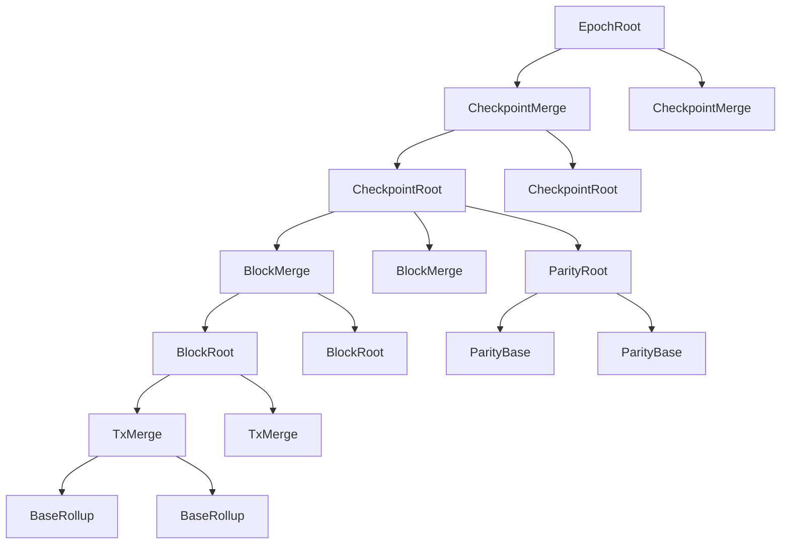

# Intro

This is a design document that covers the changes needed in circuits, types, and potentially L1 contracts to support v3 of "building in chunks".

The goal of this design is to promote _chunks_ into actual _blocks_, which get _checkpointed_ into L1 at regular intervals. This adds another level hierarchy in our block building: we now have multiple _chunks_, that are aggregated into _checkpoints_, which are aggregated into _epochs_. While we'd propose to refer to _chunks_ as _blocks_ directly, we'll keep using the term _chunk_ throughout this design document to avoid confusion with the current L2 blocks. But if we do adopt this design, an L2 _block_ will be what we list here as a _chunk_.

This design can also be seen as a stepping stone towards decoupling L2 block production from L1 txs in the future.

## Estimated effort

The design document for "building in chunks" estimates 5 weeks for chunking, without any circuit changes. We expect the following additional effort for the changes described here:

- Updates to block header and new checkpoint header: 1-2 weeks
- Changes to blob layout: 2-3 weeks
- Updated circuit topology: 3-5 weeks
- L1 changes: 1-2 weeks

Total is 7-12 weeks, on top of the 5 weeks, for **12-17 weeks total**.

### Incremental review efforts

While this proposal changes the rollup circuit topology, most of the logic for the new circuits comes from existing ones. The new `CheckpointRoot` and `CheckpointMerge` circuits are a mix-and-match from existing circuit logic, which should make an incremental review relatively easy, compared to a full re-audit. L1 changes are also small enough that should be simple to re-review.

## Spec

### Archive tree

Given _chunks_ are the new _blocks_, the archive tree now contains _chunk header hashes_. This means that all changes to the state root happen in the _chunks_, and _checkpoints_ are just a way of grouping them together (just like epochs are).

### Slots and timestamps

We keep the current definition of L2 slot as the timestamp range reserved for a given proposer, which means that now a single L2 slot can have multiple chunks (blocks).

All chunks within a given checkpoint have timestamps within that range, chosen by the proposer. The timestamps of all chunks are strictly increasing, but the intervals between consecutive chunks are determined by the proposer. Attestors should only attest to proposals whose timestamps fall between the time of the previous chunk (or the slot start for the first chunk in the checkpoint) and the current time.

The timestamp of a checkpoint equals the timestamp of the last block in it. This is verified on L1 to ensure that the proposed checkpoint's timestamp matches the current slot's timestamp. The circuits enforce that the timestamp of the first block in a checkpoint is larger than the timestamp of the previous checkpoint.

### Chunk header

Each _chunk_ header has the same format as a _block_ header today, except for the `ContentCommitment`. Today, the `ContentCommitment` contains the `inHash` and `outHash` (hashes of cross-chain messages) and the `blobHash`. These fields are only used for coordination to L1, so semantically they now belong to a _checkpoint_ and can be removed from the `ChunkHeader`.

```ts
/** First design for ChunkHeader (not final) */
class ChunkHeader {
  /** Snapshot of archive before the chunk is applied. */
  lastArchive: AppendOnlyTreeSnapshot;
  /** State reference. */
  state: StateReference;
  /** Global variables of an L2 chunk. */
  globalVariables: GlobalVariables;
  /** Total fees in the chunk, computed by the root rollup circuit */
  totalFees: Fr;
  /** Total mana used in the chunk, computed by the root rollup circuit */
  totalManaUsed: Fr;
}

class StateReference {
  l1ToL2MessageTree: AppendOnlyTreeSnapshot
  noteHashTree: AppendOnlyTreeSnapshot,
  nullifierTree: AppendOnlyTreeSnapshot,
  publicDataTree: AppendOnlyTreeSnapshot,
}
```

#### Committing to `TxEffects`

However, we still want a chunk header to commit to the _entire_ contents of a chunk. Each `TxEffect` includes fields that are inserted into the world state tree (nullifiers, note hashes, etc), which are already committed to via the chunk header's state reference. But the `TxEffect` also contains fields that are not committed to in the world state: logs and l2-to-l1 messages.

To commit to these fields, we can leverage the (Poseidon) blob sponge, which absorbs all tx effects across a checkpoint (see the "Circuit topology" section below). By including the hash of the sponge (`blobSpongeHash`) after it has absorbed all tx effects in the chunk, we guarantee that the chunk header hash is a commitment to all tx effects within that chunk.

So we have:

```ts
class ChunkHeader {
  /** Hash of the blob sponge after all blob fields within the chunk are absorbed */
  blobSpongeHash: Fr;
  /** Snapshot of archive before the chunk is applied. */
  lastArchive: AppendOnlyTreeSnapshot;
  /** State reference. */
  state: StateReference;
  /** Global variables for the chunk. */
  globalVariables: GlobalVariables;
  /** Total fees of all txs in the chunk */
  totalFees: Fr;
  /** Total mana used by all txs in the chunk */
  totalManaUsed: Fr;
}
```

#### Proving the existence of `TxEffects`:

- `note hashes`, `nullifiers`, `public data`, `L1 -> L2 messages`: committed to within the chunk header's state reference.
  - An app can read the header of the chunk emitting the effects (or any chunks after it), and perform a membership check against the tree snapshot to prove that a value exists in the tree.
  - To prove that a value was included (made available) in a specific chunk, an app can provide all values emitted in the chunk and the header of the previous chunk, and prove that the state root in the particular chunk results from inserting those values into the previous state.
  - See the "L1-to-L2 messaging" section below, for how we choose which chunk should process the messages for the entire checkpoint. (Spoiler: probably the first chunk of the checkpoint).
- `logs` and `L2 -> L1 messages`: committed to via `blobSpongeHash`.
  - To prove that a particular value came from a particular chunk, a circuit would reference the blob sponge hash in the headers of that chunk and its previous chunk, and provide the preimages of the sponges and all tx effects emitted in the chunk, to prove that the sponge hash was computed by absorbing the tx effects into the previous sponge.

> We contemplated just including the blob commitments of a checkpoint in each chunk header of that checkpoint, to enable constant-size membership proofs of logs, but a BLS12-381 KZG commitment would be many millions of constraints to open inside a circuit. Leveraging the sponge should mean we can use cheap poseidon2 to prove membership. It would still be a lot of poseidon2 hashing, though, because we'd have to hash every single tx effect of every single tx, in order to go from the start sponge to the end sponge of a chunk. In fact, because we don't know how many blobs a single chunk may use, it's possible that a single chunk might use all 6 blobs of a checkpoint. Then the distance between the start and end sponges would be `6*4096=25k` fields. So any circuit that wishes to do such a membership proof will need to use that upper bound and always do that amount of hashing. That's roughly `24576/3*75=614k` constraints. Uh oh. That's not great for proving membership of a log in a chunk.

> We also considered changing the sponge from a flat hash of all blob data to a hash of `TxEffect` hashes. In other words, we first hash each individual tx effect in the blob, and then we absorb those hashes into the sponge. However, since a tx effect is not constant-size, this requires hashing arbitrary ranges within the blob data, which is extremely inefficient. An alternative could be merkleising the tx effects, but adds complexity.

> We could feasibly compute a mini `out_hash` for each chunk in the base rollup (using poseidon2 instead of sha256), and include it in the chunk header. But that slightly increases the size of the chunk header, which increases the cost of computing the chunk header hash. Although it's not much, but we don't want to add the cost to all users and the complexity to the circuits just to support a very rare use case.

> We also considered including the sponge hash at the start of a chunk in the header, then it could save an extra membership check proving that the previous chunk header exists in the archive tree. But that's an extra field added to the chunk header. Same reason as the above, we don't want to add the cost to all users just for a rare use case.

### Blob layout

Since each _checkpoint_ may contain multiple _chunks_, these have to be embedded into the blob. Today the blob is a sequence of `TxEffect`s. Now, it should contain a sequence of `TxEffect`s for a given chunk, followed by that chunk's _partial_ header, and then the next chunk's `TxEffect`s and header, and so on. Appending the chunk header _after_ the txs in the blob is easier since the chunk header depends on its txs.

#### Optimizing blob data

Note that some fields in the `ChunkHeader` are expected to be the same across all chunks in a given checkpoint, in particular:

```ts
/** ChainId for the L2 block. */
chainId: Fr;
/** Version for the L2 block. */
version: Fr;
/** Slot number of the L2 block */
slotNumber: Fr;
/** Recipient of block reward. */
coinbase: EthAddress;
/** Address to receive fees. */
feeRecipient: AztecAddress;
/** Global gas prices for this block. */
gasFees: GasFees;
```

As an optimization, these fields are removed from the chunk header serialized in the blob data. They can be obtained from L1, since they are included in the checkpoint header and submitted as calldata when the checkpoint is proposed.

> Note that if we want to allow multiple proposers to contribute to a given checkpoint in the future, each chunk would have a different `coinbase` and `feeRecipient`.

### Checkpoint header

Checkpoint headers are only relevant to the L1 rollup contract and to the rollup circuits. The checkpoint header should contain the `ContentCommitment` used for cross-chain messaging and committing to blob data, plus a commitment to the state after the previous checkpoint. The checkpoint header is the same as the current proposed block header signed over by the committee and submitted to L1.

```ts
class CheckpointHeader {
  /** Root of the archive tree at the end of the previous checkpoint */
  lastArchiveRoot: Fr;
  /** Hash of the L1 -> L2 messages for this checkpoint */
  inHash: Fr;
  /** Root of the wonky tree comprising all L2 -> L1 messages in this checkpoint */
  outHash: Fr;
  /** Hash of all the blob hashes */
  blobsHash: Fr;
  /** Slot number of the checkpoint */
  slotNumber: Fr;
  /** Timestamp of the checkpoint. Equals the timestamp of the last block in the checkpoint. */
  timestamp: Fr;
  /** Recipient of the reward. */
  coinbase: EthAddress;
  /** Address to receive fees. */
  feeRecipient: AztecAddress;
  /** Global gas prices for this checkpoint. */
  gasFees: GasFees;
  /** Mana used by all the chunks in the checkpoint. */
  totalManaUsed: Fr;
}
```

### Circuit topology

We add two new circuit types: `CheckpointRoot` and `CheckpointMerge`. The existing `BlockRoot` circuits now represent _chunks_. The parity root circuit is supplied to the **first** `BlockRoot` circuit in each checkpoint.



All world state changes are executed in the `BlockRoot` circuits, and the `CheckpointRoot` circuits aggregate updates from multiple `BlockRoot`s. The `CheckpointRoot` then produces a `ContentCommitment` as we have today.

A Poseidon sponge is used to absorb data of all tx effects and chunk headers across a checkpoint. The _start_ sponge of a chunk must match the _end_ sponge of the previous chunk (or be empty for the first chunk in a checkpoint). In the `CheckpointRoot` circuit, raw blob fields and validated against the hash of the sponge. The circuit then splits the raw fields to create the correct number of blobs.

#### L1-to-L2 messaging

Assuming we keep the same strategy for consuming messages from the `Inbox` on every checkpoint to L1, then every chunk in a given checkpoint will have the same L1-to-L2 messages tree root. Today, this root is updated at the beginning of the `BlockRoot` circuit. Under the new model, since the `CheckpointRoot` circuit should not be making changes to the world state trees, we have two options: either the first chunk of the checkpoint updates the tree before any tx effects, or the last chunk of the checkpoint updates it after having applied its tx effects.

Updating the tree in the first chunk aligns with what we have today - all txs in the same slot can consume the messages from the previous slot.

We also want the proposer to have the flexibility to decide on the fly which chunk will be the last one in the checkpoint, it's possible the proposer does not know which will be the last chunk. So it seems safer to update the L1-to-L2 message tree in the first chunk of a checkpoint.

> Aside: If the proposer had flexibility to decide on the fly which chunk will be the last one in the checkpoint, then that would make it harder for the next proposer to begin building their block.

### L1 changes

The main change for L1 contracts is that `propose` now accepts a _checkpoint_ instead of a block/chunk. Since the checkpoint header is equivalent to the current proposed block header, no further changes are needed aside from renaming L2 blocks to checkpoints.

## Fully decoupling L2 blocks from L1

The L2 block production is decoupled from L1 checkpointing. By decoupling, we mean having L2 produce blocks, and at some point an entity groups some of them into a checkpoint and pushes them to L1, but L2 can keep advancing independent of L1. In other words, L2 liveness should not depend on L1 availability (though its finality most definitely should).

> We'd need mechanisms for fluctuating fees without having to go through L1.

## See also

- @iAmMichaelConnor's [pretty diagrams](https://miro.com/app/board/uXjVIC3ZEbE=/)
