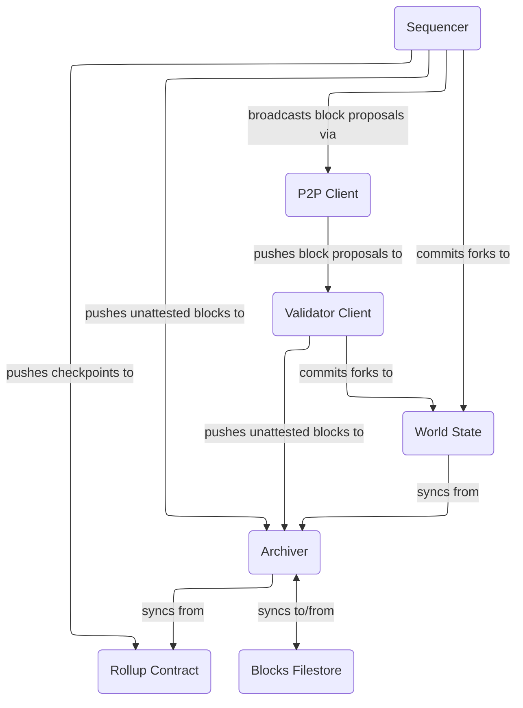

# Intro

How syncing the L2 chain works in a building-in-chunks world.

# Context

Checkpoint headers are posted to L1 as calldata, whereas block headers and bodies are posted as blobs. Validators, and nodes that want to follow the `proposed` chain, also need to sync blocks that are not yet posted to L1.

Note that acquiring L1 blobs require a supernode, so we want to avoid it if possible. Also note that block headers contain a commitment to tx effects, so if a node has a given block header, they can get the corresponding tx effects from any source and verify them.

We have the following data sources:

- Execution clients for L1 calldata (for checkpoint headers)
- Consensus semi-supernodes for L1 blobs (for block headers and bodies)
- Centralized repositories (eg cloud-based file stores) for L1 blob data
- Reconstructing tx effects via tx reexecution (assuming the original txs are available)

## Syncing proposed blocks

Blocks in the `proposed` chain are not available on L1 by definition. Nodes who follow this chain are expected to listen to block proposals in the p2p network, and reexecute these proposals.

## Syncing mined blocks

A node that starts from scratch or has been offline may first download a snapshot archive to get a view of the chain no more than a day old, to speed up syncing.

Then checkpoint headers should then be synced from L1 directly until the current tip of the L1-mined chain. For all checkpoint headers synced this way, the node should acquire its blocks from:

- Any configured centralized repositories
- Any configured L1 supernode

When syncing mined blocks, the node must check if the mined blocks match the `proposed` ones already stored. If not, it must reorg out these blocks and sync to the L1 mined chain.

# Subsystems

Updated relationships between subsystems.

## Archiver

This requires changing the archiver to accept a new source of blocks, aside from L1. We propose adding an inbound queue to the archiver where other components can inject unattested or provisional blocks as they are discovered, expected to be the validator or whatever component is responsible for (re)execution.

The archiver is expected to resolve conflicts between these data sources, and prune unmined provisional data based on synced L2 slots. In other words, if the provisional blocks for a given L2 slot are never mined on L1, the archiver must trigger a prune.

## World state

As an optimization, instead of throwing away the world state updates committed during execution/reexecution in a validator and then re-syncing, world state should commit the fork if the archiver accepts the new blocks.
