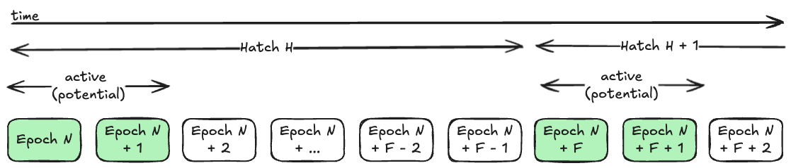
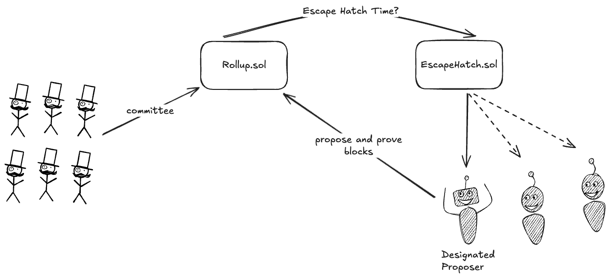
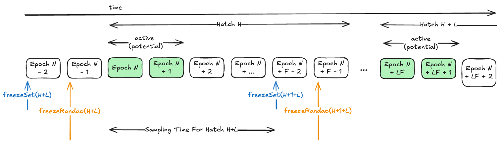
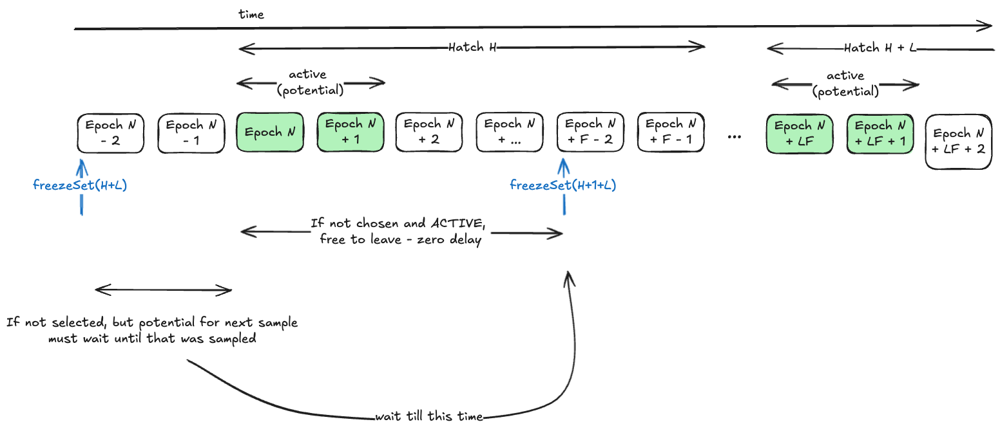
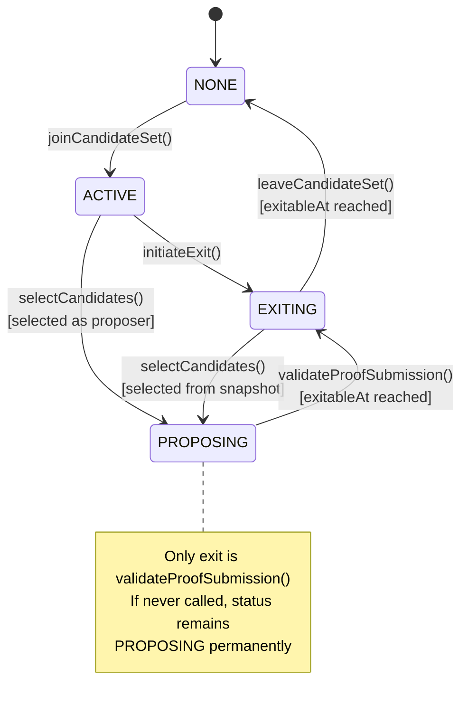
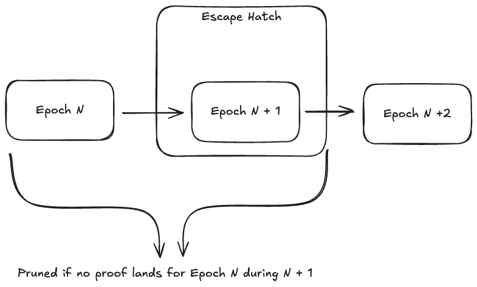
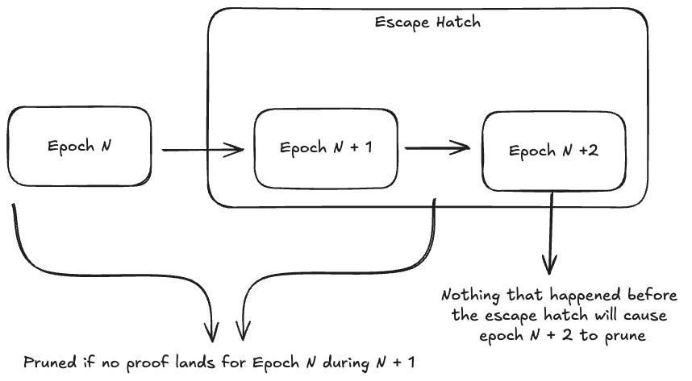
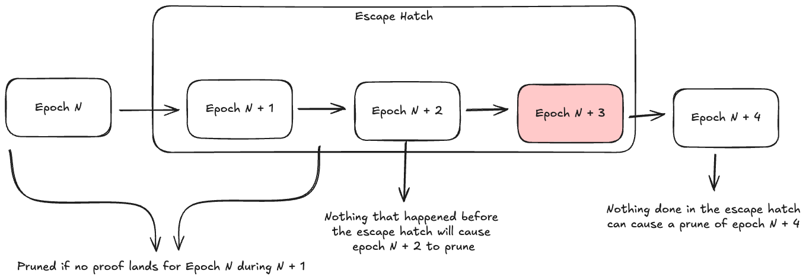
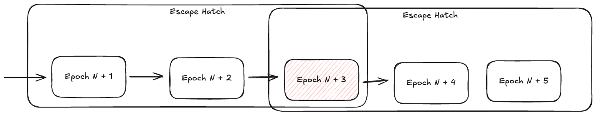

# Escape Hatch

Last edited time: January 6, 2026 11:09 AM   
Tech Lead: @LHerskind   
Contributors: @LHerskind   
Linear Issue/Project: https://linear.app/aztec-labs/project/escape-hatch-a64c9163dfdc/overview   
Code: https://github.com/AztecProtocol/aztec-packages/pull/18811   

# Problem Statement & Executive Summary

- What problem are we solving and why? For user facing features, explain the pain that users face without this, and how many people want it (you may need input from product here)
- What top-line KPIs (user perceived latency, throughput capacity, network adoption) are you trying to affect? By how much?
- What's the proposed solution in 2-3 sentences?
- How many people and how many hours will it require?

The escape hatch mitigates censorship at the block production level, to ensure that it is possible for a user to eventually get transactions through the system **even** in the case where 100% of the block builders tries to censor them - it is what moves us from stage 0 into stage 1. 

KPI’s; we are trying to affect the “time of censorship” to give users a better guarantee that even if the entire sequencer set becomes malicious they will be able to exit. Preferably within a reasonable timeframe. When the solution is not in use, e.g., no censorship is ongoing, it should have very minimal impact (both in cost + throughput). Abuse of the system should in worst case be able to reduce the throughput limits no more than 10%.

The solution is fairly simple: Add a new entrypoint where it is periodically possible to use an alternative block production path that does NOT require a committee. Proposers for this alternative path are picked from a separate set, where the only requirement for entry is to put up significant collateral.

The work will primarily be solidity L1 contract work, and for the time being NOT have a component in the node that easily allow using it. Since that can be built separately this should allow us faster cycles to build the initial design. The work is tasked to @LHerskind and expect to take:

- 1 week for the initial solidity contract
- 1 week for additional testing an fine tuning
    - includes getting a node to send an empty block during an escape hatch

# Functional Interface

- How will this be used?
- What are the inputs and outputs?
- What alternatives did you consider and why did you choose this approach?

The scheme is expected to be used by a collection of end users (or a single wealthy end user) if censorship occur, by running a special node flavor. That node flavor will not exist as part of this design, so it is unlikely that it will see immediate use.

Alternatives such as forced inclusion and doing nothing was considered, see:

- [ADR-001: Bypassing the Committee](#adr-001-bypassing-the-committee)
- [ADR-002: Forced Inclusion](#adr-002-forced-inclusion)

# Technical Design

- How will this work internally?
- What are the key technical decisions?
- What additional observability needs does this create?
- What alternatives did you consider?

Alternatives and decisions can be found in more depth in  [ADR - Architecture Design Record](#adr---architecture-design-record) 

## High Level Protocol

We introduce a new smart contract at L1, `EscapeHatch.sol` and modify the rollup to periodically allow a **single-proposer block production** path to be used. 

This contract introduce a new measure of time, the `Hatch` a hatch is a period of`FREQUENCY` epochs, and at the start of every `Hatch` is the **potential** to sidestep the general committee and have a designated proposer be the sole block producer for **2** (`ACTIVE_DURATION`) consecutive epochs. 



By default, the potential is not used, and the committee are free to propose as they have always done. But in the event that some entity wish to use the `EscapeHatch` they can bond collateral at the contract to enter a set of candidates, from which we will sample the designated proposer. 



During an active hatch, for these **2** initial epochs, only the designated proposer is able to submit blocks. A designated proposer that fails to extend the chain will be punished by taking some of its bond (`FAILED_HATCH_PUNISHMENT`). The remaining bond can be redeemed by the designated proposer after a delay have passed. Any exit incur a tax of`WITHDRAWAL_TAX`. 

> The designated proposer **does not** take over any of the governance power from the committee, the committee proposer is still the one participating here.

### Drawbacks

While the approach is pretty simple, and does provide us with the benefits we want, it has some significant drawbacks that one should be aware of.

1. Strong monopoly during the hatch
    1. Throughout the escape hatch, just a single entity is the proposer, so there is essentially solo sequencer for 2 epochs. This could allow significant profits for MEV, especially during a high volatility period.
    2. Mixed with potential for rewards this should be taken into account with the size of the withdrawal tax. See [ADR-014: Last resort or alternative production?](#adr-014-last-resort-or-alternative-production).
2. If there is a soundness bug in the AVM, blocks proposed through the escape hatch can exploit them without intervention from the committee. Any unexpected use of the escape hatch could lead to massive panic.

## Data

The data model of the system. Might be odd to see this now, but I think you will appreciate it later.

```solidity
// ============ Custom Types, Enums and Structs ============
type Hatch is uint256;

enum Status { NONE, ACTIVE, PROPOSING, EXITING }

struct CandidateInfo {
	Status status;
	uint96 amount;
	uint32 exitableAt;
	uint32 lastCheckpointNumber; 
	bytes32 lastSubmittedArchive;
}
// ============ Constants ============

uint256 public constant LAG_IN_EPOCHS_FOR_SET_SIZE = 2;
uint256 public constant LAG_IN_EPOCHS_FOR_RANDAO = 1;

// ============ Immutables ============

IInstance internal immutable ROLLUP;
uint256 internal immutable LAG_IN_HATCHES;
IERC20 internal immutable BOND_TOKEN;
uint96 internal immutable BOND_SIZE;
uint96 internal immutable WITHDRAWAL_TAX;
uint96 internal immutable FAILED_HATCH_PUNISHMENT;
uint256 internal immutable FREQUENCY;
uint256 internal immutable ACTIVE_DURATION;
uint256 internal immutable PROPOSING_EXIT_DELAY;

// ============ Storage ============

BitMaps.BitMap internal $isHatchPrepared;
BitMaps.BitMap internal $isHatchValidated;
SnapshottedAddressSet internal $activeCandidates;
mapping(address candidate => CandidateInfo data) internal $candidateDatas;
mapping(Hatch hatch => address proposer) internal $designatedProposer;
```

The `SnapshottedAddressSet` is a struct that allow accessing the active set at any point in the past, e.g., can be used to see the set at a point in the past - very useful when needing snapshots.

Also, we will have certain validity constraints that need to be satisfied for a configuration to be valid. 

```solidity
function _validateConfiguration() {
    require(LAG_IN_EPOCHS_FOR_SET_SIZE > LAG_IN_EPOCHS_FOR_RANDAO, Errors.EscapeHatch__InvalidConfiguration());
    require(_lagInHatches >= 1, Errors.EscapeHatch__InvalidConfiguration());
    require(_activeDuration >= ROLLUP.getProofSubmissionEpochs() + 1, Errors.EscapeHatch__InvalidConfiguration());
    require(_frequency > LAG_IN_EPOCHS_FOR_SET_SIZE, Errors.EscapeHatch__InvalidConfiguration());
    require(_frequency > _activeDuration, Errors.EscapeHatch__InvalidConfiguration());
    require(_failedHatchPunishment <= _bondSize, Errors.EscapeHatch__InvalidConfiguration());
    require(_withdrawalTax <= _bondSize, Errors.EscapeHatch__InvalidConfiguration());
    require(_proposingExitDelay <= 30 days, Errors.EscapeHatch__InvalidConfiguration());
}
```

The duration must be at least one epoch longer than the proof submission window to ensure that a malicious committee cannot impact the outcome of the hatch. For more info here see:

- [ADR-006: Escape Hatch Buffer](#adr-006-escape-hatch-buffer)
- [ADR-009: Remove End Buffer](#adr-009-remove-end-buffer)

## Registration

To register as a candidate, an entity must deposit `BOND_SIZE` of `BOND_TOKEN` into the `EscapeHatch.sol` contract, and their address will be added to a candidate set. The candidate set will be using the `SnapshottedAddressSet` (similar to the `GSE.sol`).

Duplicate candidates are rejected, and only entities that have no current status are accepted for simplicity.

```solidity
function joinCandidateSet() external override {
  address candidate = msg.sender;

  require(
	  !$activeCandidates.contains(candidate), 
	  Errors.EscapeHatch__AlreadyInCandidateSet(candidate)
  );

  CandidateData storage data = $candidateDatas[candidate];
  require(
	  data.status == Status.NONE, 
	  Errors.EscapeHatch__InvalidStatus(Status.NONE, data.status)
	);

  $activeCandidates.add(candidate);

  data.status = Status.ACTIVE;
  data.amount = BOND_SIZE;

  BOND_TOKEN.safeTransferFrom(candidate, address(this), BOND_SIZE);

  emit CandidateJoined(candidate, BOND_SIZE);
}
```

## Electing A Designated Proposer

Electing a designated proposer from the candidates works somewhat similar to what we are used to from the rollup itself for the committee. We use a checkpointed address set and a randao value to select the proposer.

To limit manipulation of the sampling, we need to first freeze the candidate list, and then later the randao. Otherwise it is possible to alter the candidate list by adding/removing candidates to predictably impact the selected candidate. See [ADR-005: Random Sampling and Fee](#adr-005-random-sampling-and-fee) and  [ADR-011: Address caller bias](#adr-011-address-caller-bias).

The time of the sampling itself does deviate quite substantially from the rollup though. You see, in the rollup, we freeze the values and then we sample them on demand. Which would be every epoch. We can do this because we could rely on the need for a committee to propose, e.g., if we need to do a sample at some point because we need the result of it . 

For the escape hatch the case is slightly different. Namely, we don’t always need the sampling, for example if we know there is no use of the hatch at the moment (because no members) entirely being able to skip it would be beneficial. 

Therefore, the hatch takes the approach of doing a deliberate sample for the future (but still using frozen snapshots). This allows us to do only very few static reads in the rollup and limit the impact on gas consumption - but it does make time a bit weird. See [ADR-010: Don’t prepare escape hatch in setupEpoch ](#adr-010-dont-prepare-escape-hatch-in-setupepoch).

I have extended the timeline from earlier a bit. It now shows the time where we freeze the set for specific hatches, but also the time that it is possible to sample within. Note that during `H` we are sampling for `H + L` (`L` is the `LAG_IN_HATCHES`), but we are only able to sample until the set is frozen to avoid overlapping sets, see [ADR-012: Re-selection Due To Overlap](#adr-012-re-selection-due-to-overlap) for more.



> Beware, that because sampling is now an actual action, it might not be called, so it is possible to have candidates but no active hatch if no-one calls it. However, due to the duration in which sampling can happen, it is very hard to censor, e.g., multiple epochs to call, and anyone can do it. With 1 daily hatch you would have 1 day to make the call.

When we have selected a candidate, we update the value they can exit at `exitableAt` such that it at the earliest is the time at which their work could have failed to be proven by + some delay to ensure that they cannot exit faster than a committee could for a similar “attack”.

```solidity
function selectCandidates() public override(IEscapeHatchCore) {
  Hatch currentHatch = getCurrentHatch();
  Hatch targetHatch = currentHatch + Hatch.wrap(LAG_IN_HATCHES);

  if ($isHatchPrepared.get(Hatch.unwrap(targetHatch))) {
    return;
  }

  $isHatchPrepared.set(Hatch.unwrap(targetHatch));

  uint32 freezeTs = getSetTimestamp(targetHatch);
  require(
	  freezeTs < block.timestamp, 
	  Errors.EscapeHatch__SetUnstable(targetHatch)
  );

  uint256 setSize = $activeCandidates.lengthAtTimestamp(freezeTs);
  if (setSize == 0) {
    return;
  }

  uint32 nextFreezeTs = getSetTimestamp(targetHatch + Hatch.wrap(1));
  if (block.timestamp >= nextFreezeTs) {
    return;
  }

  uint32 seedTs = getSeedTimestamp(targetHatch);
  uint256 seed = ROLLUP.getSampleSeedAt(Timestamp.wrap(seedTs));
  uint256 index = uint256(keccak256(abi.encode(targetHatch, seed))) % setSize;
  address proposer = $activeCandidates.getAddressFromIndexAtTimestamp(
	  index, freezeTs
  );

  $designatedProposer[targetHatch] = proposer;

  CandidateInfo storage data = $candidateDatas[proposer];

  if (data.status != Status.EXITING) {
    $activeCandidates.remove(proposer);
  }

  data.status = Status.PROPOSING;

  Epoch exitableEpoch =
    _getFirstEpoch(targetHatch) + 
    Epoch.wrap(ACTIVE_DURATION) + 
    Epoch.wrap(ROLLUP.getProofSubmissionEpochs());
  data.exitableAt = (Timestamp.unwrap(
	  ROLLUP.getTimestampForEpoch(exitableEpoch)
  ) + PROPOSING_EXIT_DELAY).toUint32();

  emit CandidateSelected(targetHatch, proposer);
}
```

As part of the rollup contract, we then mainly need to evaluate whether the hatch is open or not, and who the designated proposer are if open. We will get more into how exactly we should address this in the rollup in the coming sections. 

```solidity
function isHatchOpen(Epoch _epoch) 
	external 
	view 
	returns (bool isOpen, address proposer) 
{
	uint256 epochInHatch = Epoch.unwrap(_epoch) % FREQUENCY;
	if (epochInHatch >= ACTIVE_DURATION) {
	return (false, address(0));
	}
	
	Hatch hatch = _getHatch(_epoch);
	proposer = $designatedProposer[hatch];
	
	return (proposer != address(0), proposer);
}
```

## Proposing

Minor changes are required to the way blocks are proposed to ensure that we don’t end up invalidating proposals made during the escape hatch and that we can correctly identify prunes happening to those.

During the proposal, we mainly need to sidestep the `verifyProposer` and instead check against the escape hatch designated proposer, and then update the last checkpoint and archive that have been submitted using the hatch (for that proposer), to be used when proving.

```solidity
...
(bool isOpen, address proposer) = ESCAPE_HATCH.isHatchOpen(currentEpoch);
if (isOpen) {
	require(msg.sender == proposer);
} else {
	ValidatorSelectionLib.verifyProposer(...);
}
...
// All the way at the end
if (isOpen) {
	ESCAPE_HATCH.updateSubmittedArchive(proposer, checkpointNumber, _args.archive);
}
```

```solidity
function updateSubmittedArchive(
	address _proposer, 
	uint128 _checkpointNumber, 
	bytes32 _archive
)
  external
{
  require(msg.sender == address(ROLLUP), Errors.EscapeHatch__OnlyRollup(msg.sender, address(ROLLUP)));

  CandidateInfo storage data = $candidateDatas[_proposer];
  data.lastCheckpointNumber = _checkpointNumber.toUint32();
  data.lastSubmittedArchive = _archive;

  emit ArchiveUpdated(_proposer, _checkpointNumber, _archive);
}
```

### Invalidation Library

Since escape hatches have no committee, they don’t have sufficient attestations as seen from the `InvalidateLib.sol`, therefore we simple need to `revert` in the case that someone tries to invalidate an escape hatch epoch.

```solidity
...
(bool isOpen, ) = ESCAPE_HATCH.isHatchOpen(epoch);
require(!isOpen, "cannot invalidate escape hatch");
...
```

## Proving

When submitting a proof we are currently verifying the last set of attestations received. If proposed using the escape hatch, there would be no such attestations, and we will therefore have to skip those.

```solidity
...
(bool isOpen, ) = ESCAPE_HATCH.isHatchOpen(epoch);
if (!isOpen){
  verifyLastBlockAttestations(_args.end, _args.attestations);
}
...
```

Since we track the last submitted archive and checkpoint for the designated proposer during the `propose` function, we can use those and the `Rollup` state to validate if the designated proposer is a honest worker, and if not apply a punishment before allow exit.

Before figuring out if he should be punished or not, we need to ensure that, the hatch have not already been validated, that it has a proposer, that the proposer is actually proposing and that we are past the `exitableAt` timestamp as this ensures that there have been time to actually prove such that it cannot be easily used to attack an honest proposer. 

Beware that some of these checks “stack”, it should not be possible to hit a case where status is not equal to `PROPOSING` as only this function can move it out and we cannot do that for the same hatch multiple times, it is kept there for defense in depth.

```solidity
function validateProofSubmission(Hatch _hatch) external {
  require(
	  !$isHatchValidated.get(Hatch.unwrap(_hatch)), 
	  Errors.EscapeHatch__AlreadyValidated(_hatch)
  );

  address proposer = $designatedProposer[_hatch];
  require(
	  proposer != address(0), 
	  Errors.EscapeHatch__NoDesignatedProposer(_hatch)
	);

  CandidateInfo storage data = $candidateDatas[proposer];
  require(
	  data.status == Status.PROPOSING, 
	  Errors.EscapeHatch__InvalidStatus(Status.PROPOSING, data.status)
  );

  require(
	  block.timestamp >= data.exitableAt, 
	  Errors.EscapeHatch__NotExitableYet(data.exitableAt, block.timestamp)
  );

  bool success = true;
  uint256 punishment = 0;

  // Check success conditions:
  // 1. Something must have been proposed
  if (data.lastCheckpointNumber == 0) {
    success = false;
  }

  // 2. Proofs must have been submitted at least up to this checkpoint
  if (success && ROLLUP.getProvenCheckpointNumber() < data.lastCheckpointNumber) {
    success = false;
  }

  // 3. The checkpoint archive must still be in the chain (not pruned)
  if (success && ROLLUP.archiveAt(data.lastCheckpointNumber) != data.lastSubmittedArchive) {
    success = false;
  }

  if (!success) {
    punishment = FAILED_HATCH_PUNISHMENT;
    data.amount -= FAILED_HATCH_PUNISHMENT;
  }

  data.status = Status.EXITING;
  data.lastCheckpointNumber = 0;
  data.lastSubmittedArchive = bytes32(0);

  $isHatchValidated.set(Hatch.unwrap(_hatch));

  emit ProofValidated(_hatch, proposer, success, punishment);
}
```

## Exiting

Exits are initiated in one of two manners:

1. The candidate wish to withdraw from the race, 
2. The candidate was selected and is to leave after its term finishes (as seen above)

In either case, the exit is a two-step process, some initiation and then a later actual exit. The reason it is split in two is for delay purposes. It is possible to have it be one in some cases, but a clearer setup with fewer branches probably the way to go.

Due to the snapshotting and lag, the delay “depends”. We can make that “depends” slightly simpler by ensuring that `selectCandidates` are always executed first. Thereby we have two options within a single `Hatch` window:

- it is before the next freeze and we are ACTIVE: we can just leave
- it is after the next freeze and we are ACTIVE: we need to wait until that sample have happened.



One should note, that the way we force the `selectCandidate` to be executed first always is that we simply perform the action if needed. Which in practice means that trying to exit might revert because one would be selected at the same time. 

```solidity
function initiateExit() external {
  selectCandidates();

  address candidate = msg.sender;
  require(
	  $activeCandidates.contains(candidate), 
	  Errors.EscapeHatch__NotInCandidateSet(candidate)
  );

  CandidateInfo storage data = $candidateDatas[candidate];
  require(
	  data.status == Status.ACTIVE, 
	  Errors.EscapeHatch__InvalidStatus(Status.ACTIVE, data.status)
  );

  $activeCandidates.remove(candidate);
  data.status = Status.EXITING;

  Hatch nextTargetHatch = getCurrentHatch() + Hatch.wrap(1 + LAG_IN_HATCHES);
  uint32 nextFreezeTs = getSetTimestamp(nextTargetHatch);

  if (block.timestamp < nextFreezeTs) {
    data.exitableAt = block.timestamp.toUint32();
  } else {
    data.exitableAt = getSetTimestamp(nextTargetHatch + Hatch.wrap(1));
  }

  emit CandidateExitInitiated(candidate, data.exitableAt);
}
```

Independent of which of the paths taken, to leave the set the candidate must wait until the delay have passed and pay a `WITHDRAWAL_TAX` to leave the system.

The `WITHDRAWAL_TAX` exist to ensure that there is always a cost of using the escape hatch, since it could otherwise be used “cheaply” to censor the network for the full duration without an impact to the attackers holdings (indirect impact because of the delay from `selectCandidates`).

```solidity
function leaveCandidateSet() external override {
  address candidate = msg.sender;
  CandidateData storage data = $candidateDatas[candidate];

  require(
	  data.status == Status.EXITING, 
	  Errors.EscapeHatch__InvalidStatus(Status.EXITING, data.status)
  );

  require(
	  block.timestamp >= data.exitableAt, 
	  Errors.EscapeHatch__NotExitableYet(data.exitableAt, block.timestamp)
  );

  uint256 refund = uint256(data.amount);
  if (refund > WITHDRAWAL_TAX) {
    refund -= WITHDRAWAL_TAX;
  } else {
    refund = 0;
  }

  delete $candidateDatas[candidate];

  if (refund > 0) {
    BOND_TOKEN.safeTransfer(candidate, refund);
  }

  emit CandidateExited(candidate, refund);
}
```

## Deployment And Updating

By default the rollup should be deployed **without** an escape hatch and then use a function to update the hatch address. This is the case due to circular dependencies. And also allow governance to update the escape hatch. This is acceptable because governance already have a slew of other methods it could use to break rollup to stop block production (infinite fees, reverting reward boosts etc). See [ADR-013: EscapeHatch Deployment and Rollup Integration](#adr-013-escapehatch-deployment-and-rollup-integration).

## Governance Implications

Since the governance proposer is known to be using the current block proposer as signal proposer, we need to rectify that understanding slightly. As per the changes, the `getCurrentProposer` does **not** change from the escape hatch - but it is not the block proposer anymore. 

This needs to be incorporated into the node, since it might otherwise start building blocks and collecting attestations for things it will never be able to publish. 

Since the hatch will either be open or closed for the full epoch, it should be doable by altering the epoch cache slightly to still make the signals flow but chain extensions lie dormant.

## Observability needs

We need additional monitoring to spot when any calls are made to the escape hatch contract. If anyone is depositing into it, or using it, we need to know. This is especially important if there are any concerns about circuit soundness.

## Status Diagrams

A small state machine shown for the `status` value of a candidate. 



## Configuration suggestions

The configuration is currently the remaining unknown of the escape hatch, below are suggestions for a configuration.

- **Rollup**: Specific to rollup, TBD on which one
- **BondToken**: Aztec
- **BondSize**: 9,600,000 Aztec
    - Similar to a committee at alpha ~48 * 200K
    - This exist, to ensure that a **bad but provable block** inclusion will impact the attacker (token go down) similar to if a committee had done it.
- **WithdrawalTax:** 51,200 Aztec
    - Rewards could be up to 25,600 Aztec, so more than that. Cost must be balanced with ability to use if censored.
- **FailedHatchPunishment**: 4,800,000 Aztec
    - Should only happen if unprovable block → severe punishment
- **ProposingExitDelay:** 14 days
    - The exit delay should be comparable to the delay for committee members

The values above are based on having a penalty for wrongdoing that is similar to if the committee did it. While making it possible to get into a case of proposing blocks that is cheaper than getting a committee.

## A few scenarios

- Stalling for 2 epochs by producing empty blocks would bear a cost of 25,600 Aztec (~700$)
- Any builder that can earn >25,600 Aztec over two epochs can pull off a profitable monopoly

# Documentation Plan

- What documentation will be produced so people know how to use this?
- Has DevRel been looped in to write their own docs plan?

Short-term the documentation will mainly be this document and the code itself, but we will longer term need to get a standalone “node” going that can easily use the escape hatch and then document how to use that. 

Devrel have not been looped in.

# Test Plan

- How will we test that this thing works correctly?
- How will we test that it delivered the predicted impact to the KPIs mentioned in the summary?

As the contracts are being developed the solidity components will be tested using Branching Tree Technique as well as bigger integration testing. We plan to simple use it to propose the blocks that would usually be proposed using the committee.

To evaluate impact on KPI’s we will construct a worst case scenario and look at the impact to throughput and latency.

# Rollout Plan

- What are the key milestones and their deliverables?
    - How many focused people x hours/weeks will each deliverable take?
- Does it need a rollup upgrade, or the majority of nodes to coordinate upgrading?
- Any risks or rollback plans?
- What additional support needs does this create?

The key milestone is to allow block production outside the committee, and the key deliverable is the new contract + changes to the existing rollup contract to make it possible.

To roll it out, it **NEEDS** a rollup upgrade since it changes the block production. 
Interestingly, we might not need node upgrade to make it work.

There are **significant risks** related to the existence of the escape hatch as it does pose a way to bypass the committee - effectively removing the training wheels, see [ADR-001: Bypassing the Committee](#adr-001-bypassing-the-committee).

As part of the rollout, we should be able to try out the empty block proposal using the escape hatch. 

# ADR - Architecture Design Record

## ADR-001: Bypassing the Committee

**Status**: Accepted

**Decision**: Allow bypassing the committee in certain cases

To provide guarantees against censorship from the committee we MUST have a way to bypass it. Censorship may occur due to active censoring or if the committee is simply offline for any reason.

This has a tension with safety of the system since bypassing the committee in case of censorship also means bypassing them in the case were censorship was desirable, e.g., in the case where there is a soundness bug in the circuits such that a block that SHOULD have been invalid can still be proven. As an example, if an attacker can prove a block where he have set the `outhash` arbitrarily. If that happens, he would be able to exit funds from the rollup as he convinced the outbox that he indeed exited the funds. 

Nevertheless, without the ability to bypass we will be sitting in the kiddy-pool of rollups, and users rely on our sequencer set and not ethereum. 

By requiring a large collateral bond denominated in protocol-token to be held for longer than the committee is being bypassed we can at least incur a cost to attackers creating a lower bound for attacks to be profitable.

## ADR-002: Forced Inclusion

**Status**: Rejected

**Decision**: We will NOT be building forced inclusion due to technical risks

A method often used by public rollups is that they have a “queue” on the base layer where users can insert transactions and if not included within some timeframe the chain will halt. 

This sounds all good, and works well when dealing with public transactions where it transactions can easily handle reverts and transaction can still be included even if un-succesful execution. 

That is however not the case for private transactions. In private we will need to be much more careful around “who” made a mistake as well. If the proof is invalid, you might not know instantly why, it could be the sequencer providing invalid merkle paths or it could be user just sending bad transactions. 

To account for this, there is a whole plethora of issues to address, please consult [8131-forced-inclusion.md](https://github.com/AztecProtocol/engineering-designs/blob/main/in-progress/8131-forced-inclusion.md) for more info on this if needed.

The technical risk is simply too high for us to do that at this point.  

## ADR-003: Escape Hatch

**Status**: Accepted

**Decision**: We will use an escape hatch to mitigate censorship

A method that we employed in the past for Aztec Connect was to have a periodic opening where the normal block production path could be bypassed, an escape hatch.

An escape hatch can be implemented fully on the L1 solidity contracts since the selection of block producers or their validation are completely decoupled from the circuits themselves. 

To allow reusing of the existing circuits and node code, the escape hatch will work on the basis of blocks/checkpoints and epochs. 

## ADR-004: Fast Candidate Entry

**Status**: Accepted

**Decision**: An entity can become a candidate without needing to go through the rollup itself

When a new candidate is to be added to the list, it have been discussed if it should first have to become a sequencer or not. By becoming a sequencer first, the funds are already in the setup and it could allow current sequencers to become candidates without needing to do an exit of the funds first. 

However, it puts a limit on the speed at which a new candidate can be added to the set, since the rollup is using an entry queue to slow down deposits. This means that an entity might be delayed to the point where an upgrade or the like could have already happened before it even gets into the candidate set. 

## ADR-005: Random Sampling and Fee

**Status**: Accepted

**Decision**: Picking a candidate should happen with random sample of the candidate set

When selecting candidates from the list multiple variations were though of:

- Queue ordered by arrival time
- Queue ordered by bid
- Random sampling using randao

The bid-queue means that a wealthy attacker might stall you until he runs out of money. 

The time-queue could allow an attacker to prepare, ensuring that any other candidate gets delayed some known time.

The random sampling removes the guarantee of the attacker, but also gives no guarantee to the proposer about being chosen. But given a cost to propose (explicit fee here) we can limit an attackers ability to keep the same fraction of the set, increasing the censored entity’s probability of being a candidate over time.

Random sampling was agreed upon as it was i) simple to understand, ii) simple to implemented and seemed to give us fine properties.

## ADR-006: Escape Hatch Buffer

**Status**: Accepted

**Decision**: An escape hatch has a buffer of 1 epoch on each side, e.g., duration of **3** epochs.

In the Aztec setup, the current configuration is that there is **1** epoch to submit a proof, e.g., for epoch N, the proof must be submitted at the latest during epoch N + 1. If a proof have not been submitted, the pending chain will be pruned. 

If an escape hatch is **1** epoch long, it will happen right after another epoch, meaning that it must be building on the blocks in there, but more importantly, if any of those blocks were to be pruned (which would happen only **after** N + 1) the escape hatch is essentially voided!



To mitigate this, we can extend the extend hatch duration to be **2** epochs, such that the designated proposer can chose to do nothing during the first epoch to guarantee that there is at least one good epoch during this. 



In the case where epoch N have already been proven, the escape hatch proposer can use both epochs. 

A similar problem exists after the escape hatch, just with reversed roles. If the escape hatch were to cause a prune, the following committee can practically be powerless to extend the chain. To counter this, another epoch is added as buffer at the end.



The total duration of the escape hatch is therefore **3** epochs long. 

> Note that this must be updated accordingly if the submission window changes

## ADR-007: Consecutive Escape Hatches

**Status**: Accepted → Rejected

**Decision**: ~~Run multiple consecutive escape hatches to limit downtime~~. Optimistic approach of removing end buffer

As per [ADR-006: Escape Hatch Buffer](#adr-006-escape-hatch-buffer) we have a “dead epoch” at the end of an escape hatch. Since there is a “potentially” dead at the start already, it is possible to overlap these for consecutive escape hatches to limit their combined duration to 2N+1 instead of 3N. 



## ADR-008: Punish Censoring Escape Hatches

**Status**: Accepted

**Decision**: Unproven or non-chain-extending escape hatches result in a loss of collateral to the designated proposer.

The introduction of the escape hatch does introduce a new source for censorship, namely censoring the honest committee by enacting the escape hatch but not using it or proposing unprovable blocks. If this happens, the chain is practically stalled for **3** full epochs, which with the current configuration is a significant time period of 115,2 minutes. 

To limit this, we introduce a cost of `_failedEscapeHatchSlash` to the designated proposer. 

This is a risk for honest escape hatch proposers, but it should be very limited as there is ample time to propose, plus the ability to simple propose an empty block. 

## ADR-009: Remove End Buffer

**Status**: Accepted

**Decision**: Limit duration to 2

Since the escape hatch causing a prune would incur a significantly higher cost to the proposer, we could accept that there is this option and reduce the duration to just **2** epochs. This would mean that there is no longer a guarantee towards the committee that they could produce blocks in the epoch right after the escape hatch, but in the happy path, they would be, which reduces the downtime of the chain. 

It seems to strictly give us a better option in the happy path, and just the same situation as now in the unhappy and it may limit the need for consecutive escape hatches for performance reasons. 

Removing the end buffer will also mean that there are no longer a benefit in using [ADR-007: Consecutive Escape Hatches](#adr-007-consecutive-escape-hatches) so we can simplify the choosing logic based on this.

## ADR-010: Don’t prepare escape hatch in setupEpoch

**Status**: Accepted

**Decision**: Must be prepared by separate call

While the escape hatches will be aligned with epochs, and selecting the candidates as part of the generic setup we are doing in the rollup would be convenient - it does increase cost of the setup. This cost would most of the time be completely wasted as the candidate list will likely be empty, to which end `call`'s have been made and storage loaded. 

This way, we reduce the additional costs to block production to be “just” the call to check `isHatchOpen` during the `propose`.

## ADR-011: Address caller bias

**Status**: Accepted

**Decision**: Address the caller bias by using snapshot and including delays.

If the sampling of the designated proposer is done based on **current** data, it is possible to alter the outcome of the sampling by manipulating that data. Consider the sampling working based on a list of candidates and the randao. While the randao might be difficult to manipulate, the list of candidates is fairly simple to alter. If you have funds you can extend the list and if you have multiple on the list, you can reduce it. 

Consider the case where the list of candidates is `[1, 2, 3, 4, 5]` and and that we can do “keccak in the head = `x**3`”. 

Say that I am an attacker, and I control `1` and `2`. 

For randao of  `18` we are to derive the index as:

```solidity
18 ** 3 % 5 = 5832 % 5 = 2
```

But, if I am free to add or remove from the list and they take effect instantly, I could remove a candidate, which would make the list be 4 instead, which would alter the index to become:

```solidity
18 ** 3 % 4 = 5832 % 4 = 0
```

Which would be me. So I remove `2` and have now taken over the hatch for the next opening. 

Given a sufficiently rich attacker, they can use the bias to ensure that you will never be chosen as they can essentially push the mod as much as they would like. 

To mitigate the issue of list manipulation we can snapshot the list (just like in the rollup code) such that it gets frozen before the randao, which reduces the problem of bias to biasing randao instead. 

Note however, that this put us into a case were we also need to alter exits, as someone being able to exit AFTER the set is frozen for sampling but before the actual sampling could cause a situation where they are selected as the candidate, but are no longer in the set - nothing at stake. 

There are multiple avenues to mitigate this:

1. Don’t let people exit beyond being picked 🤷
2. Constrain times at which people can exit such that they can leave if not chosen
    
    
    
3. Having an exit delay that ensures that it is not possible to exit when “potentially chosen” but can be initiated. See more in [Exiting](#exiting) 

## ADR-012: Re-selection Due To Overlap

**Status**: Accepted

**Decision**: Restrict and do no-op.

Due to the way sampling was done, it was possible for the same entity to be selected for two hatches in a row. This could potentially lead to having less at stake that expected.

The case happens when sampling AFTER the set for the next sampling is frozen, but before we go into the next hatch. If sampling at this point, the candidate set is the same between the two hatches, even though one member should have been removed.

```
Snapshot(N)    Snapshot(N+1)     Selection(N)     Selection(N+1)
    ↓              ↓                 ↓                  ↓
────┼──────────────┼─────────────────┼──────────────────┼────
    │              │                 │                  │
    │  [A in both snapshots]         │                  │
    │              │                 │  A selected      │
    │              │                 │  & punished      │
    │              │                 │      ↓           │
    │              │                 │  EXITING 90e18   │  A re-selected!
```

It can be addressed in two different approaches, i) don’t allow selection that could lead to messy state, ii) perform an extra sampling if we are in the messy state. 

Since the frequency is expected to be much longer than the active duration, we will adopt the stricter method and don’t allow entering the messy state, we simply do a no-op if we are in dirty waters.

## ADR-013: EscapeHatch Deployment and Rollup Integration

**Status**: Accepted

**Decision**: The EscapeHatch address is passed to the Rollup via a governance-controlled setter, with `address(0)` indicating "no escape hatch".

The EscapeHatch and Rollup have a circular dependency:

- EscapeHatch requires the Rollup address at construction (to query epochs, archives, etc.)
- Rollup needs the EscapeHatch address to check `isHatchOpen` during proposals

To address, we use a governance-controlled setter on the Rollup - no constructor parameter. This allow us to keep it “off” by default, and doing an action to enable (or enable before governance get ownership).

We consider making this a set-once value, but keep it as a updatable values since a gov that want to can already make it fail using some of the other configuration values. And this allow flexibility which is the mantra to allow late changes.

## ADR-014: Last resort or alternative production?

**Status**: Proposed

**Decision**: TBD

If the escape hatch is to be used only for last resort, we need to address the profit ability of it, by limiting this significantly. While we cannot directly influence how much profit is made from the state changes we can influence at least 3 aspects of the profit formula:

1. Block/checkpoint rewards
2. User fees
3. Withdrawal tax size

Impacting these to make the hatch more expensive, does make it more expensive for all cases, not only the ones that is less desired. So it need to be balanced with ability for users to escape with it. 

Altering the rewards and user fees will also impact the ability to use the existing prover network as they would prove for free if linked. 

Nevertheless, if only desired as worst case and self proving, we could entirely skip the reward and fee distribution (essentially fees are sacrificed and rollup don’t move it at all) and then also have a tax. Thereby needing an attacker to make a profit covering at least these for economic rationality (which based on the value of Aztec could mitigate some MEV opportunity)

Alternatively, to hit the “proposer” the hardest while still providing some benefit to provers. The tax size could be set to be greater than the rewards possible for the epochs.  

## ADR-015: Tighter Exit Boundaries

**Status**: Rejected

**Decision**: Keep the simpler less tight boundary

The exit boundary can be made strict already at the point in time where the randao value is frozen as nothing will change after that. This could allow a slightly faster exit. 

However it would increase complexity and cases, so we will simply not do it unless really necessary, as it is at only slightly earlier.