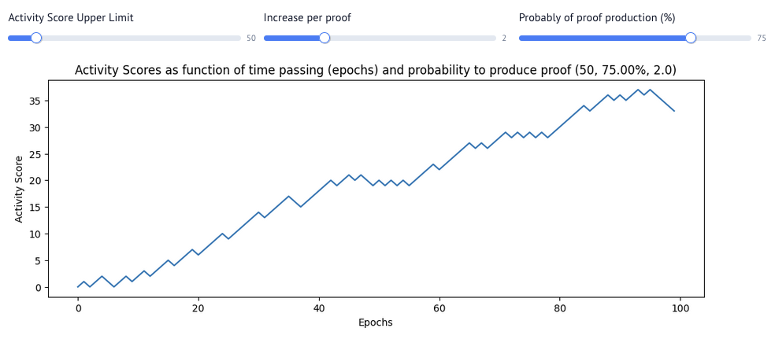

# Prover Reward Boost Design Document

- Owner: @LHerskind
- Approvers:
  - @just-mitch
  - @Maddiaa0
  - @aminsammara
  - @joeandrews
- Target DD Approval Date: 2025-06-10
- Target Project Delivery Date: 2025-06-13

## Executive Summary

To incentivize consistent proving, we "boost" the share of rewards going to consistent provers based on their activity.

Basic requirement: Provers that consistently prove blocks should be rewarded more than provers that sporadically prove blocks.

## Timeline

- Update the contracts: 1-2 days
- @aminsammara and @joeandrews chooses params: 🤷

Total: 2 days + 🤷

## Introduction

We want people to prove consistently.
This work pay people proving consistently a bigger share of rewards.

Assumes that there will be more than 1 prover.
Otherwise the share don't matter.

## Interface

No user will interact directly with this, it is merely an accounting update behind the scenes.

## Implementation

Please consult the interactive `marimo` notebook for this, that is probably much simpler. Same text as here is also in there.

Currently a prover have `1` share of the reward.
To support boosting, we alter this such that a prover will instead have that their number of shares depends on their prior actions.

To do so, we will first introduce an "activity score" and then a method to derive the number of shares from that it.

Every `prover` will have some value `x` that is stored for them specifically reflecting their recent activity.
The value is computed fairly simply.
Every time an epoch passes, the activity score goes down by 1.
Every block the prover produces increases their value with 2.
The value is bounded to be between `0` and `upper`.

We use `upper` to limit the score in order to constrain how long a boost is maintained after the actor stops proving.

Beware that this structure means that the score WILL go down, if there is nothing to prove.
This is acknowledged, since supporting that makes the accounting much simpler and cheaper, as we only need to store a score and a time of that score to be able to derive the current score.

The score and timestamp is then updated at proof submission.



By then feeding this activity value as $x$ into the following formula, we compute their share.

$$
y(x) = \begin{cases}
	\max(k - a(x - h)^2, m), & \text{if } x \leq h \\
	k, & \text{if } x > h
\end{cases}
$$

In here, $k$ acts as the "max" boost that can be hit, and $h$ the score at which this is hit. The value $m$ is the default multiplier.

Note, that setting $h$ to be equal the `upper` limit that we supplied earlier is a way to have instant decay. As $h$ becomes equal to `upper` note that we cannot hit the $x > h$ case anymore.


---

The practical implementation will update the `SubEpochRewards` struct, `EpochProofLib::handleRewardsAndFees` and `RewardLib::claimProverRewards`.

```solidity
// Old
struct SubEpochRewards {
  uint256 summedCount;
  mapping(address prover => bool proofSubmitted) hasSubmitted;
}

// New
struct SubEpochRewards {
  uint256 summedShares;
  mapping(address prover => uint256 shares) proverShares;
}
```

`EpochProofLib::handleRewardsAndFees`:
Instead of storing `bool` with `hasSubmitted` we store the `proverShares`, and increase the `summedShares` instead `summedCount`.

`RewardLib::claimProverRewards`:
Hence we don't have `hasSubmitted` anymore, we will simply alter the accumulation as:

```solidity
SubEpochRewards storage es = e.subEpoch[e.longestProvenLength];
accumulatedRewards += (es.proverShares[msg.sender] * e.rewards / es.summedShares);
```

## Change Set

Fill in bullets for each area that will be affected by this change.

- [ ] Cryptography
- [ ] Noir
- [ ] Aztec.js
- [ ] PXE
- [ ] Aztec.nr
- [ ] Enshrined L2 Contracts
- [ ] Sequencer
- [ ] AVM
- [ ] Public Kernel Circuits
- [ ] Rollup Circuits
- [x] L1 Contracts
- [ ] Prover
- [x] Economics
- [ ] P2P Network
- [ ] DevOps

## Test Plan

The `marimo` doc is generating test data that can be used to ensure that the math makes sense.

## Documentation Plan

You are looking at it.

## Disclaimer

The information set out herein is for discussion purposes only and does not represent any binding indication or commitment by Aztec Labs and its employees to take any action whatsoever, including relating to the structure and/or any potential operation of the Aztec protocol or the protocol roadmap. In particular: (i) nothing in these projects, requests, or comments is intended to create any contractual or other form of legal relationship with Aztec Labs or third parties who engage with this AztecProtocol GitHub account (including, without limitation, by responding to a conversation or submitting comments) (ii) by engaging with any conversation or request, the relevant persons are consenting to Aztec Labs’ use and publication of such engagement and related information on an open-source basis (and agree that Aztec Labs will not treat such engagement and related information as confidential), and (iii) Aztec Labs is not under any duty to consider any or all engagements, and that consideration of such engagements and any decision to award grants or other rewards for any such engagement is entirely at Aztec Labs’ sole discretion. Please do not rely on any information on this account for any purpose - the development, release, and timing of any products, features, or functionality remains subject to change and is currently entirely hypothetical. Nothing on this account should be treated as an offer to sell any security or any other asset by Aztec Labs or its affiliates, and you should not rely on any content or comments for advice of any kind, including legal, investment, financial, tax, or other professional advice.
