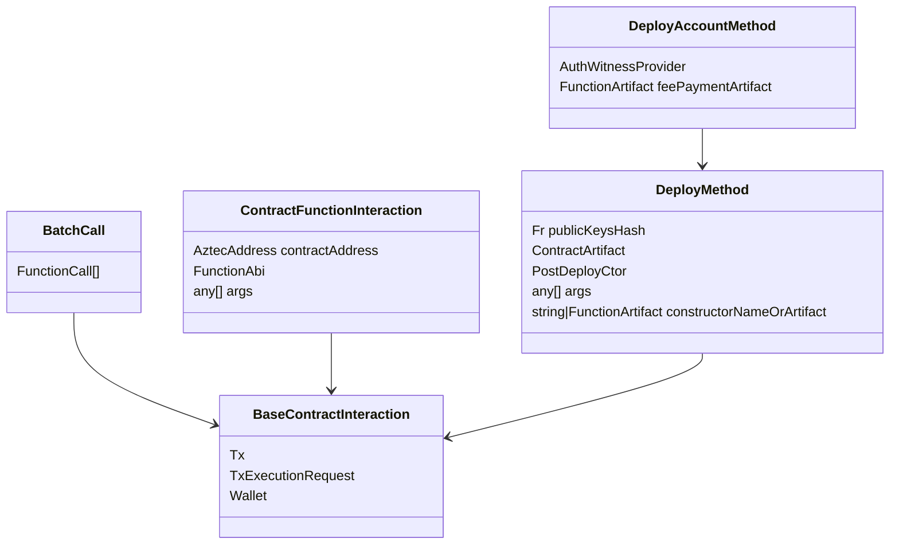

|                      |                                   |
| -------------------- | --------------------------------- |
| Issue                | [title](github.com/link/to/issue) |
| Owners               | @you                              |
| Approvers            | @alice @bob                       |
| Target Approval Date | YYYY-MM-DD                        |


## Executive Summary

This is a refactor of the `BaseContractInteraction` class to simplify the API and improve the user (developer) experience.

The refactored approach mimics Viem's API, with some enhancements and modifications to fit our needs.

Example:
```ts

// Create a new schnorr account

const signingPrivateKey = GrumpkinPrivateKey.random();
const signingPublicKey = new Schnorr().computePublicKey(alice.signingPrivateKey); 

const alice = {
  signingPrivateKey,
  signingPublicKey,
  secretKey: Fr.random(),
}

const aliceDeploymentOptions = {
  constructorArtifact: 'constructor',
  constructorArgs: {
    signing_pub_key_x: alice.signingPublicKey.x,
    signing_pub_key_y: alice.signingPublicKey.y
  },
  salt: 42,
  publicKeysHash: deriveKeys(alice.secretKey).publicKeys.hash(),
  deployer: AztecAddress.ZERO
}

const aliceContractInstance = getContractInstanceFromDeployParams(
  SchnorrAccountContract.artifact, 
  aliceDeploymentOptions
);

const aliceCompleteAddress = CompleteAddress.fromSecretKeyAndInstance(alice.secretKey, aliceContractInstance);

await pxe.registerAccount(
  alice.secretKey,
  aliceCompleteAddress.partialAddress
);
await waitForAccountSynch(pxe, aliceCompleteAddress);

const aliceAuthWitProvider = new SchnorrAuthWitnessProvider(alice.signingPrivateKey)
const nodeInfo = await pxe.getNodeInfo();
const aliceInterface = new DefaultAccountInterface(aliceAuthWitProvider, aliceCompleteAddress, nodeInfo)
const aliceWallet = new AccountWallet(pxe, aliceInterface);

const paymentMethod = new PrivateFeePaymentMethod(bananaCoin.address, bananaFPC.address, aliceWallet, refundSecret);

await aliceContractInstance.send.constructor({
  wallet: aliceWallet,
  args: aliceDeploymentOptions.constructorArgs,
  paymentMethod
}).wait();


// Deploy BananaCoin as an instance of TokenContract

const bananaCoinDeploymentOptions = {
  constructorArtifact: 'constructor',
  constructorArgs: {
    admin: aliceWallet.getAddress(),
    name: 'BananaCoin',
    symbol: 'BC',
    decimals: 18
  },
  salt: 43,
  publicKeysHash: Fr.ZERO,
  deployer: aliceWallet.getAddress()
}

const bananaCoinInstance = getContractInstanceFromDeployParams(
  TokenContract.artifact,
  bananaCoinDeploymentOptions
);


// puts the artifact and instance in the PXE
await aliceWallet.registerContract({
  artifact: TokenContract.artifact,
  instance: bananaCoinInstance
});

// create function call to deploy the contract class
// will consume the capsule when called
const tokenContractClass = getContractClassFromArtifact(TokenContract.artifact);
const registerer = getRegistererContract();
const registerBCClassFnCall = registerer.prepare.register({
  // this is an instance of the contract class
  // so the address is stubbed in
  args: {
    artifact_hash: tokenContractClass.artifactHash,
    private_functions_root: tokenContractClass.privateFunctionsRoot,
    public_bytecode_commitment: tokenContractClass.publicBytecodeCommitment
  },
});

// create function call to deploy the contract instance
const deployerContract = getDeployerContract();
const deployBCInstanceFnCall = deployerContract.prepare.deploy({
  args: {
    salt: bananaCoinInstance.salt,
    contract_class_id: bananaCoinInstance.contractClassId,
    initialization_hash: bananaCoinInstance.initializationHash,
    public_keys_hash: bananaCoinInstance.publicKeysHash,
    universal_deploy: bananaCoinInstance.deployer.isZero(),
  }
});

// create function call to initialize the contract
const initializeBCFnCall = bananaCoinInstance.prepare.constructor({
  args: bananaCoinDeploymentOptions.constructorArgs
});

// prepare a capsule for contract class registration
const encodedBytecode = bufferAsFields(
  bananaCoinClass.packedBytecode,
  MAX_PACKED_PUBLIC_BYTECODE_SIZE_IN_FIELDS
);

// simulate to get the gas estimation
const { request: deployTokenRequest } = await aliceWallet.multiCall.simulate({
  calls: [registerBCClassFnCall, deployBCInstanceFnCall, initializeBCFnCall],
  capsules: [encodedBytecode],
  paymentMethod
})

await aliceWallet.multiCall.send(deployTokenRequest).wait();


// Now use the contract
const { result: privateBalance } = await bananaCoinInstance.simulate.balance_of_private({
  wallet: aliceWallet,
  args: {owner: aliceWallet.getAddress()},
});

const bobAddress = AztecAddress.random();

// Gas estimation is done automatically and set on the request object
const { request: transferRequest } = await bananaCoinInstance.simulate.transfer({
  wallet: aliceWallet,
  args: { 
    from: aliceAddress,
    to: bobAddress,
    value: privateBalance,
    nonce: 0n
  },
  paymentMethod
});

// Proving is done automatically since `request` wouldn't have it set after just simulation.
// Users can prove explicitly ahead of time with 
// const { request: requestWithProof } = await bananaCoin.prove.transfer(request);
// await bananaCoin.send.transfer(requestWithProof).wait();
await bananaCoinInstance.send.transfer(transferRequest).wait();
```

## Introduction

Developers and users have to think too hard when submitting transactions. 

This is due to a wonky API when interacting with the `BaseContractInterface`, and people need to know what's happening under the hood.

Further, it is presently difficult to estimate the gas cost of a transaction.

### The old UML




### What was really bad about the old API?

The `BaseContractInteraction` was an abstract base class, *with non-private state*, which its subclasses modified.

In the base class needed to perform outrageous defensive programming, such as:
```ts
  // Ensure we don't accidentally use a version of tx request that has estimateGas set to true, leading to an infinite loop.
  this.txRequest = undefined;
  const txRequest = await this.create({
    fee: { paymentMethod, gasSettings: GasSettings.default() },
    estimateGas: false,
  });
  // Ensure we don't accidentally cache a version of tx request that has estimateGas forcefully set to false.
  this.txRequest = undefined;
```
Reasoning about the state became too difficult, especially when it came to performing accurate gas estimations.

### How are we fixing it?

Whenever we called `contract.methods.someFunction`, we were getting a `ContractFunctionInteraction` object, which was a subclass of `BaseContractInterface`,
but we didn't know what we were going to do with it yet, e.g. simulate, prove, or send.

So, we're changing the generated typescript interfaces to contracts to read like `contract.{action}.someFunction` where `action` is one of `prepare`, `simulate`, `prove`, or `send`.

These functions will always accept `ContractFunctionArgs` which will be converted into a `TxExecutionRequest`.


By changing the 


Old way:
```ts
const aliceAddress = AztecAddress.random();
const privateBalance = await bananaCoin.methods.balance_of_private(aliceAddress).simulate();

const bobAddress = AztecAddress.random();
const paymentMethod = new PrivateFeePaymentMethod(bananaCoin.address, bananaFPC.address, aliceWallet, refundSecret);
const interaction = await bananaCoin.methods
  .transfer(aliceAddress, bobAddress, privateBalance, 0n)
  .send({
    fee: {
      gasSettings,
      paymentMethod 
    },
  })
  .wait();
```

## Interface

The key operations we want to perform are:
- Producing a valid Tx Request
- Simulating a Tx Request
  - This has private and public variants
- Estimating the gas cost of a Tx Request
- Proving a Tx Request
- Submitting a Tx Request

Currently, the `BaseContractInterface`
```ts
/**
 * Represents options for calling a (constrained) function in a contract.
 * Allows the user to specify the sender address and nonce for a transaction.
 */
export type SendMethodOptions = {
  /** Wether to skip the simulation of the public part of the transaction. */
  skipPublicSimulation?: boolean;
  /** The fee options for the transaction. */
  fee?: FeeOptions;
  /** Whether to run an initial simulation of the tx with high gas limit to figure out actual gas settings (will default to true later down the road). */
  estimateGas?: boolean;
};


export abstract class BaseContractInteraction {
  private tx?: Tx;
  private txRequest?: TxExecutionRequest;

  /**
   * Create a transaction execution request ready to be simulated.
   * @param options - An optional object containing additional configuration for the transaction.
   * @returns A transaction execution request.
   */
  public abstract create(options?: SendMethodOptions): Promise<TxExecutionRequest>;

  public async prove(options: SendMethodOptions = {}): Promise<Tx> {
    const txRequest = this.txRequest ?? (await this.create(options));
    this.tx = await this.wallet.proveTx(txRequest, !options.skipPublicSimulation);
    return this.tx;
  }

    public async estimateGas(
    paymentMethod: FeePaymentMethod,
  ): Promise<Pick<GasSettings, 'gasLimits' | 'teardownGasLimits'>> {
    // REFACTOR: both `this.txRequest = undefined` below are horrible, we should not be caching stuff that doesn't need to be.
    // This also hints at a weird interface for create/request/estimate/send etc.


    const simulationResult = await this.wallet.simulateTx(txRequest, true);
    const { totalGas: gasLimits, teardownGas: teardownGasLimits } = getGasLimits(simulationResult, Gas.empty());
    return { gasLimits, teardownGasLimits };
  }
}
```

Then for subclasses we have something like:
```ts
export class ContractFunctionInteraction extends BaseContractInteraction {

  constructor(
    wallet: Wallet,
    protected contractAddress: AztecAddress,
    protected functionDao: FunctionAbi,
    protected args: any[],
  ) {
    super(wallet);
    if (args.some(arg => arg === undefined || arg === null)) {
      throw new Error('All function interaction arguments must be defined and not null. Received: ' + args);
    }
  }


  /**
   * Create a transaction execution request that represents this call, encoded and authenticated by the
   * user's wallet, ready to be simulated.
   * @param opts - An optional object containing additional configuration for the transaction.
   * @returns A Promise that resolves to a transaction instance.
   */
  public async create(opts?: SendMethodOptions): Promise<TxExecutionRequest> {
    if (this.functionDao.functionType === FunctionType.UNCONSTRAINED) {
      throw new Error("Can't call `create` on an unconstrained function.");
    }
    if (!this.txRequest) {
      const calls = [this.request()];
      const fee = opts?.estimateGas ? await this.getFeeOptionsFromEstimatedGas({ calls, fee: opts?.fee }) : opts?.fee;
      this.txRequest = await this.wallet.createTxExecutionRequest({ calls, fee });
    }
    return this.txRequest;
  }

    /**
   * Simulate a transaction and get its return values
   * Differs from prove in a few important ways:
   * 1. It returns the values of the function execution
   * 2. It supports `unconstrained`, `private` and `public` functions
   *
   * @param options - An optional object containing additional configuration for the transaction.
   * @returns The result of the transaction as returned by the contract function.
   */
  public async simulate(options: SimulateMethodOptions = {}): Promise<any> {
    if (this.functionDao.functionType == FunctionType.UNCONSTRAINED) {
      return this.wallet.simulateUnconstrained(this.functionDao.name, this.args, this.contractAddress, options?.from);
    }

    const txRequest = await this.create();
    const simulatedTx = await this.wallet.simulateTx(txRequest, true, options?.from);

    // As account entrypoints are private, for private functions we retrieve the return values from the first nested call
    // since we're interested in the first set of values AFTER the account entrypoint
    // For public functions we retrieve the first values directly from the public output.
    const rawReturnValues =
      this.functionDao.functionType == FunctionType.PRIVATE
        ? simulatedTx.privateReturnValues?.nested?.[0].values
        : simulatedTx.publicOutput?.publicReturnValues?.[0].values;

    return rawReturnValues ? decodeReturnValues(this.functionDao.returnTypes, rawReturnValues) : [];
  }
}
  
```

```ts
export class DeployMethod<TContract extends ContractBase = Contract> extends BaseContractInteraction {
  private instance?: ContractInstanceWithAddress = undefined;

  /** Constructor function to call. */
  private constructorArtifact: FunctionArtifact | undefined;

  /** Cached call to request() */
  private functionCalls?: ExecutionRequestInit;

    constructor(
    private publicKeysHash: Fr,
    wallet: Wallet,
    private artifact: ContractArtifact,
    private postDeployCtor: (address: AztecAddress, wallet: Wallet) => Promise<TContract>,
    private args: any[] = [],
    constructorNameOrArtifact?: string | FunctionArtifact,
  ) {
    super(wallet);
    this.constructorArtifact = getInitializer(artifact, constructorNameOrArtifact);
  }

    /**
   * Create a contract deployment transaction, given the deployment options.
   * This function internally calls `request()` and `sign()` methods to prepare
   * the transaction for deployment. The resulting signed transaction can be
   * later sent using the `send()` method.
   *
   * @param options - An object containing optional deployment settings, contractAddressSalt, and from.
   * @returns A Promise resolving to an object containing the signed transaction data and other relevant information.
   */
  public override async create(options: DeployOptions = {}): Promise<TxExecutionRequest> {
    if (!this.txRequest) {
      this.txRequest = await this.wallet.createTxExecutionRequest(await this.request(options));
    }
    return this.txRequest;
  }


    // REFACTOR: Having a `request` method with different semantics than the ones in the other
  // derived ContractInteractions is confusing. We should unify the flow of all ContractInteractions.

  /**
   * Returns an array of function calls that represent this operation. Useful as a building
   * block for constructing batch requests.
   * @param options - Deployment options.
   * @returns An array of function calls.
   * @remarks This method does not have the same return type as the `request` in the ContractInteraction object,
   * it returns a promise for an array instead of a function call directly.
   */
  public async request(options: DeployOptions = {}): Promise<ExecutionRequestInit> {
    if (!this.functionCalls) {
      // TODO: Should we add the contracts to the DB here, or once the tx has been sent or mined?
      // Note that we need to run this registerContract here so it's available when computeFeeOptionsFromEstimatedGas
      // runs, since it needs the contract to have been registered in order to estimate gas for its initialization,
      // in case the initializer is public. This hints at the need of having "transient" contracts scoped to a
      // simulation, so we can run the simulation with a set of contracts, but only "commit" them to the wallet
      // once this tx has gone through.
      await this.wallet.registerContract({ artifact: this.artifact, instance: this.getInstance(options) });

      const deployment = await this.getDeploymentFunctionCalls(options);
      const bootstrap = await this.getInitializeFunctionCalls(options);

      if (deployment.calls.length + bootstrap.calls.length === 0) {
        throw new Error(`No function calls needed to deploy contract ${this.artifact.name}`);
      }

      const request = {
        calls: [...deployment.calls, ...bootstrap.calls],
        authWitnesses: [...(deployment.authWitnesses ?? []), ...(bootstrap.authWitnesses ?? [])],
        packedArguments: [...(deployment.packedArguments ?? []), ...(bootstrap.packedArguments ?? [])],
        fee: options.fee,
      };

      if (options.estimateGas) {
        // Why do we call this seemingly idempotent getter method here, without using its return value?
        // This call pushes a capsule required for contract class registration under the hood. And since
        // capsules are a stack, when we run the simulation for estimating gas, we consume the capsule
        // that was meant for the actual call. So we need to push it again here. Hopefully this design
        // will go away soon.
        await this.getDeploymentFunctionCalls(options);
        request.fee = await this.getFeeOptionsFromEstimatedGas(request);
      }

      this.functionCalls = request;
    }

    return this.functionCalls;
  }

    /**
   * Returns calls for registration of the class and deployment of the instance, depending on the provided options.
   * @param options - Deployment options.
   * @returns A function call array with potentially requests to the class registerer and instance deployer.
   */
  protected async getDeploymentFunctionCalls(options: DeployOptions = {}): Promise<ExecutionRequestInit> {
    const calls: FunctionCall[] = [];

    // Set contract instance object so it's available for populating the DeploySendTx object
    const instance = this.getInstance(options);

    // Obtain contract class from artifact and check it matches the reported one by the instance.
    // TODO(@spalladino): We're unnecessarily calculating the contract class multiple times here.
    const contractClass = getContractClassFromArtifact(this.artifact);
    if (!instance.contractClassId.equals(contractClass.id)) {
      throw new Error(
        `Contract class mismatch when deploying contract: got ${instance.contractClassId.toString()} from instance and ${contractClass.id.toString()} from artifact`,
      );
    }

    // Register the contract class if it hasn't been published already.
    if (!options.skipClassRegistration) {
      if (await this.wallet.isContractClassPubliclyRegistered(contractClass.id)) {
        this.log.debug(
          `Skipping registration of already registered contract class ${contractClass.id.toString()} for ${instance.address.toString()}`,
        );
      } else {
        this.log.info(
          `Creating request for registering contract class ${contractClass.id.toString()} as part of deployment for ${instance.address.toString()}`,
        );
        calls.push((await registerContractClass(this.wallet, this.artifact)).request());
      }
    }

    // Deploy the contract via the instance deployer.
    if (!options.skipPublicDeployment) {
      calls.push(deployInstance(this.wallet, instance).request());
    }

    return {
      calls,
    };
  }

  /**
   * Returns the calls necessary to initialize the contract.
   * @param options - Deployment options.
   * @returns - An array of function calls.
   */
  protected getInitializeFunctionCalls(options: DeployOptions): Promise<ExecutionRequestInit> {
    const { address } = this.getInstance(options);
    const calls: FunctionCall[] = [];
    if (this.constructorArtifact && !options.skipInitialization) {
      const constructorCall = new ContractFunctionInteraction(
        this.wallet,
        address,
        this.constructorArtifact,
        this.args,
      );
      calls.push(constructorCall.request());
    }
    return Promise.resolve({
      calls,
    });
  }

  /**
   * Send the contract deployment transaction using the provided options.
   * This function extends the 'send' method from the ContractFunctionInteraction class,
   * allowing us to send a transaction specifically for contract deployment.
   *
   * @param options - An object containing various deployment options such as contractAddressSalt and from.
   * @returns A SentTx object that returns the receipt and the deployed contract instance.
   */
  public override send(options: DeployOptions = {}): DeploySentTx<TContract> {
    const txHashPromise = super.send(options).getTxHash();
    const instance = this.getInstance(options);
    this.log.debug(
      `Sent deployment tx of ${this.artifact.name} contract with deployment address ${instance.address.toString()}`,
    );
    return new DeploySentTx(this.wallet, txHashPromise, this.postDeployCtor, instance);
  }

  /**
   * Builds the contract instance to be deployed and returns it.
   *
   * @param options - An object containing various deployment options.
   * @returns An instance object.
   */
  public getInstance(options: DeployOptions = {}): ContractInstanceWithAddress {
    if (!this.instance) {
      this.instance = getContractInstanceFromDeployParams(this.artifact, {
        constructorArgs: this.args,
        salt: options.contractAddressSalt,
        publicKeysHash: this.publicKeysHash,
        constructorArtifact: this.constructorArtifact,
        deployer: options.universalDeploy ? AztecAddress.ZERO : this.wallet.getAddress(),
      });
    }
    return this.instance;
  }

  /**
   * Prove the request.
   * @param options - Deployment options.
   * @returns The proven tx.
   */
  public override prove(options: DeployOptions): Promise<Tx> {
    return super.prove(options);
  }

  /**
   * Estimates gas cost for this deployment operation.
   * @param options - Options.
   */
  public override estimateGas(paymentMethod?: FeePaymentMethod) {
    return super.estimateGas(paymentMethod ?? new NativeFeePaymentMethod(this.wallet.getAddress()));
  }

  /** Return this deployment address. */
  public get address() {
    return this.instance?.address;
  }

  /** Returns the partial address for this deployment. */
  public get partialAddress() {
    return this.instance && computePartialAddress(this.instance);
  }

}

```


Then we have further specialization:
```ts
export class DeployAccountMethod extends DeployMethod {
  #authWitnessProvider: AuthWitnessProvider;
  #feePaymentArtifact: FunctionArtifact | undefined;

  constructor(
    authWitnessProvider: AuthWitnessProvider,
    publicKeysHash: Fr,
    wallet: Wallet,
    artifact: ContractArtifact,
    args: any[] = [],
    constructorNameOrArtifact?: string | FunctionArtifact,
    feePaymentNameOrArtifact?: string | FunctionArtifact,
  ) {
    super(
      publicKeysHash,
      wallet,
      artifact,
      (address, wallet) => Contract.at(address, artifact, wallet),
      args,
      constructorNameOrArtifact,
    );

    this.#authWitnessProvider = authWitnessProvider;
    this.#feePaymentArtifact =
      typeof feePaymentNameOrArtifact === 'string'
        ? getFunctionArtifact(artifact, feePaymentNameOrArtifact)
        : feePaymentNameOrArtifact;
  }

  protected override async getInitializeFunctionCalls(options: DeployOptions): Promise<ExecutionRequestInit> {
    const exec = await super.getInitializeFunctionCalls(options);

    if (options.fee && this.#feePaymentArtifact) {
      const { address } = this.getInstance();
      const emptyAppPayload = EntrypointPayload.fromAppExecution([]);
      const feePayload = await EntrypointPayload.fromFeeOptions(address, options?.fee);

      exec.calls.push({
        name: this.#feePaymentArtifact.name,
        to: address,
        args: encodeArguments(this.#feePaymentArtifact, [emptyAppPayload, feePayload]),
        selector: FunctionSelector.fromNameAndParameters(
          this.#feePaymentArtifact.name,
          this.#feePaymentArtifact.parameters,
        ),
        type: this.#feePaymentArtifact.functionType,
        isStatic: this.#feePaymentArtifact.isStatic,
        returnTypes: this.#feePaymentArtifact.returnTypes,
      });

      exec.authWitnesses ??= [];
      exec.packedArguments ??= [];

      exec.authWitnesses.push(await this.#authWitnessProvider.createAuthWit(emptyAppPayload.hash()));
      exec.authWitnesses.push(await this.#authWitnessProvider.createAuthWit(feePayload.hash()));
      exec.packedArguments.push(...emptyAppPayload.packedArguments);
      exec.packedArguments.push(...feePayload.packedArguments);
    }

    return exec;
  }
}
```


## Implementation

Delve into the specifics of the design. Include diagrams, code snippets, API descriptions, and database schema changes as necessary. Highlight any significant changes to the existing architecture or interfaces.

Discuss any alternative or rejected solutions.

## Change Set

Fill in bullets for each area that will be affected by this change.

- [ ] L1 Contracts
- [ ] Enshrined L2 Contracts
- [ ] Private Kernel Circuits
- [ ] Public Kernel Circuits
- [ ] Rollup Circuits
- [ ] Aztec.nr
- [ ] Noir
- [ ] AVM
- [ ] Sequencer
- [ ] Fees
- [ ] P2P Network
- [ ] Cryptography
- [ ] DevOps

## Test Plan

Outline what unit and e2e tests will be written. Describe the logic they cover and any mock objects used.

## Documentation Plan

Identify changes or additions to the user documentation or protocol spec.


## Rejection Reason

If the design is rejected, include a brief explanation of why.

## Abandonment Reason

If the design is abandoned mid-implementation, include a brief explanation of why.

## Implementation Deviations

If the design is implemented, include a brief explanation of deviations to the original design.
