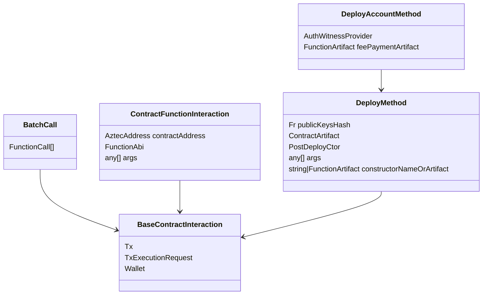

|                      |                                   |
| -------------------- | --------------------------------- |
| Issue                | [title](github.com/link/to/issue) |
| Owners               | @you                              |
| Approvers            | @alice @bob                       |
| Target Approval Date | YYYY-MM-DD                        |


## Executive Summary

This is a refactor of the `BaseContractInteraction` class to simplify the API and improve the user (developer) experience.

The refactored approach mimics Viem's API, with some enhancements and modifications to fit our needs.

### Account Creation

```ts
const pxe = await createCompatibleClient(rpcUrl, debugLogger);
const secretKey = Fr.random();
const salt = 42;

// Returns the wallet and deployment options. 
// Does not modify PXE state.
const { wallet: aliceWallet, deploymentOptions } = await getSchnorrWallet(pxe, secretKey, salt);

// Register the account in PXE, and wait for it to sync.
await aliceWallet.registerAccountInPXE({ sync: true });

// No wallet or secret passed to FPC
const paymentMethod = new PrivateFeePaymentMethod(someCoin.address, someFPC.address);

// Changes to the PXE (e.g. notes, nullifiers, auth wits, contract deployments, capsules) are not persisted.
const { request: deployAliceAccountRequest } = await aliceWallet.deploy.simulate({
  artifact: SchnorrAccountContract.artifact,
  deploymentOptions,
  paymentMethod,
  skipClassRegistration: true, 
  skipPublicDeployment: true,
  skipInitialization: false, 
  // gasSettings: undefined => automatic gas estimation. the returned `request` will have the gasSettings set.
});

const { contractInstance } = await aliceWallet.deploy.send(deployAliceAccountRequest).wait();

debugLogger(`Alice's account deployed at ${contractInstance.address.toString()}`);

```

### Deploy and Use Contract

```ts
const bananaCoinDeploymentOptions = {
  constructorArtifact: 'constructor',
  constructorArgs: {
    admin: aliceWallet.getAddress(),
    name: 'BananaCoin',
    symbol: 'BC',
    decimals: 18
  },
  salt: 43,
  publicKeysHash: Fr.ZERO,
  deployer: aliceWallet.getAddress()
}

const { request: deployTokenRequest } = await aliceWallet.deploy.simulate({
  artifact: TokenContract.artifact,
  deploymentOptions: bananaCoinDeploymentOptions,
  skipClassRegistration: false, 
  skipPublicDeployment: false, 
  skipInitialization: false,
  paymentMethod
})

const { contractInstance: bananaCoinInstance } = await aliceWallet.deploy.send(deployTokenRequest).wait();

const { result: privateBalance } = await aliceWallet.simulate({
  contractInstance: bananaCoinInstance,
  functionName: 'balance_of_private'
  args: {owner: aliceWallet.getAddress()},
});


const { request: transferRequest } = await aliceWallet.simulate({
  contractInstance: bananaCoinInstance,
  functionName: 'transfer',
  args: { 
    from: aliceAddress,
    to: bobAddress,
    value: privateBalance,
    nonce: 0n
  },
  paymentMethod,
});


// Proving is done automatically since `request` wouldn't have it set after just simulation.
// Users can prove explicitly ahead of time with 
// const { request: requestWithProof } = await aliceWallet.prove(request);
// await aliceWallet.send(requestWithProof).wait();
await aliceWallet.send(transferRequest).wait();

```

### Scoping Instances

A bit of a "nice to have".

```ts
const aliceBananaCoinInstance = aliceWallet.useContractInstanceAt(TokenContract.artifact, bananaCoinInstance.address);
const {result: privateBalance} = await aliceBananaCoinInstance.simulate.balance_of_private({
  args: {owner: aliceWallet.getAddress()},
});
```


## Introduction

Developers and users have to think too hard when deploying accounts and submitting transactions.

This is due in part to holding mutable state in the `BaseContractInteraction` class, which is a base class for all contract interactions: 
it has multiple subclasses that mutate the state, so it is hard to know what has been set. 

For example, the current attempt to estimate gas has a section that reads:
```ts
  // REFACTOR: both `this.txRequest = undefined` below are horrible, we should not be caching stuff that doesn't need to be.
  // This also hints at a weird interface for create/request/estimate/send etc.

  // Ensure we don't accidentally use a version of tx request that has estimateGas set to true, leading to an infinite loop.
  this.txRequest = undefined;
  const txRequest = await this.create({
    fee: { paymentMethod, gasSettings: GasSettings.default() },
    estimateGas: false,
  });
  // Ensure we don't accidentally cache a version of tx request that has estimateGas forcefully set to false.
  this.txRequest = undefined;
```

This push for a refactor was motivated by the realization that we need a more sophisticated gas estimation mechanism where we first simulate without the FPC to get the gas cost of app logic, then plug that into a simulation with the FPC. 

Doing this well also requires that simulations to be idempotent: all changes to the PXE including notes, nullifiers, auth wits, contract deployments, capsules, etc. should not be persisted until the user explicitly sends the transaction.

This would fix comments seen in the `DeployMethod` class like:
```ts
// TODO: Should we add the contracts to the DB here, or once the tx has been sent or mined?
// Note that we need to run this registerContract here so it's available when computeFeeOptionsFromEstimatedGas
// runs, since it needs the contract to have been registered in order to estimate gas for its initialization,
// in case the initializer is public. This hints at the need of having "transient" contracts scoped to a
// simulation, so we can run the simulation with a set of contracts, but only "commit" them to the wallet
// once this tx has gone through.
await this.wallet.registerContract({ artifact: this.artifact, instance: this.getInstance(options) });

// ...

if (options.estimateGas) {
  // Why do we call this seemingly idempotent getter method here, without using its return value?
  // This call pushes a capsule required for contract class registration under the hood. And since
  // capsules are a stack, when we run the simulation for estimating gas, we consume the capsule
  // that was meant for the actual call. So we need to push it again here. Hopefully this design
  // will go away soon.
  await this.getDeploymentFunctionCalls(options);
  request.fee = await this.getFeeOptionsFromEstimatedGas(request);
}
```

We also want to unify the mechanism for creating, simulating, proving, and sending transactions, regardless of whether they are for deploying a contract, calling a function, or deploying an account.

This would clear up concerns like:

> // REFACTOR: Having a `request` method with different semantics than the ones in the other
  // derived ContractInteractions is confusing. We should unify the flow of all ContractInteractions.


### The old UML




## Interface

The key operations we want to perform are:
- Producing a valid Tx Request
- Simulating a Tx Request
- Estimating the gas cost of a Tx Request
- Proving a Tx Request
- Submitting a Tx Request

These operations should be accessible from a `Wallet`, which will generally be `Schnorr` or `Signerless`. 

This is analogous to `viem` having a `walletClient` and a `publicClient`.


### What is a Wallet?

```ts
export type Wallet = AccountInterface & PXE & AccountKeyRotationInterface;

export interface AccountInterface extends AuthWitnessProvider, EntrypointInterface {
  /** Returns the complete address for this account. */
  getCompleteAddress(): CompleteAddress;

  /** Returns the address for this account. */
  getAddress(): AztecAddress;

  /** Returns the chain id for this account */
  getChainId(): Fr;

  /** Returns the rollup version for this account */
  getVersion(): Fr;
}

export interface AuthWitnessProvider {
  createAuthWit(
    messageHashOrIntent:
      | Fr
      | Buffer
      | {
          /** The caller to approve  */
          caller: AztecAddress;
          /** The action to approve */
          action: ContractFunctionInteraction | FunctionCall;
          /** The chain id to approve */
          chainId?: Fr;
          /** The version to approve  */
          version?: Fr;
        },
  ): Promise<AuthWitness>;
}

export class TxExecutionRequest {
  constructor(
    // All these are the same:
    public origin: AztecAddress,
    public functionSelector: FunctionSelector,
    public firstCallArgsHash: Fr,
    public txContext: TxContext,
    public argsOfCalls: PackedValues[],
    public authWitnesses: AuthWitness[],
    // Add:
    /**
     * Transient capsules needed for this execution.
     */
    public capsules: Fr[][],
  ) {}
  // ...
}

export type TxExecutionRequestEntrypoint = Pick<TxExecutionRequest,
  | 'functionSelector'
  | 'firstCallArgsHash'
  | 'argsOfCalls'
  | 'authWitnesses' >

export interface ExecutionRequestInit {
  contractInstance: ContractInstanceWithAddress;
  functionName: string;
  args: any;
  paymentMethod?: FeePaymentMethod;
  contractArtifact?: ContractArtifact;
  functionAbi?: FunctionAbi;
  from?: AztecAddress;
  simulatePublicFunctions?: boolean;
}

export interface FeePaymentMethod {
  getSetup(gasSettings: GasSettings): Promise<{
    functionCalls: FunctionCall[],
    authWitnesses: AuthWitness[],
  }>;

  getEquivalentAztBalance(): Promise<Fr>;
}


export interface EntrypointInterface {
  createTxExecutionRequestEntrypoint(
    functionCalls: {
      appFunctionCalls: FunctionCall[];
      setupFunctionCalls: FunctionCall[];
    }, 
    authWitnessProvider: AuthWitnessProvider
  ): TxExecutionRequestEntrypoint;
}

```


## Implementation

### Drop `isFeePayer` from `FeeEntrypointPayload`


I think removing this makes the code simpler and more flexible: account contracts can just check if fee payer has been set and set it if not.

Concerned users can just inspect the simulation result to see if they are paying the fee.

Then we just have `EntrypointPayload` as a single, concrete class.

### Translating user requests to TxExecutionRequests

Consider that we have

```ts
const { request: transferRequest } = await aliceWallet.simulate({
  contractInstance: bananaCoinInstance,
  functionName: 'transfer',
  args: { 
    from: aliceAddress,
    to: bobAddress,
    value: privateBalance,
    nonce: 0n
  },
  paymentMethod
});
```

We need to ultimately get to a `TxExecutionRequest`.

There are a few key steps to get there. 

Assume we're dealing with schnorr.

#### Translate the `contractInstance`, `functionName` and `args` to a `FunctionCall`

Get the contract artifact out of the PXE using the contractInstance's contractClassId.

```ts

function findFunctionAbi(contractArtifact: ContractArtifact, functionName: string): FunctionAbi {
  const functionAbi = contractArtifact.abi.find((abi) => abi.name === functionName);
  if (!functionAbi) {
    throw new Error(`Function ${functionName} not found in contract artifact`);
  }
  return functionAbi;
}

function makeFunctionCall(
  functionAbi: FunctionAbi,
  instanceAddress: AztecAddress,
  args: any,
): FunctionCall {
  return FunctionCall.from({
    name: functionAbi.name,
    args: mapArgsObjectToArray(functionAbi.parameters, args),
    selector: FunctionSelector.fromNameAndParameters(functionAbi.name, functionAbi.parameters),
    type: functionAbi.functionType,
    to: instanceAddress,
    isStatic: functionAbi.isStatic,
    returnTypes: functionAbi.returnTypes,
  });
}


```

Note that since `gasSettings` was not provided, we need to determine them. 

In order to do this, we need to simulate the function call without the FPC to get the gas cost of the app logic, then simulate with the FPC to get the gas cost of the entire transaction.

#### Get the `TxExecutionRequestEntrypoint`

```ts
createTxExecutionRequestAccountEntrypoint(
    functionCalls: {
      appFunctionCalls: FunctionCall[];
      setupFunctionCalls: FunctionCall[];
    },
    authWitnessProvider: AuthWitnessProvider
  ): TxExecutionRequestEntrypoint {
  const appPayload = EntrypointPayload.fromFunctionCalls(functionCalls.appFunctionCalls);
  const setupPayload = EntrypointPayload.fromFunctionCalls(functionCalls.setupFunctionCalls);
  const abi = this.getEntrypointAbi();
  const entrypointPackedArgs = PackedValues.fromValues(encodeArguments(abi, [appPayload, setupPayload]));
  const firstCallArgsHash = entrypointPackedArgs.hash();
  const argsOfCalls = [...appPayload.packedArguments, ...feePayload.packedArguments, entrypointPackedArgs];
  const functionSelector = FunctionSelector.fromNameAndParameters(abi.name, abi.parameters);

  // Does not insert into PXE
  const appAuthWit = await authWitnessProvider.createAuthWit(appPayload.hash());
  const setupAuthWit = await authWitnessProvider.createAuthWit(setupPayload.hash());

  return {
    functionSelector,
    firstCallArgsHash,
    argsOfCalls,
    authWitnesses: [appAuthWit, setupAuthWit],
  }
}
```

#### Fill in the `TxExecutionRequest`

```ts
// within alice wallet.
// This is a low level call that requires us to have resolved the contract artifact and function abi.
// It is intentionally synchronous.
#getTxExecutionRequest(requestInit: ExecutionRequestInit) {
  if (!requestInit.functionAbi) {
    throw new Error('Function ABI must be provided');
  }

  const builder = new TxExecutionRequestBuilder();
  builder.setOrigin(this.getAddress());

  builder.setTxContext({
    chainId: this.getChainId(),
    version: this.getVersion(),
    gasSettings: requestInit.gasSettings,
  });

  const setup = requestInit.paymentMethod.getSetup(requestInit.gasSettings);

  builder.addAuthWitnesses(setup.authWitnesses);

  // Could also allow users to pass the artifact and short-circuit this
  const appFunctionCall = makeFunctionCall(
    requestInit.functionAbi,
    requestInit.contractInstance.address,
    requestInit.args
  );
  const entrypointInfo = createTxExecutionRequestAccountEntrypoint({
    appFunctionCalls: [appFunctionCall],
    setupFunctionCalls: setup.functionCalls,
  }, this.account);

  builder.setFunctionSelector(entrypointInfo.functionSelector);
  builder.setFirstCallArgsHash(entrypointInfo.firstCallArgsHash);
  builder.setArgsOfCalls(entrypointInfo.argsOfCalls);
  builder.addAuthWitnesses(entrypointInfo.authWitnesses);

  return builder.build();

}
```


#### Define top-level `Simulate`

```ts
// helpers somewhere

function decodeSimulatedTx(simulatedTx: SimulatedTx, functionAbi: FunctionAbi): DecodedReturn | [] {
  const rawReturnValues =
    functionAbi.functionType == FunctionType.PRIVATE
      ? simulatedTx.privateReturnValues?.nested?.[0].values
      : simulatedTx.publicOutput?.publicReturnValues?.[0].values;

  return rawReturnValues ? decodeReturnValues(functionAbi.returnTypes, rawReturnValues) : [];
}

// within alice wallet

async #simulateInner(requestInit: ExecutionRequestInit): {
  tx: SimulatedTx,
  result: DecodedReturn | [],
  request: ExecutionRequestInit,
} {
  const txExecutionRequest = this.getTxExecutionRequest(initRequest);
  // Call the PXE
  const simulatedTx = await this.simulateTx(txExecutionRequest, builder.simulatePublicFunctions, builder.from); 
  const decodedReturn = decodeSimulatedTx(simulatedTx, builder.functionAbi);
  return {
    tx: simulatedTx,
    result: decodedReturn,
    request: initRequest,
  };
}

async simulate(requestInit: ExecutionRequestInit):  {
  const builder = new ExecutionRequestInitBuilder(requestInit);

  if (!builder.functionAbi) {
    const contractArtifact = builder.contractArtifact ?? await pxe.getContractArtifact(builder.contractInstance.contractClassId);
    builder.setContractArtifact(contractArtifact);
    const functionAbi = findFunctionAbi(builder.contractArtifact, builder.functionName);
    builder.setFunctionAbi(functionAbi);
  }

  // If we're not paying, e.g. this is just a read that we don't intend to submit as a TX,
  // set the gas settings to default
  if (!builder.paymentMethod){
    builder.setFeePaymentMethod(new NoFeePaymentMethod());
    builder.setGasSettings(GasSettings.default());
    return this.#simulateInner(builder.build());
  }
  if (builder.gasSettings) {
    return this.#simulateInner(builder.build());
  }

  // If we're paying, e.g. in bananas, figure out how much AZT that is.
  // Note: this may call simulate recursively,
  // but it *should* set the payment method to a NoFeePaymentMethod or undefined.
  // perhaps we need a `read` method on the wallet.
  const equivalentAztBalance = await builder.paymentMethod.getEquivalentAztBalance();
  gasEstimator = GasEstimator.fromAztBalance(equivalentAztBalance);
  builder.setGasSettings(gasEstimator.proposeGasSettings());

  while (!gasEstimator.isConverged()) {
    const result = await this.#simulateInner(builder.build());
    gasEstimator.update(result);
    builder.setGasSettings(gasEstimator.proposeGasSettings());
  }

  return result;

}


```


### Kitchen Sink

```ts

// Create a new schnorr account

const aliceSecretKey = Fr.random(),

const signingPrivateKey = deriveSigningKey(aliceSecretKey);
const signingPublicKey = new Schnorr().computePublicKey(signingPrivateKey); 


const aliceDeploymentOptions = {
  constructorArtifact: 'constructor',
  constructorArgs: {
    signing_pub_key_x: signingPublicKey.x,
    signing_pub_key_y: signingPublicKey.y
  },
  salt: 42,
  publicKeysHash: deriveKeys(aliceSecretKey).publicKeys.hash(),
  deployer: AztecAddress.ZERO
}

const aliceContractInstance = getContractInstanceFromDeployParams(
  SchnorrAccountContract.artifact, 
  aliceDeploymentOptions
);

const aliceCompleteAddress = CompleteAddress.fromSecretKeyAndInstance(aliceSecretKey, aliceContractInstance);

await pxe.registerAccount(
  aliceSecretKey,
  aliceCompleteAddress.partialAddress
);
await waitForAccountSynch(pxe, aliceCompleteAddress);

const aliceAuthWitProvider = new SchnorrAuthWitnessProvider(signingPrivateKey)
const nodeInfo = await pxe.getNodeInfo();
const aliceInterface = new DefaultAccountInterface(aliceAuthWitProvider, aliceCompleteAddress, nodeInfo)
const aliceWallet = new AccountWallet(pxe, aliceInterface);


// Everything above could be rolled into a single function call:
// const wallet = await getSchnorrAccount(
//   pxe,
//   alice.secretKey,
//   deriveSigningKey(alice.secretKey),
//   aliceDeploymentOptions.salt
// ).getWallet();

const paymentMethod = new PrivateFeePaymentMethod(someCoin.address, someFPC.address);

const { request: deployAliceAccountRequest } = await aliceWallet.deploy.simulate({
  artifact: SchnorrAccountContract.artifact,
  deploymentOptions: aliceDeploymentOptions,
  paymentMethod,
  skipClassRegistration: true, 
  skipPublicDeployment: true,
});

await aliceWallet.deploy.send(deployAliceAccountRequest).wait();


// Deploy BananaCoin as an instance of TokenContract

const bananaCoinDeploymentOptions = {
  constructorArtifact: 'constructor',
  constructorArgs: {
    admin: aliceWallet.getAddress(),
    name: 'BananaCoin',
    symbol: 'BC',
    decimals: 18
  },
  salt: 43,
  publicKeysHash: Fr.ZERO,
  deployer: aliceWallet.getAddress()
}

const bananaCoinInstance = getContractInstanceFromDeployParams(
  TokenContract.artifact,
  bananaCoinDeploymentOptions
);

// simulate to get the gas estimation
const { request: deployTokenRequest } = await aliceWallet.deploy.simulate({
  artifact: TokenContract.artifact,
  deploymentOptions: bananaCoinDeploymentOptions,
  skipClassRegistration: false, // injects the capsule and function call below
  skipPublicDeployment: false, // injects the function call below
  // skipInitialization: false, assumed false since we specified the initializerFunction
  paymentMethod
})

// wallet.deploy does the following under the hood:

// Use contract instances to prepare function calls
// const initializeBCFnCall = bananaCoinInstance.prepareCall({
//     functionName: 'constructor',
//     args: bananaCoinDeploymentOptions.constructorArgs
// });

// await aliceWallet.registerContract({
//   artifact: TokenContract.artifact,
//   instance: bananaCoinInstance
// });
// note: if we are `simulating`, the contract will be transient and not actually registered


// prepare a capsule for contract class registration
// const encodedBytecode = bufferAsFields(
//   bananaCoinClass.packedBytecode,
//   MAX_PACKED_PUBLIC_BYTECODE_SIZE_IN_FIELDS
// );

// inject a function call to deploy the contract class, which will consume the capsule
// const tokenContractClass = getContractClassFromArtifact(TokenContract.artifact);
// const registerBCClassFnCall = getRegistererContract().prepareCall({
//   functionName: 'register',
//   args: {
//     artifact_hash: tokenContractClass.artifactHash,
//     private_functions_root: tokenContractClass.privateFunctionsRoot,
//     public_bytecode_commitment: tokenContractClass.publicBytecodeCommitment
//   }
// });

// inject a function call to deploy the contract instance
// const deployBCInstanceFnCall = getDeployerContract().prepareCall({
//   functionName: 'deploy',
//   args: {
//     salt: bananaCoinInstance.salt,
//     contract_class_id: bananaCoinInstance.contractClassId,
//     initialization_hash: bananaCoinInstance.initializationHash,
//     public_keys_hash: bananaCoinInstance.publicKeysHash,
//     universal_deploy: bananaCoinInstance.deployer.isZero(),
//   }
// });


const { contractInstance: bananaCoinInstance } = await aliceWallet.deploy.send(deployTokenRequest).wait();


// Now use the contract
const { result: privateBalance } = await aliceWallet.simulate({
  contractInstance: bananaCoinInstance,
  functionName: 'balance_of_private'
  args: {owner: aliceWallet.getAddress()},
});

// Can also scope the instance to Alice's wallet
// But this requires the contract to be registered in the wallet
const aliceBananaCoinInstance = aliceWallet.useContractInstanceAt(BananaCoin, bananaCoinInstance.address);

const {result: privateBalance} = await aliceBananaCoinInstance.simulate.balance_of_private({
  args: {owner: aliceWallet.getAddress()},
});


// Let's transfer the balance to Bob

const bobAddress = AztecAddress.random();

// Gas estimation is done automatically and set on the request object
const { request: transferRequest } = await aliceWallet.simulate({
  contractInstance: bananaCoinInstance,
  functionName: 'transfer',
  args: { 
    from: aliceAddress,
    to: bobAddress,
    value: privateBalance,
    nonce: 0n
  },
  paymentMethod
});


// Proving is done automatically since `request` wouldn't have it set after just simulation.
// Users can prove explicitly ahead of time with 
// const { request: requestWithProof } = await aliceWallet.prove(request);
// await aliceWallet.send(requestWithProof).wait();
await aliceWallet.send(transferRequest).wait();


/////////////////////////
/// Over on Bob's PXE ///
/////////////////////////

// somehow Bob gets the following:
const bananaCoinInstance: ContractInstanceWithAddress = {
  version: 1,
  contractClassId: getContractClassFromArtifact(TokenContract.artifact).id,
  salt, // somehow bob gets this
  initializationHash, // somehow bob gets this
  publicKeysHash, // somehow bob gets this
  address, // somehow bob gets this
  deployer, // somehow bob gets this
};

pxe.registerContract({
  artifact: TokenContract.artifact,
  instance: bananaCoinInstance,
});

const { result: bobPrivateBalance } = await bobWallet.simulate({
  contractInstance: bobBananaCoinInstance,
  functionName: 'balance_of_private'
  args: {owner: bobWallet.getAddress()},
});


// can also use the wallet to load a particular instance
const bobBananaCoinInstance = bobWallet.useContractInstanceAt(BananaCoin, bananaCoinInstance.address);

const { result: bobPrivateBalance } = await bobBananaCoinInstance.simulate.balance_of_private({
  args: {owner: bobWallet.getAddress()},
});

const { request: transferRequest } = await bobBananaCoinInstance.simulate.transfer({
  args: { 
    from: bobWallet.getAddress(),
    to: aliceWallet.getAddress(),
    value: bobPrivateBalance,
    nonce: 0n
  },
  paymentMethod
});

await bobBananaCoinInstance.send.transfer(transferRequest).wait();
```

Delve into the specifics of the design. Include diagrams, code snippets, API descriptions, and database schema changes as necessary. Highlight any significant changes to the existing architecture or interfaces.

Discuss any alternative or rejected solutions.

## Change Set

Fill in bullets for each area that will be affected by this change.

- [ ] L1 Contracts
- [ ] Enshrined L2 Contracts
- [ ] Private Kernel Circuits
- [ ] Public Kernel Circuits
- [ ] Rollup Circuits
- [ ] Aztec.nr
- [ ] Noir
- [ ] AVM
- [ ] Sequencer
- [ ] Fees
- [ ] P2P Network
- [ ] Cryptography
- [ ] DevOps

## Test Plan

Outline what unit and e2e tests will be written. Describe the logic they cover and any mock objects used.

## Documentation Plan

Identify changes or additions to the user documentation or protocol spec.


## Rejection Reason

If the design is rejected, include a brief explanation of why.

## Abandonment Reason

If the design is abandoned mid-implementation, include a brief explanation of why.

## Implementation Deviations

If the design is implemented, include a brief explanation of deviations to the original design.
