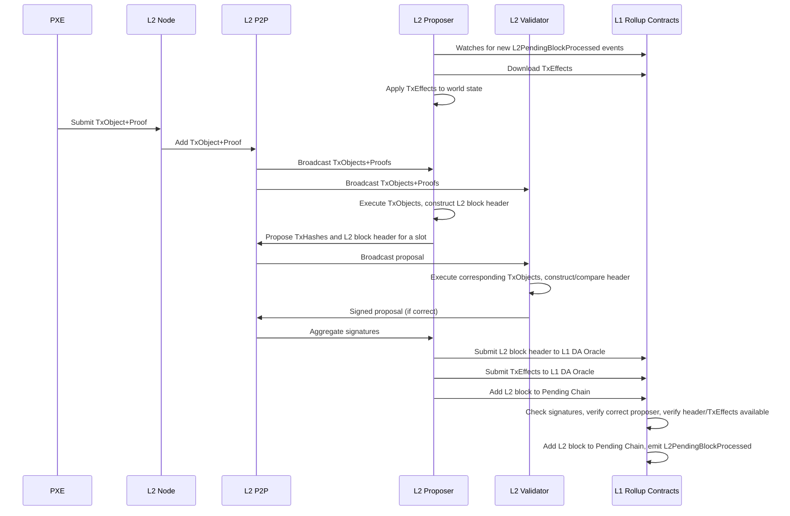
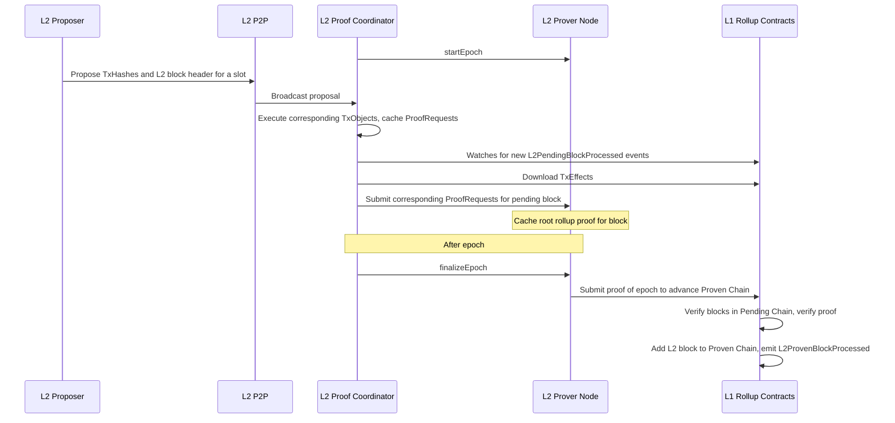
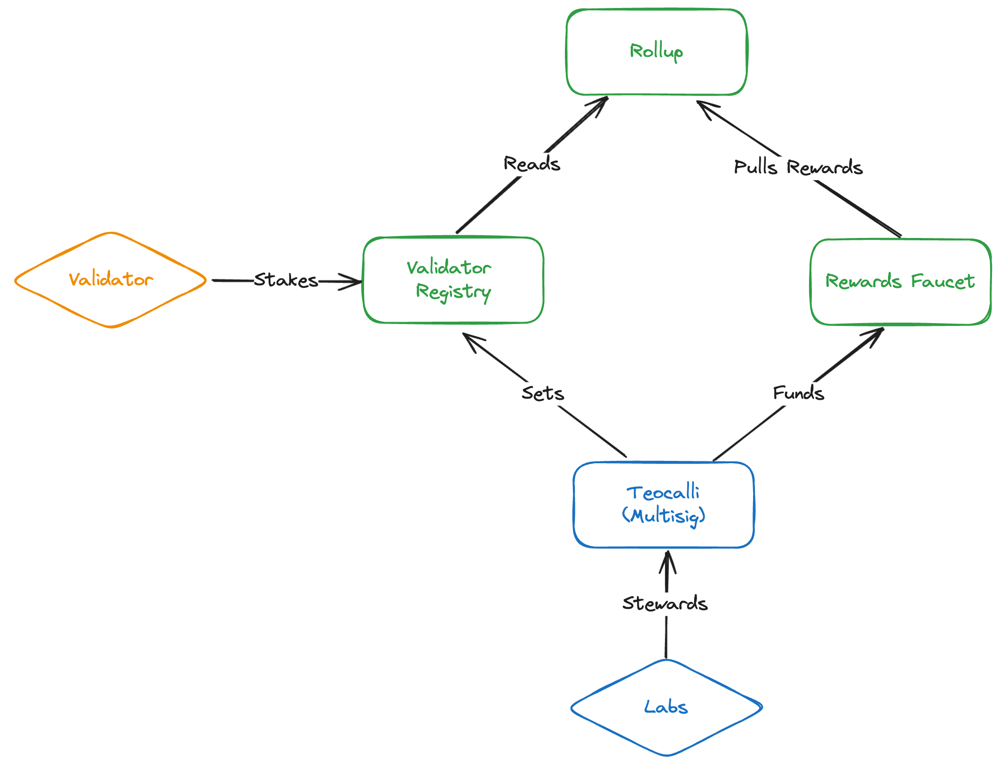

# SPRTN v1.0.0 Design and Implementation Plan 

|                      |                                                                                         |
| -------------------- | --------------------------------------------------------------------------------------- |
| Issue                | [Sequencer/Prover TestNet](https://github.com/AztecProtocol/aztec-packages/issues/7482) |
| Owners               | @just-mitch @LHerskind @Maddiaa0                                                        |
| Approvers            | @joeandrews @charlielye @iAmMichaelConnor @spalladino @PhilWindle                       |
| Target Approval Date | 2024-07-24                                                                              |

## Executive Summary

This design and implementation plan describes version 1.0.0 of a Sequencer/Prover TestNet (SPRTN, pronounced "Spartan") that will be operational on/before 2024-09-16.

We consider delivery of this network to be an engineering milestone; it remains to be seen if/how the network will be:
- communicated to the public
- used by developers

We have designed against a subset of the requirements for MainNet; those with checkmarks are part of this milestone:

- [x] have a "pending chain" with state updates at least every 30s
- [x] have a design that can support 10 TPS
- [x] "proposers" can build ahead on the "pending chain"
- [x] app developers and users can rely on the pending chain state for UX
- [x] have a mechanism to incentivize "proposers" to participate in the "pending chain"
- [x] have a CI/CD framework to easily deploy the network in different configurations for modeling, stress and regression tests
- [x] demonstrate building of full, proven rollup blocks on L1
- [x] have a design that can support forced inclusions
- [ ] support forced inclusions
- [ ] be able to select/rotate the set of "proposers" permissionlessly
- [ ] a governance mechanism to support upgrades and integration with execution environment
- [ ] have an enshrined mechanism to punish "proposers" for misbehaving, and a quantifiable guarantee of the punishment
- [ ] do not depend on the "pending chain" for liveness
- [ ] do not require a hard fork to take advantage of most software updates
- [ ] integrated with the execution environment

Thus, SPRTN v1.0.0 is effectively a stepping stone toward MainNet.

In a sense, part of SPRTN v1.0.0 is a subset of [Option B-](https://hackmd.io/B1Ae2zp6QxaSDOQgdFKJkQ#Option-B-), with key differences:
- the validator set is small and defined by an Aztec Labs multisig (no PoS)
- all validators re-execute transactions
- TxEffects are committed to DA as opposed to TxObjects
- no built-in slashing
- no forced inclusions
- no optimistic signature verification
- no fallback to direct L1 sequencing (i.e. based sequencing)

**However, as stated, our design and implementation will be forward-compatible with the remaining MainNet requirements, and subsequent milestones will satisfy requirements based on their priority.**

## Introduction

We now introduce the broad design of the SPRTN v1.0.0.

### SPRTN v1.0.0 Definitions

**Validator**
A node that is participating in consensus by producing blocks and attesting to blocks

**Slot**
Time is divided into fixed length slots. Within each slot, exactly one validator is selected to propose a block. A slot might be empty if no block is proposed. Sometimes the validator selected to propose is called proposer or sequencer

**Epoch**
A fixed-length sequence of slots

**Committee**
A list of validators to propose/attest blocks for an epoch. The committee is stable throughout the epoch. Attesters are active throughout the entire duration, and one proposer per slot is active.

**Attestation**
A vote on the head on the chain.

**Confirmed**
Of a block, if it is included in a chain.

**Confirmation Rules**
Of a chain, the set of conditions that must be met for a block to be considered confirmed.

**Proof Coordinator**
The final proposer in an epoch, responsible for submitting the proof of the epoch.

### SPRTN v1.0.0 Chains

We will explicitly support multiple concurrent "chains":

- "Pending Chain" - Reflects blocks published to L1 with their state diffs, but not yet been proven.
- "Proven Chain" - Reflects blocks that have had their proof published and verified on L1.
- "Finalized Chain" - Reflects blocks in the "Proven Chain" that have been finalized on L1 (Casper).

The Finalized Chain is a prefix of the Proven Chain, which is a prefix of the Pending Chain.

Note: we do not need to "do" anything for the Finalized Chain, but it is relevant to users.

E.g., a front-end with low-value transactions may display the Pending Chain, but a DEX bridge might wait to release funds until the transaction is in the Finalized Chain.

In SPRTN v1.0.0 the committee will solely be responsible for building the Pending and Proven Chains.

### SPRTN v1.0.0 Sequencer Selection

At the beginning of each epoch, the committee will be selected by shuffling the validator set, and round-robining over them.

Each validator will be assigned a slot in the epoch, and will be responsible for proposing a block in that slot.

The exact number of sequencers will be determined via stress tests, modeling, and feedback from the community.

Part of the deliverable for this milestone will be an analysis of network performance based on the sequencer set size.

### SPRTN v1.0.0 Incentives

For SPRTN v1.0.0, we will create a simple incentives contract within the deployment:
- Whenever a block is added to the Pending Chain, the proposer will receive a reward.
- Whenever a block is added to the Proven Chain, the proposer will receive a reward.

### The SPRTN v1.0.0 Pending Chain


#### Overview



#### Confirmation Rules

A proposer may submit a block B to the rollup contract on L1 for inclusion in the Pending Chain.

The rollup contract will verify that:

- B is building on the tip of the Pending Chain:
  - The block number of B is one greater than the block number of the tip of the Pending Chain.
  - The slot of B is larger than the slot of the tip of the Pending Chain.
  - The slot of B is in the past
- B is submitted by the correct proposer for the slot.
- B contains proof it has signatures from 2/3 + 1 of the committee members attesting to the block.
- B's header has been made available on L1
- B's constituent TxEffects have been made available on L1

After this, the block is confirmed in the Pending Chain.

### The SPRTN v1.0.0 Proven Chain

#### Overview

It is the responsibility of the final proposer in an epoch to submit the proof of the epoch.



#### Confirmation Rules

A node may submit a transaction to the rollup contract on L1 to add blocks from the Pending Chain to the Proven Chain.

The rollup contract will verify that:

- The transaction is submitted by the correct proposer.
- The specified blocks are in the Pending Chain
- A proof of the block's correctness has been verified on L1.

After this, all blocks in the epoch are confirmed in the Proven Chain.

### SPRTN v1.0.0 Governance

The SPRTN will have its own governance contract.

Version 1.0.0 will specify an L1 account owner by Aztec Labs that is able to add or remove sequencers. 


## Interface

Who are your users, and how do they interact with this? What is the top-level interface?

### Smart Contracts
The contracts to support this milestone will provide minimal functionality, an overview of their arrangement is shown below.


#### Teocalli (Multisig)
The Teocalli (Aztec great temple) contract will serve as governance for the testnet, for now it is sufficient that it be operated by Aztec Labs. In which case
its interface will follow that of an arbitrary multisig (gnosis safe will likely be used in practice).
```sol
interface ITeocalli {
  // Execute multisig operations
  function execute(bytes calldata cmd) external;
}
```

#### Validator Registry
A simple validator registry owned by Teocalli. The addition and removal of validators / sequencers will be permissioned, governed by Teocalli. 

```sol
interface IValidatorRegistry {
  // Allow validators to stake, in which they will enter a pending queue.
  function stake(bytes32 pubkey) external;

  // Allow validators to exit state, they will exit after a grace period (x epoch).
  function exitStake(bytes32 pubkey) external;

  // Add a validator (who has previously staked) to the staking set.
  // @dev only admin
  function addValidator(bytes32 pubkey) external;

  // Remove a currently active validator from the staking set.
  // @dev only admin
  function removeValidator(bytes32 pubkey) external;

  // Return the currently active sequencer
  function getCurrentSequencer() view external;

}
```

### Rollup Contract
Much of the current rollup contract will remain unchanged, although sequencer / validator management will be moved to the registry.

```sol
interface IRollup {
  // Append a block to the pending chain
  function processPendingBlock(bytes calldata header, bytes32 archive, bytes calldata signatures) external;

  // Prove a block in the pending chain
  function processProvenBlock(bytes calldata header, bytes32 archive, bytes calldata proof);

  function currentSlot() view external;

  function currentEpoch() view external;
}
```

### Rewards Contract
The rewards contract is controlled by Teocalli and drips rewards to the rollup instance.
```sol
interface IRewardsContract {
  // The rollup will pull rewards from the rewards contract if granted to do so by Teocalli in the function below.
  function pullRewards() external;

  // @dev only admin
  function allocateRewards(address recipient, uint256 amount) external;
}
```

### Prover Marketplace

At first, there will be no marketplace. Sequencers will be configured to communicate with a single Prover Client.

### Prover Coordination

The Prover Client will expose the following interface:

- startEpoch
- addTx(processedTx)
- finalizeEpoch


## Implementation

Delve into the specifics of the design. Include diagrams, code snippets, API descriptions, and database schema changes as necessary. Highlight any significant changes to the existing architecture or interfaces.

Discuss any alternative or rejected solutions.

## Change Set

- [ ] Cryptography
- [ ] Noir
- [ ] Aztec.js
- [ ] PXE
- [ ] Aztec.nr
- [ ] Enshrined L2 Contracts
- [ ] Private Kernel Circuits
- [x] Sequencer
- [ ] AVM
- [ ] Public Kernel Circuits
- [x] Rollup Circuits
- [x] L1 Contracts
- [x] Prover
- [x] Economics
- [x] P2P Network
- [x] DevOps

## Test Plan

### Local Clusters

We will be merging into master, so we will be adding unit and e2e test to the existing test suites that will run on every PR.

New e2e tests will be added which create an ephemeral, local network of nodes and test the basic functionality of the network.

### Parameterized clusters

We will have a set of parameters that can be passed to a deployment script to configure the network.

The parameters will be:
- Number of sequencers
- Number of provers
- Number of PXEs
- Slot time
- Epoch length
- Committee size
- P2P enabled
- Proving enabled
- Fees enabled
- Cluster type (local, sprtn, devnet, etc.)

### Byzantine Faults

We will need to configure components to be able to simulate Byzantine faults.

We will need to be able to simulate:
- Sequencers going offline
- Provers going offline
- Sequencers submitting invalid blocks

### E2E Tests

The core cases we want to cover in our end-to-end tests are:

- A block is proposed and added to the Pending Chain
- A block is proven and added to the Proven Chain
- A block is finalized
- The network can tolerate a sequencer going offline
- The network can tolerate a prover going offline
- The network can tolerate a sequencer submitting an invalid block

## Deployment Plan

### The SPRTN Deployment

There will be a new cluster of nodes deployed in AWS called `sprtn`.

We will create a new branch called `sprtn` that we will merge master into whenever we want to redeploy the network.

This will be the cluster that we run stress tests on, which will be triggered whenever the network is redeployed.

**This will be primarily used for internal testing and will not be public.**

### Stress Tests

We will have a series of scenarios that we will run on the network to test its performance.

We will run these scenarios across a range of parameters (number of sequencers, number of provers, slot duration) to assess the network's performance profile.

Scenarios will include:
- Sustained high TPS
- Burst TPS
- Sustained load with a sequencer offline
- Sustained load with a prover offline
- Sustained load with a sequencer submitting invalid blocks

Some key metrics will be:
- Time for the proposer to advance their world state based on the Pending Chain
- Time for the proposer to prepare a block
- Time for the proposer to collect signatures
- Time for validators to verify a block
- Time for the proposer to submit a block to L1
- Number of simultaneous proofs that can be generated
- TPS of sequencer simulation
- TPS of the Pending Chain
- TPS of the Proven Chain
- TPS of a new node syncing

## Documentation Plan

We will add a README with information on how to submit transactions to the SPRTN.

We will also add a README with information on how to run the network locally.


