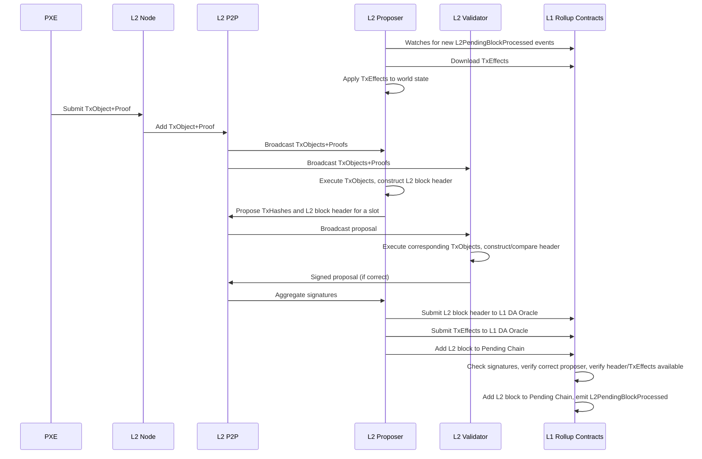
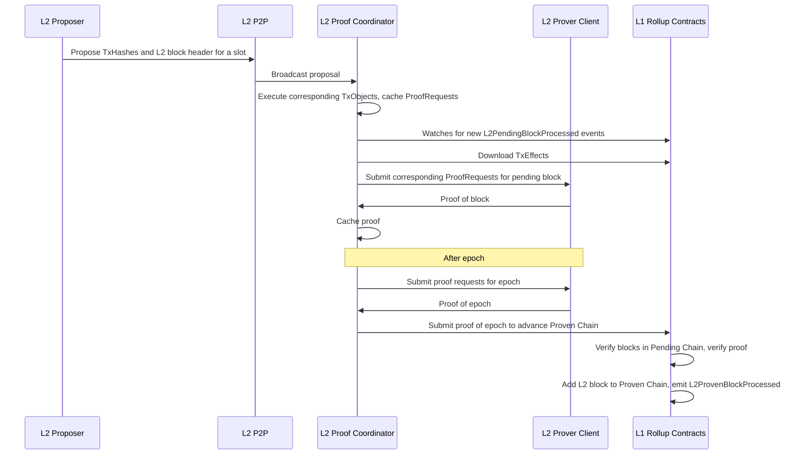

# SPRTN v1.0.0 Design and Implementation Plan 

|                      |                                                                                         |
| -------------------- | --------------------------------------------------------------------------------------- |
| Issue                | [Sequencer/Prover TestNet](https://github.com/AztecProtocol/aztec-packages/issues/7482) |
| Owners               | @just-mitch @LHerskind @Maddiaa0                                                        |
| Approvers            | @joeandrews @charlielye @iAmMichaelConnor @spalladino @PhilWindle                       |
| Target Approval Date | 2024-07-24                                                                              |

## Executive Summary

This design and implementation plan describes version 1.0.0 of a Sequencer/Prover TestNet (SPRTN, pronounced "Spartan") that will be operational on/before 2024-09-16.

We consider delivery of this network to be an engineering milestone; it remains to be seen if/how the network will be:
- communicated to the public
- used by developers

We have designed against a subset of the requirements for MainNet; those with checkmarks are part of this milestone:

- [x] have a "pending chain" with state updates at least every 30s
- [x] have a design that can support 10 TPS
- [x] "proposers" can build ahead on the "pending chain"
- [x] app developers and users can rely on the pending chain state for UX
- [x] have a mechanism to incentivize "proposers" to participate in the "pending chain"
- [x] have a CI/CD framework to easily deploy the network in different configurations for modeling, stress and regression tests
- [x] demonstrate building of full, proven rollup blocks on L1
- [x] have a design that can support forced inclusions
- [ ] support forced inclusions
- [ ] be able to select/rotate the set of "proposers" permissionlessly
- [ ] a governance mechanism to support upgrades and integration with execution environment
- [ ] have an enshrined mechanism to punish "proposers" for misbehaving, and a quantifiable guarantee of the punishment
- [ ] do not depend on the "pending chain" for liveness
- [ ] do not require a hard fork to take advantage of most software updates
- [ ] integrated with the execution environment

Thus, SPRTN v1.0.0 is effectively a stepping stone toward MainNet.

In a sense, part of SPRTN v1.0.0 is a subset of [Option B-](https://hackmd.io/B1Ae2zp6QxaSDOQgdFKJkQ#Option-B-), with key differences:
- the validator set is small and defined by an Aztec Labs multisig (no PoS)
- all validators re-execute transactions
- TxEffects are committed to DA as opposed to TxObjects
- no built-in slashing
- no forced inclusions
- no optimistic signature verification
- no fallback to direct L1 sequencing (i.e. based sequencing)

**However, as stated, our design and implementation will be forward-compatible with the remaining MainNet requirements, and subsequent milestones will satisfy requirements based on their priority.**

## Introduction

We now introduce the broad design of the SPRTN v1.0.0.

### SPRTN v1.0.0 Definitions

**Validator**
A node that is participating in consensus by producing blocks and attesting to blocks

**Slot**
Time is divided into fixed length slots. Within each slot, exactly one validator is selected to propose a block. A slot might be empty if no block is proposed. Sometimes the validator selected to propose is called proposer or sequencer

**Epoch**
A fixed-length sequence of slots

**Committee**
A list of validators to propose/attest blocks for an epoch. The committee is stable throughout the epoch. Attesters are active throughout the entire duration, and one proposer per slot is active.

**Attestation**
A vote on the head on the chain.

**Confirmed**
Of a block, if it is included in a chain.

**Confirmation Rules**
Of a chain, the set of conditions that must be met for a block to be considered confirmed.

**Proof Coordinator**
The final proposer in an epoch, responsible for submitting the proof of the epoch.

### SPRTN v1.0.0 Chains

We will explicitly support multiple concurrent "chains":

- "Pending Chain" - Reflects blocks published to L1 with their state diffs, but not yet been proven.
- "Proven Chain" - Reflects blocks that have had their proof published and verified on L1.
- "Finalized Chain" - Reflects blocks in the "Proven Chain" that have been finalized on L1 (Casper).

The Finalized Chain is a prefix of the Proven Chain, which is a prefix of the Pending Chain.

Note: we do not need to "do" anything for the Finalized Chain, but it is relevant to users.

E.g., a front-end with low-value transactions may display the Pending Chain, but a DEX bridge might wait to release funds until the transaction is in the Finalized Chain.

In SPRTN v1.0.0 the committee will solely be responsible for building the Pending and Proven Chains.

### SPRTN v1.0.0 Sequencer Selection

At the beginning of each epoch, the committee will be selected by shuffling the validator set, and round-robining over them.

Each validator will be assigned a slot in the epoch, and will be responsible for proposing a block in that slot.

The exact number of sequencers will be determined via stress tests, modeling, and feedback from the community.

Part of the deliverable for this milestone will be an analysis of network performance based on the sequencer set size.

### SPRTN v1.0.0 Incentives

For SPRTN v1.0.0, we will create a simple incentives contract within the deployment:
- Whenever a block is added to the Pending Chain, the proposer will receive a reward.
- Whenever a block is added to the Proven Chain, the proposer will receive a reward.

### The SPRTN v1.0.0 Pending Chain

#### Overview

#### Confirmation Rules

A proposer may submit a block B to the rollup contract on L1 for inclusion in the Pending Chain.

The rollup contract will verify that:

- B is building on the tip of the Pending Chain:
  - The block number of B is one greater than the block number of the tip of the Pending Chain.
  - The slot of B is larger than the slot of the tip of the Pending Chain.
  - The slot of B is in the past
- B is submitted by the correct proposer for the slot.
- B contains proof it has signatures from 2/3 + 1 of the committee members attesting to the block.
- B's header has been made available on L1
- B's constituent TxEffects have been made available on L1

After this, the block is confirmed in the Pending Chain.

### The SPRTN v1.0.0 Proven Chain

#### Overview

It is the responsibility of the final proposer in an epoch to submit the proof of the epoch.

#### Confirmation Rules

A node may submit a transaction to the rollup contract on L1 to add blocks from the Pending Chain to the Proven Chain.

The rollup contract will verify that:

- The transaction is submitted by the correct proposer.
- The specified blocks are in the Pending Chain
- A proof of the block's correctness has been verified on L1.

After this, all blocks in the epoch are confirmed in the Proven Chain.

### SPRTN v1.0.0 Governance

The SPRTN will have its own governance contract.

Version 1.0.0 will specify an L1 account owner by Aztec Labs that is able to add or remove sequencers. 

## Interface

Who are your users, and how do they interact with this? What is the top-level interface?

### Prover Marketplace

## Implementation

Delve into the specifics of the design. Include diagrams, code snippets, API descriptions, and database schema changes as necessary. Highlight any significant changes to the existing architecture or interfaces.

Discuss any alternative or rejected solutions.

## Change Set

Fill in bullets for each area that will be affected by this change.

- [x] L1 Contracts
- [ ] Enshrined L2 Contracts
- [ ] Private Kernel Circuits
- [ ] Public Kernel Circuits
- [x] Rollup Circuits
- [ ] Aztec.nr
- [ ] Noir
- [ ] AVM
- [x] Sequencer
- [ ] Fees
- [x] P2P Network
- [ ] Cryptography
- [x] DevOps

## Test Plan

We will be merging into master, so we will be adding unit and e2e test to the existing test suites that will run on every PR.

New e2e tests will be added which create a network of nodes and test the functionality of the network.

There will be a new cluster of nodes deployed in AWS called "SPRTN".

We will create a new release-please PR that will be merged whenever we want to redeploy the network.

This will be the cluster that we run stress tests on, which will be triggered whenever the network is redeployed.

The operational network and stress test results will be the primary deliverable in the milestone.

## Documentation Plan

Identify changes or additions to the user documentation or protocol spec.

## Suggested Immediate Next Steps

- Publish TxObjects instead of TxEffects to the Pending Chain

## Rejection Reason

If the design is rejected, include a brief explanation of why.

## Abandonment Reason

If the design is abandoned mid-implementation, include a brief explanation of why.

## Implementation Deviations

If the design is implemented, include a brief explanation of deviations to the original design.
