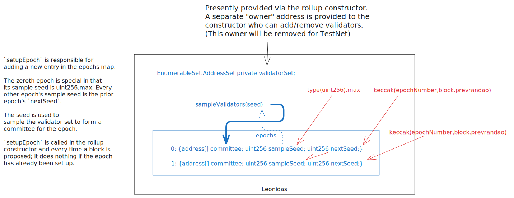
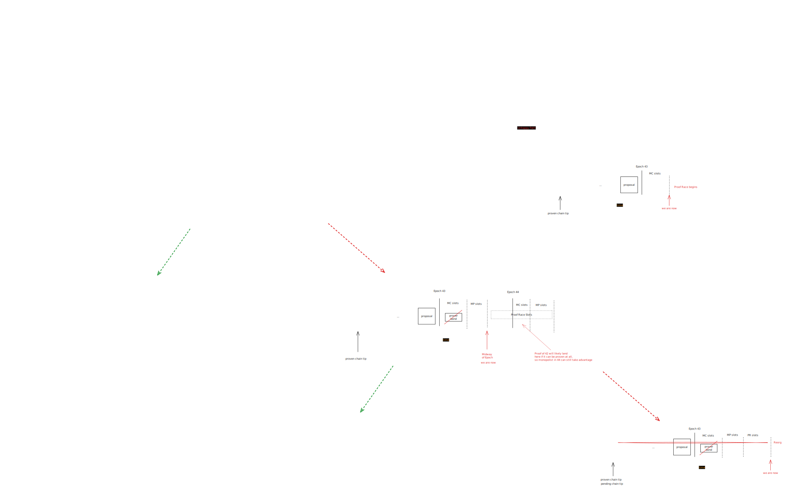

# Publishing TxObjects

|                      |                                   |
| -------------------- | --------------------------------- |
| Issue                | [title](github.com/link/to/issue) |
| Owners               | @just-mitch @LHerskind @Maddiaa0  |
| Approvers            |                                   |
| Target Approval Date | 2024-09-11                        |

## Executive Summary

We currently publish transaction effects to L1. This means we execute the public portion of the transaction, accumulate all of its side effects, and publish those to the L1 contract.

In contrast, we're moving to a world where we simply publish the outputs of the private execution (performed by a user's PXE) and the public call requests.

Further, we are not requiring validators participating in the pending chain to execute transactions, and are merely required to verify the private proofs of transactions in a block that has been proposed.

## Introduction

### Epochs and committees

We have epochs, which are divided into $E$ slots, which are measured in $S$ seconds.

An epoch has a committee, which is responsible for proposing/validating blocks in the pending chain.

The committee is sampled from a broader validator set based on a seed that gets set when the first proposal in the *previous* epoch is submitted.

The committee changes every epoch.



### Proposal process overview

TODO


### Committee Signature Scheme

- Optimistic BLS

To see how we get to this, look at [Pleistarchus](https://github.com/AztecProtocol/aztec-packages/issues/7978).

### What is published, when

A proposer will collect signatures from the committee, and then publish (within a single L1 transaction) the content in blobs and his "proposal" to the rollup contract:

- CallData
  - proposal:
    - numTxs
    - txsHash (a commitment to first nullifiers of all transactions in the proposal)
    - kzgHashes (a commitment to the versioned KZG hashes which include all the transactions of the proposal)
    - inHash
    - GlobalVariables
      - blockNumber
      - slotNumber
      - timestamp
      - coinbase
      - feeRecipient
      - gasSetting (`fee_per_da_gas`, `fee_per_l1_gas`)
  - Proposer sig (ECDSA)
  - Attestations:
    - aggregate BLS sig
    - bitmap for missing signatures
- Blobs
  - Tx1
    - max fee
    - note hashes (from private)
    - nullifiers (from private)
    - l2ToL1Messages (from private)
    - note encrypted logs (from private)
    - encrypted logs (from private)
    - unencrypted logs (from private)
    - public call request 1
      - contract address
      - call context
        - msgSender
        - storageContractAddress
        - functionSelector
        - isDelegateCall
        - isStaticCall
      - args
    - public call request 2
    - ...
  - Tx2
  - ...

> Most of the global variables could be directly populated by L1, but providing it makes it a lot clearer what the reason of failure is if such a one is encountered. Also the `inHash` can be populated by L1.

#### DA Oracle Changes

When the data is to be submitted as part of the same transaction as the block proposal to the L1 contract, we have two variations possible:

1. Remove the data availability oracle in its whole, and simply use the versioned KZG hashes directly
2. Save the versioned KZG hashes in the data availability oracle

Solution 1 is significantly cheaper as it don't update storage. Furthermore, by requiring that the versioned KZG hashes are part of the proposal provided, we can show the exact KZG hashes using just the transaction and the commitment to the proposal.

#### Rollup Contract Changes

```python
struct ChainTip:
  block_number: uint256
  slot_number: uint256


struct State:
  pending_tip: ChainTip
  proven_tip: ChainTip


struct ProposalLog:
  hash: bytes32
  slot_number: uint256
  archive: bytes32


struct GasSettings:
  feePerDaGas: uint256
  feePerL2Gas: uint256


struct GlobalVariables:
  block_number: uint256
  slot_number: uint256
  timestamp: uint256
  coinbase: address
  fee_recipient: AztecAddress # discuss
  gas_settings: GasSettings


struct Attestations:
  signature: AggregateBLS
  missing: uint256 # support up to 3*256 members in committee


struct Proposal:
  num_tx: uint256
  txs_hash: bytes32
  kzg_hashes: bytes32
  in_hash: bytes32
  global_variables: GlobalVariables
  proposer_sig: ECDSA
  attestations: Attestations


struct FeePayment:
  coinbase: address
  amount: uint256


EPOCH_LENGTH: constant(uint256) = 48 # pulled out of my ass


proposals: public(HashMap[uint256, ProposalLog])
state: public(State);


def __init__():
  proposals[0] = Proposal(hash = GENESIS_PROPOSAL_HASH, slot = 0, archive = GENESIS_ARCHIVE)


def propose(
    proposal: Proposal,
    proposer_sig: ECDSA,
    attestations: Attestations
  ):
  '''
  Notice that no signatures are checked, all of that is optimistic
  '''
  if proposal.num_tx == 0:
    assert len(tx.blob_versioned_hashes) == 0
    assert proposal.kzg_hashes = empty(bytes32)
  else
    assert hash([h for h in tx.blob_versioned_hashes]) == proposal.kzh_hashes # Replaces DA oracle

  gv = proposal.global_variables

  assert gv.gas_settings.is_sane() # To be designed

  assert gv.slot_number > self.state.pending_tip.slot_number
  assert gv.slot_number == get_current_slot()

  assert gv.timestamp == get_time_at_slot(gv.slot_number)
  assert gv.timestamp <= block.timestamp

  assert gv.block_number == self.state.pending_tip.block_number + 1
  assert proposal.inHash == INBOX.consume(gv.block_number)

  proposal_hash = sha256(proposal, proposer_sig, attestations)

  self.proposals[gv.block_number] = ProposalLog(proposal_hash, gv.slot_number)
  self.state.pending_tip = ChainTip(gv.block_number, gv.slot_number)


def challenge_proposal(
    proposal: Proposal,
    proposer_sig: ECDSA,
    attestations: Attestations
  ):
  '''
  Implement challenges for:
  - Bad proposer
  - Bad attestation
  '''
  pass


def submit_next_epoch_proof(proof, archive: bytes32, fees: FeePayment[EPOCH_LENGTH]):
  '''
  Submits the proof for the "next unproven" epoch. Note that this mean that we only
  support sequential proof submission. This could cause issues depending on the
  duration of "monopoly" proving etc.
  '''
  assert self.state.proven_tip.block_number < self.state.pending_tip.block_number

  proposal_hashes = []
  block_number = self.state.proven_tip.block_number + 1
  epoch_number = get_epoch_from_slot(self.proposals[block_number].slot_number)
  end_slot = get_last_slot_in_epoch(epoch_number)
  upper_limit = min(block_number + EPOCH_LENGTH, self.state.pending_tip.block_number)

  last_slot = 0

  for bn in range(block_number, upper_limit):
    proposal_log = self.proposals[bn]
    if proposal_log.slot_number <= end_slot:
      last_slot = proposal_log.slot_number
      proposal_hashes.append(proposal_log.hash)
      block_number = bn
    else:
      break

  assert len(proposal_hashes) > 0, 'no proposals'

  prev_archive = self.proposals[self.state.proven_tip.block_number].archive
  assert proof.verify(prev_archive, proposal_hashes, archive, fees)

  for fee in fees:
    if fee.amount > 0 and fee.coinbase not empty(address):
      FEE_JUICE.distributeFees(fee.coinbase, fee.amount)

  self.state.proven_tip = ChainTip(block_number, last_slot)
  self.proposals[block_number].archive = archive

  # TODO: Out hashes options
  # 1. List them and add individually
  # 2. Make another tree 🌲
```

- TODO:
  - What are we going to do with stuff like the outhashes? They depend on the execution, so we cannot really do it at the time of the proposal if that is. So we would practically need it to happen with the entire epoch at this point. Might just be another tree to make it cheaper. It gets kinda funky with finding the block number because it depends.

### Forced inclusion of transactions

- Need to fix some notation on what is the "full" proposal etc.
- My syntax is not really valid vyper but I just enjoy writing it that way, sorry not sorry.

The idea:

- We have a commitment `txs_hash` that is a l1 friendly merkle tree of the first nullifiers in a proposal.
- To do forced inclusion, we require that a specific `nullifier` is in one of these trees at some point in time.
  - If not, then the proof will simply fail and one will end up eventually submitting a new proposal that have it to extend the chain
  - If the committee stalls forever, we need an option to go "based" and propose and verify the proof at the same time.

We will first showcase, how you can force the committee, and then afterwards the changes needed to perform the based operation. The reason behind this is mainly that I have not outlined the based yet.

```python
struct ForceInclusion:
  nullifier: bytes32
  include_by_slot: uint256
  included: bool


struct ForceInclusionProof:
  proposal: Proposal
  forced_inclusion_index: uint256,
  block_number: uint256
  membership_proof: bytes32[]


forced_inclusions: public(HashMap[uint256, ForceInclusion])
forced_inclusion_tip: public(uint256)
forced_inclusion_count: public(uint256)

FORCE_INCLUSION_DEADLINE: immutable(uint256)


def __init__(deadline: uint256):
  self.FORCE_INCLUSION_DEADLINE = deadline


def initiate_force_include(tx, proof, block_number_proven_against):
  '''
  To be used by a user if they are getting massively censored by
  the committees.
  '''

  assert block_number_proven_against <= self.proven_tip.block_number

  archive = self.proposals[block_number_proven_against].archive
  assert proof.verify(archive, tx)

  self.forced_inclusions[self.forced_inclusion_count] = ForceInclusion(
    nullifier = tx.nullifiers[0],
    include_by_slot = get_current_slot() + self.FORCE_INCLUSION_DEADLINE
  )
  self.forced_inclusion_count += 1


def show_included(fip: ForceInclusionProof):
  '''
  Convince the contract that a specific forced inclusion at `forced_inclusion_index` is
  indeed included.
  '''
  assert fip.forced_inclusion_index < self.forced_inclusion_count
  nullifier = self.forced_inclusions[fip.forced_inclusion_index].nullifier

  assert self.proposals[fip.block_number].hash == fip.proposal.hash()
  assert fip.membership_proof.verify(nullifier, fip.proposal.txs_hash)

  self.forced_inclusions[fip.forced_inclusion_index].nullifier.included = True

  self.progress_forced_inclusion_tip()


def progress_forced_inclusion_tip():
  cache = self.forced_inclusion_tip
  for i in range(cache, self.forced_inclusion_count):
    if not self.forced_inclusions[i].included:
      return
    self.forced_inclusion_tip = cache


@override
def submit_next_epoch_proof(proof, archive: bytes32, fees: FeePayment[EPOCH_LENGTH]):
  super.submit_next_epoch_proof(proof, archive, fees)

  forced_tip = self.forced_inclusions[self.forced_inclusions_tip]

  if forced_tip.included_by_slot != 0:
    assert forced_tip.included_by_slot > proposal_hashes[-1].slot, 'force'


def submit_proof_with_force(proof, archive, fips: ForceInclusionProof[]):
  '''
  To be used by the proof submitter if they are including forced inclusions.
  If the forced inclusions are not needed for their block, but is for a later deadline
  they can use the old, and someone else can include it later when required
  '''

  super.submit_next_epoch_proof(proof, archive, fees)

  for fip in fips:
    self.show_included(fip)

  forced_tip = self.forced_inclusions[self.forced_inclusions_tip]
  if forced_tip.included_by_slot != 0:
    assert forced_tip.included_by_slot > proposal_hashes[-1].slot, 'force'
```

### Blob circuits

### Rollup circuits

### Prover interactions

### Keeping track of chain state

How do nodes keep track of the pending archive since they are not published to L1?

### Private kernel verification

Validators need to verify the private kernels

### Transaction validation

If a transaction is "valid" if and only if it can be included in a block (and subsequently an epoch), and the proof of that epoch can be verified on L1.

Nodes need to "validate" transactions: i.e. check if a transaction is valid.

It *must* be possible to determine if a transaction is valid without executing it.

Therefore, transactions *must* be valid iff it has a private kernel proof that successfully verifies.

#### Changes needed

There are many cases today where a transaction is invalid, and cannot be included in a block, e.g.:
- global variable mismatches (chainId, version, etc.)
- transactions reverting in public setup
- the transaction was not included before its "max block"
- duplicate nullifiers
- etc.

The protocol must gracefully handle these cases, and instead of having the transaction be invalid, it should allow the transaction to be included, but with a "failed" status.

In the event of a "failed" transaction, the transaction will appear in the block, but with no side effects, apart from its transaction nullifier.

Further, the transaction's fee will be set to zero.

### Proving phases

<!-- Editors: you can copy/paste the svg from the repository into excalidraw to make edits. -->



#### Monopoly claim phase

The beginning of each epoch is the "monopoly claim phase".

This phase has a duration of $MC$ slots (e.g. 2 slots).

The committee member who could submit the first proposal in epoch `n` can submit a prover commitment bond.

This can be a transaction separate from the submission of their proposed block.

Doing so grants monopoly rights to the rewards for submitting the proof of epoch `n-1`.

Out of scope: it is possible that the protocol should incentivize the submission of a proof with a bond.

#### Monopoly production phase

If a claim is submitted during the monopoly claim phase, the next phase is the "monopoly production phase".

This phase has a duration of $MP$ slots (e.g. 14 slots).

Failure to submit a proof results in the bond posted with the claim being slashed.

The duration of `mp + mc` should be more than the time it takes to submit a proof (e.g. 10 minutes).

#### Proof race

A proof race is entered if:
- the monopoly claim phase ends and no claim is made
- a claim is made but no proof lands

The duration of a proof race is $PR$ slots (e.g. 32 slots).

During the proof race, anyone can submit a proof for the previous epoch.

#### Pending chain prune 

If the proof race ends and no proof is submitted, the pending chain is pruned to the last proven block.

## Interface

Who are your users, and how do they interact with this? What is the top-level interface?

## Implementation

Delve into the specifics of the design. Include diagrams, code snippets, API descriptions, and database schema changes as necessary. Highlight any significant changes to the existing architecture or interfaces.

Discuss any alternative or rejected solutions.

## Change Set

Fill in bullets for each area that will be affected by this change.

- [ ] Cryptography
- [ ] Noir
- [ ] Aztec.js
- [ ] PXE
- [ ] Aztec.nr
- [ ] Enshrined L2 Contracts
- [ ] Private Kernel Circuits
- [ ] Sequencer
- [ ] AVM
- [ ] Public Kernel Circuits
- [ ] Rollup Circuits
- [ ] L1 Contracts
- [ ] Prover
- [ ] Economics
- [ ] P2P Network
- [ ] DevOps

## Test Plan

Outline what unit and e2e tests will be written. Describe the logic they cover and any mock objects used.

## Documentation Plan

Identify changes or additions to the user documentation or protocol spec.

## Rejection Reason

If the design is rejected, include a brief explanation of why.

## Abandonment Reason

If the design is abandoned mid-implementation, include a brief explanation of why.

## Implementation Deviations

If the design is implemented, include a brief explanation of deviations to the original design.

## Disclaimer

The information set out herein is for discussion purposes only and does not represent any binding indication or commitment by Aztec Labs and its employees to take any action whatsoever, including relating to the structure and/or any potential operation of the Aztec protocol or the protocol roadmap. In particular: (i) nothing in these projects, requests, or comments is intended to create any contractual or other form of legal relationship with Aztec Labs or third parties who engage with this AztecProtocol GitHub account (including, without limitation, by responding to a conversation or submitting comments) (ii) by engaging with any conversation or request, the relevant persons are consenting to Aztec Labs’ use and publication of such engagement and related information on an open-source basis (and agree that Aztec Labs will not treat such engagement and related information as confidential), and (iii) Aztec Labs is not under any duty to consider any or all engagements, and that consideration of such engagements and any decision to award grants or other rewards for any such engagement is entirely at Aztec Labs’ sole discretion. Please do not rely on any information on this account for any purpose - the development, release, and timing of any products, features, or functionality remains subject to change and is currently entirely hypothetical. Nothing on this account should be treated as an offer to sell any security or any other asset by Aztec Labs or its affiliates, and you should not rely on any content or comments for advice of any kind, including legal, investment, financial, tax, or other professional advice.
