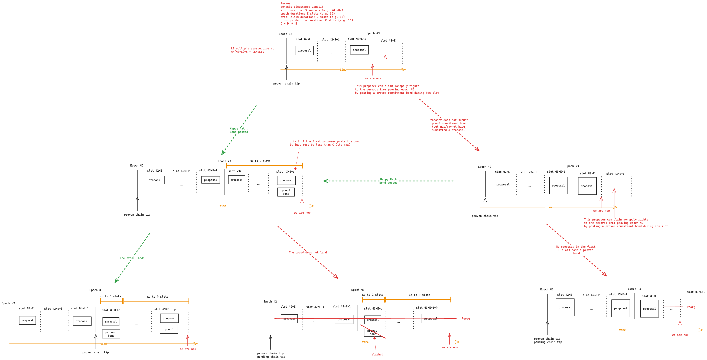

# Publishing TxObjects

|                      |                                   |
| -------------------- | --------------------------------- |
| Issue                | [title](github.com/link/to/issue) |
| Owners               | @just-mitch @LHerskind @Maddiaa0  |
| Approvers            |                                   |
| Target Approval Date | 2024-09-11                        |

## Executive Summary

We currently publish transaction effects to L1. This means we execute the public portion of the transaction, accumulate all of its side effects, and publish those to the L1 contract.

In contrast, we're moving to a world where we simply publish the outputs of the private execution (performed by a user's PXE) and the public call requests.

Further, we are not requiring validators participating in the pending chain to execute transactions, and are merely required to verify the private proofs of transactions in a block that has been proposed.

## Introduction

### Epochs and committees

We have epochs, which are divided into $E$ slots, which are measured in $S$ seconds.

An epoch has a committee, which is responsible for proposing/validating blocks in the pending chain.

The committee is sampled from a broader validator set based on a seed that gets set when the first proposal in the _previous_ epoch is submitted.

The committee changes every epoch.

<!-- Editors: you can copy/paste the png from the repository into excalidraw to make edits. -->


### Proposal process overview

TODO

### Committee Signature Scheme

For the following changes it is assumed that [Pleistarchus](https://github.com/AztecProtocol/aztec-packages/issues/7978) will be used.
This means that we will be using an optimistic approach for the sampling, proposer and signature validation.

### Changes to contracts

The contracts will be altered such that instead of receiving block `header`s and bodies with tx-effects (state diffs), we will now be receiving `proposal`s which include parts of what was previously in the `header` but not all of its components.

The proposal will be of the structure as follows, notable they DO NOT include an archive or references to the state:

```python
struct GasSettings:
  feePerDaGas: uint256
  feePerL2Gas: uint256


struct GlobalVariables:
  block_number: uint256
  slot_number: uint256
  timestamp: uint256
  coinbase: address
  fee_recipient: AztecAddress # discuss
  gas_settings: GasSettings


struct Attestations:
  signature: AggregateBLS
  missing: uint256 # Supports committee size of 256 members


struct ProposalHeader:
  num_tx: uint256
  txs_hash: bytes32
  kzg_hashes: bytes32
  in_hash: bytes32
  global_variables: GlobalVariables
  proposer_sig: ECDSA


struct CallContext:
  msg_sender: AztecAddress
  storage_contract_address: AztecAddress
  function_selector: bytes4
  is_delegate_call: bool
  is_static_call: bool


struct PublicCallRequest:
  target: AztecAddress
  call_context: CallContext
  args: DynArray[bytes32, ] #How we are dealing with the max number of args?


struct PrivateTxEffects:
  note_hashes: DynArray[bytes32, MAX_NOTE_HASHES_PER_TX]
  nullifiers: DynArray[bytes32, MAX_NULLIFIERS_PER_TX]
  l2_to_l1_messages: DynArray[bytes32, MAX_L2_TO_L1_MSGS_PER_TX]
  note_encrypted_logs_hashes: DynArray[bytes32, MAX_NOTE_ENCRYPTED_LOGS_PER_CALL]
  encrypted_logs_hashes: DynArray[bytes32, MAX_ENCRYPTED_LOGS_PER_CALL]
  unencrypted_logs_hashes: DynArray[bytes32, MAX_UNENCRYPTED_LOGS_PER_CALL]


# Need a better name for this one!
struct TxObject:
  max_fee: uint256
  private_tx_effects: PrivateTxEffects
  public_call_requests: DynArray[
    PublicCallRequest,
    MAX_PUBLIC_CALL_STACK_LENGTH_PER_TX
  ]


# Will be published in blobs. Capped by blobs
struct ProposalBody:
  txs: DynArray[TxObject, ]

```

As noted earlier, in [Proposal process overview](#proposal-process-overview), the proposal will eventually either be pruned or proven. To propose, the sequencer is publishing `ProposalHeader` and attestation as calldata and `ProposalBody` as blobs within a single L1 transaction.

> Most of the global variables could be directly populated by L1, but providing it makes it a lot clearer what the reason of failure is if such a one is encountered. Also the `inHash` can be populated by L1.

#### DA Oracle Changes

When the data is to be submitted as part of the same transaction as the block proposal to the L1 contract, we have two variations possible:

1. Remove the data availability oracle in its whole, and simply use the versioned KZG hashes directly
2. Save the versioned KZG hashes in the data availability oracle

Solution 1 is significantly cheaper as it don't update storage. Furthermore, by requiring that the versioned KZG hashes are part of the proposal provided, we can show the exact KZG hashes using just the transaction and the commitment to the proposal.

**Conclusion**: The data availability oracle dies.

#### Rollup Contract Changes

```python
struct ChainTip:
  block_number: uint256
  slot_number: uint256


struct State:
  pending_tip: ChainTip
  proven_tip: ChainTip


struct ProposalLog:
  hash: bytes32
  slot_number: uint256
  archive: bytes32


struct FeePayment:
  coinbase: address
  amount: uint256


EPOCH_LENGTH: constant(uint256) = EPOCH_LENGTH


proposals: public(HashMap[uint256, ProposalLog])
state: public(State);


def __init__():
  proposals[0] = ProposalLog(
    hash = GENESIS_PROPOSAL_HASH,
    slot = 0,
    archive = GENESIS_ARCHIVE
  )


@blobs(ProposalBody) # This is my ugly way of saying is in blob
def propose(proposal: ProposalHeader, attestations: Attestations):
  '''
  Notice that no signatures are checked, all of that is optimistic
  The signatures will be of the `ProposalHeader`
  '''
  if proposal.num_tx == 0:
    assert len(tx.blob_versioned_hashes) == 0
    assert proposal.kzg_hashes = empty(bytes32)
  else
    # Replaces DA oracle
    assert hash([h for h in tx.blob_versioned_hashes]) == proposal.kzg_hashes

  gv = proposal.global_variables

  assert gv.gas_settings.is_sane() # To be designed

  assert gv.slot_number > self.state.pending_tip.slot_number
  assert gv.slot_number == get_current_slot()

  assert gv.timestamp == get_time_at_slot(gv.slot_number)
  assert gv.timestamp <= block.timestamp

  assert gv.block_number == self.state.pending_tip.block_number + 1
  assert proposal.inHash == INBOX.consume(gv.block_number)

  self.proposals[gv.block_number] = ProposalLog(sha256(proposal, attestations), gv.slot_number)
  self.state.pending_tip = ChainTip(gv.block_number, gv.slot_number)


def challenge_proposal(proposal: ProposalHeader, attestations: Attestations):
  '''
  Implement challenges for:
  - Bad proposer
  - Bad attestation
  '''
  pass


def submit_next_epoch_proof(proof, archive: bytes32, fees: FeePayment[EPOCH_LENGTH]):
  '''
  Submits the proof for the "next unproven" epoch. Note that this mean that we only
  support sequential proof submission. This could cause issues depending on the
  duration of "monopoly" proving etc.
  '''
  assert self.state.proven_tip.block_number < self.state.pending_tip.block_number

  proposal_hashes = []
  block_number = self.state.proven_tip.block_number + 1
  epoch_number = get_epoch_from_slot(self.proposals[block_number].slot_number)
  end_slot = get_last_slot_in_epoch(epoch_number)
  upper_limit = min(block_number + EPOCH_LENGTH, self.state.pending_tip.block_number)

  last_slot = 0

  for bn in range(block_number, upper_limit):
    proposal_log = self.proposals[bn]
    if proposal_log.slot_number <= end_slot:
      last_slot = proposal_log.slot_number
      proposal_hashes.append(proposal_log.hash)
      block_number = bn
    else:
      break

  assert len(proposal_hashes) > 0, 'no proposals'

  prev_archive = self.proposals[self.state.proven_tip.block_number].archive
  assert proof.verify(prev_archive, proposal_hashes, archive, fees)

  for fee in fees:
    if fee.amount > 0 and fee.coinbase not empty(address):
      FEE_JUICE.distributeFees(fee.coinbase, fee.amount)

  self.state.proven_tip = ChainTip(block_number, last_slot)
  self.proposals[block_number].archive = archive

  # TODO: Out hashes options
  # 1. List them and add individually
  # 2. Make another tree 🌲
```

- TODO:
  - What are we going to do with stuff like the outhashes? They depend on the execution, so we cannot really do it at the time of the proposal if that is. So we would practically need it to happen with the entire epoch at this point. Might just be another tree to make it cheaper. It gets kinda funky with finding the block number because it depends.

### Changes to circuits

#### Blob circuits

We need some blob circuits that allow us to prove that things were in blobs such that we can convince the contracts that i) the data was published and ii) that the data published is what have been applied to the state. Think this is likely already described somewhere else 🤷.

#### Rollup circuits

The circuit changes is mainly related to transaction validation as elaborated [later](#transaction-validation), but beyond those, we will mainly need to deal with work related to creating the `txs_hash`.

Doing this will require us to alter the Merge rollup to compute the a "partial" `txs_hash` from the first nullifiers of its two children, and then continuing this up the whole tree. Exactly like we have been computing the `out_hash` and `txs_effects_hash` previously.

### Changes to the node

Since the L1 will no longer know about the complete state-diffs, the node will be unable to simple download these and apply them. This means that the node will instead get a hold of the `ProposalHeader` and `ProposalBody` from L1. It could then apply these proposals on top of its current state to progress. Essentially to sync all of the history on top of the genesis state by re-execution. This model is very similar to what is done in Ethereum or really most blockchains. Consider looking at https://forum.aztec.network/t/collaborative-based-rollups/5227 for a more thorough walkthrough.

When applying the history through re-execution, the node will need to also use the same version of the AVM (Aztec Virtual Machine) as was used when the proof was originally submitted to the rollup contract, practically meaning that the node will need multiple versions and how to distinguish between "when" they were used. Keeping track of the versions and when they were used is handled by the Gerousia and Apella design, but the actual versions need to stored separately as they are only referred through version id and verification keys on the rollup.

Note, that since every epoch is to be proven, there will be a state root `archive` after each of those that a user can use as a "root of trust" and check against. This is also useful when validating snapshots received.

The node will have its own view of the current `archive` and state based on the proposals that it have applied itself.

> Remember, that one can always get someone else to perform the job of re-executing (look at infura/alchemy and Ethereum), but that comes with its own concerns.

#### Forks (re-orgs)

Separately to this change with re-execution, the node will need to handle forking and re-orgs as well. This is not really specific to this proposal, but have not really been discussed for the point of view of the node. When we above pointed to the current `archive` based on the proposal it have applied, we say so as there could potentially be multiple proposals which have been published (for the same block number / at the same height).

Since we push the L1 to figure out what is the real, the node will need to take the `ProposalLog` from the contract into account when it is applying the state changes.
To have the view of the proven chain, the node must simple apply all of the `ProposalLog`'s that are stored in the `proposals` and have a block number smaller than or equal to the `proven_tip`.
Everything beyond the `proven_tip` is still "up for discussion".
This means that we need to support the ability to "revert" full blocks, since they might have been applied at the start of an epoch, but you then later figure out that it was no good, e.g., not proven in time,
In this case, you want to go back to the proven chain, throwing the current pending chain away, and then start new pending proposals.

The PXE also need to have an idea around if things have been forked out, since we don't want it to believe that it have plenty of notes, but only figure out when it needs to spend those that it don't.
One way to deal with this, could be that the PXE will check that its "new" notes and nullifiers are indeed in the `archive` whenever a proof lands on L1.

### Prover interactions

### Forced inclusion of transactions

We want to support a method to **force** the inclusion of a transaction.
Note that this is done using the L1 contracts, and not directly by altering the circuits.

We want this ability to handle the really nasty cases of censorship, for example trying to upgrade without allowing you to escape 🏴‍☠️.

The idea of the scheme is relatively simple:

- We have a commitment `txs_hash` that is a l1 friendly merkle tree of the first nullifiers in a proposal.
- To do forced inclusion, we require that a specific `nullifier` is in one of these trees at some point in time.
  - If not, then the proof will simply fail and one will end up eventually submitting a new proposal that have it to extend the chain
  - If the committee stalls forever, we need an option to go "based" and propose and verify the proof at the same time.

Beware that we only really address the forced inclusion needs when the proof is proposed.
It can be based on the time of the proposal, just note that you can propose something that does not include it, and people might believe it to be the pending chain if they are not checking if it satisfy the force inclusion.

We will first showcase, how you can force the committee, and then afterwards the changes needed to perform the based operation.
The reason behind this is mainly that I have not outlined the based yet.

```python
struct ForceInclusion:
  nullifier: bytes32
  include_by_slot: uint256
  included: bool


struct ForceInclusionProof:
  proposal: ProposalHeader
  attestations: Attestations
  forced_inclusion_index: uint256,
  block_number: uint256
  membership_proof: bytes32[]


forced_inclusions: public(HashMap[uint256, ForceInclusion])
forced_inclusion_tip: public(uint256)
forced_inclusion_count: public(uint256)


FORCE_INCLUSION_DEADLINE: immutable(uint256)


def __init__(deadline: uint256):
  self.FORCE_INCLUSION_DEADLINE = deadline


def initiate_force_include(tx: TxObject, proof: , block_number_proven_against):
  '''
  To be used by a user if they are getting massively censored by
  the committees.
  '''

  assert block_number_proven_against <= self.proven_tip.block_number

  archive = self.proposals[block_number_proven_against].archive
  assert proof.verify(archive, tx)

  self.forced_inclusions[self.forced_inclusion_count] = ForceInclusion(
    nullifier = tx.nullifiers[0],
    include_by_slot = get_current_slot() + self.FORCE_INCLUSION_DEADLINE
  )
  self.forced_inclusion_count += 1


def show_included(fip: ForceInclusionProof):
  '''
  Convince the contract that a specific forced inclusion at `forced_inclusion_index` is
  indeed included.
  '''
  assert fip.forced_inclusion_index < self.forced_inclusion_count
  nullifier = self.forced_inclusions[fip.forced_inclusion_index].nullifier

  assert self.proposals[fip.block_number].hash == hash(fip.proposal, fip.attestations)
  assert fip.membership_proof.verify(nullifier, fip.proposal.txs_hash)

  self.forced_inclusions[fip.forced_inclusion_index].nullifier.included = True

  self.progress_forced_inclusion_tip()


def progress_forced_inclusion_tip():
  cache = self.forced_inclusion_tip
  for i in range(cache, self.forced_inclusion_count):
    if not self.forced_inclusions[i].included:
      return
    self.forced_inclusion_tip = cache


@override
def submit_next_epoch_proof(proof, archive: bytes32, fees: FeePayment[EPOCH_LENGTH]):
  super.submit_next_epoch_proof(proof, archive, fees)

  forced_tip = self.forced_inclusions[self.forced_inclusions_tip]

  if forced_tip.included_by_slot != 0:
    assert forced_tip.included_by_slot > proposal_hashes[-1].slot, 'force'


def submit_proof_with_force(proof, archive, fips: ForceInclusionProof[]):
  '''
  To be used by the proof submitter if they are including forced inclusions.
  If the forced inclusions are not needed for their block, but is for a later deadline
  they can use the old, and someone else can include it later when required
  '''

  super.submit_next_epoch_proof(proof, archive, fees)

  for fip in fips:
    self.show_included(fip)

  forced_tip = self.forced_inclusions[self.forced_inclusions_tip]
  if forced_tip.included_by_slot != 0:
    assert forced_tip.included_by_slot > proposal_hashes[-1].slot, 'force'
```

### Private kernel verification

Validators need to verify the private kernels, and should only attest to proposals where all are valid.

### Transaction validation

A transaction is "valid" if and only if it can be included in a block (and subsequently an epoch), and the proof of that epoch can be verified on L1.

Nodes need to "validate" transactions: i.e. check if a transaction is valid.

It _must_ be possible to determine if a transaction is valid without executing it.

Therefore, transactions _must_ be valid iff it has a private kernel proof that successfully verifies.

#### Changes needed

There are many cases today where a transaction is invalid, and cannot be included in a block, e.g.:

- global variable mismatches (chainId, version, etc.)
- transactions reverting in public setup
- the transaction was not included before its "max block"
- duplicate nullifiers
- invalid sibling paths
- etc.

The protocol must gracefully handle these cases, and instead of having the transaction be invalid, it should allow the transaction to be included, but with a "failed" status.

In the event of a "failed" transaction, the transaction will appear in the block, but with no side effects, apart from its transaction nullifier.

Further, the transaction's fee will be set to zero.

**Invalid sibling paths**:
As the sequencer is the one providing membership paths for the base rollup, it must not be possible for him to deliberately provide bad paths, thereby making the tx "invalid" and make it have no effect.
To address this, we can add another check to each of our membership or non memberships, to ensure that the paths provided were not utter nonsense.
Remember that failure to prove inclusion is not equal non-inclusion.
This check is fairly simple, if it is a membership check where an index was provided, and it fails, the sequencer must show what the "real" value was, and that it differs.
If it is a membership without a provided index, and it fails, a non-membership must be made.
If it is a non-membership we must prove that it was in there.
Essentially the sequencer is to do an `xor` operation, with membership and non-membership - one of them must be valid if he is not lying.

### Proving phases

<!-- Editors: you can copy/paste the png from the repository into excalidraw to make edits. -->



#### Proof claim phase

The beginning of each epoch is the "proof claim phase".

This phase has a duration of $C$ slots (e.g. 16 slots).

During this time, the proposer for a slot can submit a claim to be the prover for the previous epoch.

This can be a transaction separate from the submission of their proposed block.

Doing so grants monopoly rights to the rewards for submitting the proof of epoch `n-1`.

If no claim is submitted, the pending chain is pruned to the tip of the proven chain.

#### Proof production phase

If a claim is submitted during the proof claim phase, the next phase is the "proof production phase".

This phase has a duration of $P$ slots (e.g. 16 slots).

Failure to submit a proof results in the bond posted with the claim being slashed.

Further, the pending chain is pruned to the tip of the proven chain.

The wall time duration of $P$ slots must be greater than the time required to produce a proof.

For simplicity, $P + C <= E$: this means we will never be producing a proof for more than one epoch at a time.

## Interface

Who are your users, and how do they interact with this? What is the top-level interface?

## Implementation

Delve into the specifics of the design. Include diagrams, code snippets, API descriptions, and database schema changes as necessary. Highlight any significant changes to the existing architecture or interfaces.

Discuss any alternative or rejected solutions.

## Change Set

Fill in bullets for each area that will be affected by this change.

- [ ] Cryptography
- [ ] Noir
- [ ] Aztec.js
- [ ] PXE
- [ ] Aztec.nr
- [ ] Enshrined L2 Contracts
- [ ] Private Kernel Circuits
- [ ] Sequencer
- [ ] AVM
- [ ] Public Kernel Circuits
- [ ] Rollup Circuits
- [ ] L1 Contracts
- [ ] Prover
- [ ] Economics
- [ ] P2P Network
- [ ] DevOps

## Test Plan

Outline what unit and e2e tests will be written. Describe the logic they cover and any mock objects used.

## Documentation Plan

Identify changes or additions to the user documentation or protocol spec.

## Rejection Reason

If the design is rejected, include a brief explanation of why.

## Abandonment Reason

If the design is abandoned mid-implementation, include a brief explanation of why.

## Implementation Deviations

If the design is implemented, include a brief explanation of deviations to the original design.

## Disclaimer

The information set out herein is for discussion purposes only and does not represent any binding indication or commitment by Aztec Labs and its employees to take any action whatsoever, including relating to the structure and/or any potential operation of the Aztec protocol or the protocol roadmap. In particular: (i) nothing in these projects, requests, or comments is intended to create any contractual or other form of legal relationship with Aztec Labs or third parties who engage with this AztecProtocol GitHub account (including, without limitation, by responding to a conversation or submitting comments) (ii) by engaging with any conversation or request, the relevant persons are consenting to Aztec Labs’ use and publication of such engagement and related information on an open-source basis (and agree that Aztec Labs will not treat such engagement and related information as confidential), and (iii) Aztec Labs is not under any duty to consider any or all engagements, and that consideration of such engagements and any decision to award grants or other rewards for any such engagement is entirely at Aztec Labs’ sole discretion. Please do not rely on any information on this account for any purpose - the development, release, and timing of any products, features, or functionality remains subject to change and is currently entirely hypothetical. Nothing on this account should be treated as an offer to sell any security or any other asset by Aztec Labs or its affiliates, and you should not rely on any content or comments for advice of any kind, including legal, investment, financial, tax, or other professional advice.
