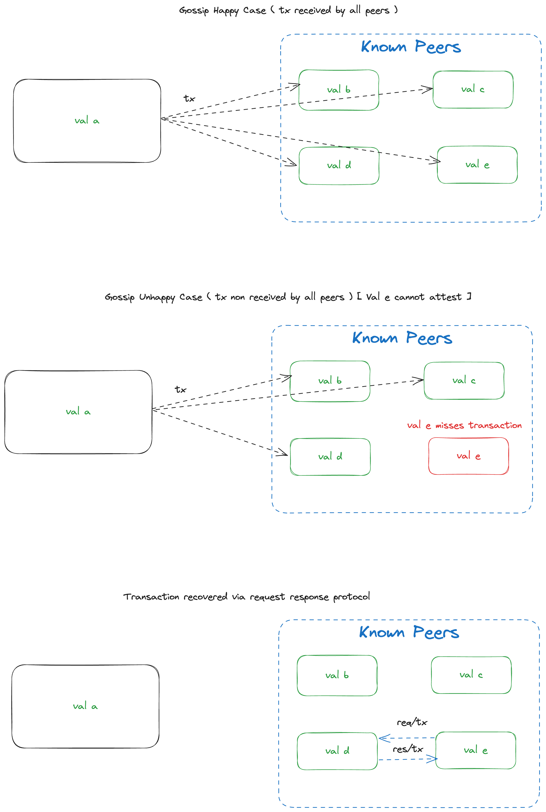

# Request/Response for Transactions

|                      |                                                                                  |
| -------------------- | -------------------------------------------------------------------------------- |
| Issue                | [feat(vc): ReqResp](https://github.com/AztecProtocol/aztec-packages/issues/8077) |
| Owners               | @Maddiaa0                                                                        |
| Approvers            | @just-mitch                                                                      |
| Target Approval Date | 2024-09-17                                                                       |


## Executive Summary

Validator nodes need a mechanism to fetch transactions from peers that they have been asked to sign as part of a proposed block. This design proposes a request/response mechanism for fetching transactions from peers.

**NOTE:**, this has been largely copied from https://github.com/AztecProtocol/engineering-designs/pull/19/files, which was closed in favor of breaking that design into smaller pieces; credit should go to @Maddiaa0 for the design presented here.

## P2P Layer Description

Validators are expected to validate all private transaction proofs before signing an attestation to a block proposal. A block proposal will contain (at LEAST) a list of all of the transaction hashes that are to be included within the block. At an extension, and provided the p2p layer can handle large message payloads, the entire transaction payload - not just the transaction hash - may be included within the block proposal.

The happy path for the p2p layer is that gossiped transactions are broadcast to all peers, and then further propagated throughout the network. If only the transaction hashes are included in the block proposal, there is a possibility that a node may not have the full transaction payload for a proposed block. In the case that a node does not have the full transaction payload for a proposed block, the node should request the full transaction payload from a peer. This will be performed by a request response protocol between nodes.


## Implementation

### Protocol Identification 
Each request response interaction is identified by a protocolID (a.k.a. SubProtocol). 
This protocol will take a form similar to the `gossipSub` protocol topic, the form is expected to be as follows. 

```
/aztec/req/{subprotocol}/{version}
```

Where subprotocol details the type of request being made, and version details the version of the protocol being used, the exact form of version is yet to be determined. It may represent a semantic version (such as a hardfork), or it may represent a specific protocol implementation version (semver identifier).

Whatever version standard is used will match that used by the `gossipSub` protocol topics.

### Request / Response Interactions
When a validator requires a payload from a peer, they will dial their peer's, opening up ONE stream per interaction. This stream will be closed when this interaction is complete, regardless of whether the interaction was successful or not.

### Request / Response Interfaces

Each request response interaction is explicitly defined by the protocolID (a.k.a. SubProtocol). This protocolID can be used to determine the expected message request types, and the expected data response types.

*Request / Response Mapping*

```ts
/**
 * The Request Response Pair interface defines the methods that each
 * request response pair must implement
 */
interface RequestResponsePair<Req, Res> {
  request: new (...args: any[]) => Req;
  /**
   * The response must implement the static fromBuffer method (generic serialisation)
   */
  response: {
    new (...args: any[]): Res;
    fromBuffer(buffer: Buffer): Res;
  };
}
```

For an example transaction request protocol, the serialized request and response types are defined as follows:
- The request will send a TransactionHash, which means the responder should expect strict serialization of the TransactionHash type.
- The response will send a Transaction, which means the responder should expect strict serialization of the Transaction type.

```ts
  '/aztec/req/tx/0.1.0': {
    request: TxHash,
    response: Tx,
  },
```

### Making a request 
When opening a stream with a peer, a specific protocolID (a.k.a. SubProtocol) will be used to determine what data the peer requires. For example, a SubProtocol with id `/aztec/req/tx/0.1.0` represents a stream that will be used to request a transaction payload from a peer.

If the requesting node does not receive a response from the peer, it will wait for a maximum `REQUEST_TIMEOUT` before the stream is closed and the node attempts to open a new stream with a different peer.

When a peer makes a request via the stream, their side of the stream will be closed upon sending the request, and no further messages will be send to the peer. 

The requester will read from the stream until:
1. An error is returned.
2. The stream is closed by the responding peer.
3. Any error is processed when interpreting the response.
4. A maximum number of chunks are read (e.g. the expected size of the payload to be received).
5. A timeout is reached.

The response to the message should be processed fully before the stream is closed.

### Making a response
Both the requester and responder will negotiate a protocolID (a.k.a. SubProtocol) to be used for the stream.

Based on the negotiated protocolID, the responder will know the message length to expect from the requester. 
It should fail if, the message received is not of the expected size.
The message cannot be deserialized into the expected type.

The responder will read from the stream until:

1. An error is returned.
2. The stream is closed by the requesting peer.
3. Any error is processed when interpreting the request.
4. A maximum number of chunks are read (e.g. the expected size of the payload to be received).
5. A timeout is reached.

At the time of writing, erroneous responses are represented by an empty response type. In the future, it may be beneficial to include additional information about the error, such as an error code and/or message.

> We do not include any information below the libp2p level in the protocol, messaging protocol etc are not defined here.


#### An overview of p2p layer flows.




## Change Set

Fill in bullets for each area that will be affected by this change.

- [ ] Cryptography
- [ ] Noir
- [ ] Aztec.js
- [ ] PXE
- [ ] Aztec.nr
- [ ] Enshrined L2 Contracts
- [ ] Private Kernel Circuits
- [ ] Sequencer
- [ ] AVM
- [ ] Public Kernel Circuits
- [ ] Rollup Circuits
- [ ] L1 Contracts
- [ ] Prover
- [ ] Economics
- [ ] P2P Network
- [ ] DevOps

## Test Plan

Outline what unit and e2e tests will be written. Describe the logic they cover and any mock objects used.

## Documentation Plan

Identify changes or additions to the user documentation or protocol spec.


## Rejection Reason

If the design is rejected, include a brief explanation of why.

## Abandonment Reason

If the design is abandoned mid-implementation, include a brief explanation of why.

## Implementation Deviations

If the design is implemented, include a brief explanation of deviations to the original design.

## Disclaimer

The information set out herein is for discussion purposes only and does not represent any binding indication or commitment by Aztec Labs and its employees to take any action whatsoever, including relating to the structure and/or any potential operation of the Aztec protocol or the protocol roadmap. In particular: (i) nothing in these projects, requests, or comments is intended to create any contractual or other form of legal relationship with Aztec Labs or third parties who engage with this AztecProtocol GitHub account (including, without limitation, by responding to a conversation or submitting comments) (ii) by engaging with any conversation or request, the relevant persons are consenting to Aztec Labs’ use and publication of such engagement and related information on an open-source basis (and agree that Aztec Labs will not treat such engagement and related information as confidential), and (iii) Aztec Labs is not under any duty to consider any or all engagements, and that consideration of such engagements and any decision to award grants or other rewards for any such engagement is entirely at Aztec Labs’ sole discretion. Please do not rely on any information on this account for any purpose - the development, release, and timing of any products, features, or functionality remains subject to change and is currently entirely hypothetical. Nothing on this account should be treated as an offer to sell any security or any other asset by Aztec Labs or its affiliates, and you should not rely on any content or comments for advice of any kind, including legal, investment, financial, tax, or other professional advice.
