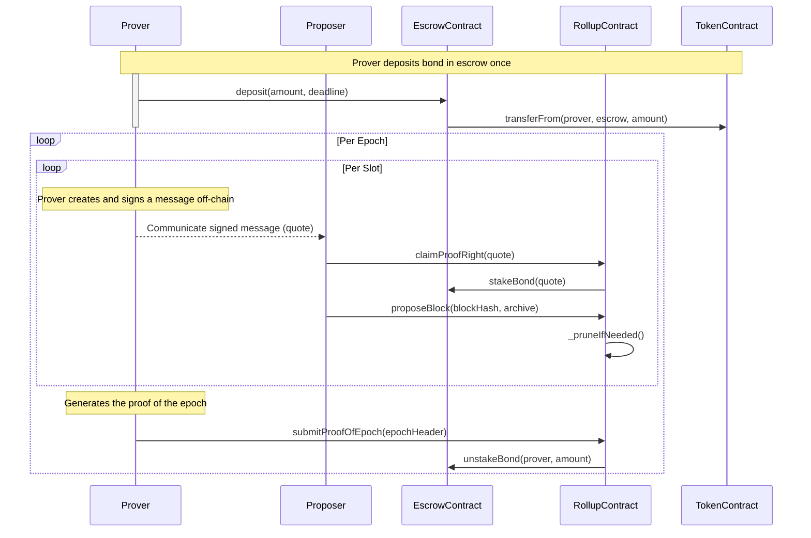

# Proof Timeliness

|                      |                                                             |
| -------------------- | ----------------------------------------------------------- |
| Issue                | https://github.com/AztecProtocol/aztec-packages/issues/8401 |
| Owners               | @just-mitch                                                 |
| Approvers            | @LHerskind                                                  |
| Target Approval Date | 2024-09-13                                                  |


## Executive Summary

The rollup contract will require that the pending chain be pruned to the proven chain if a proof for an epoch does not get verified on L1 in a fixed amount of time.

Proposers will be able to submit quotes signed by provers that indicate a percentage of the rewards they will receive if a proof is submitted in time.

An escrow contract will be provided for provers to stake a bond.

This design enshrines the Quote, and the escrow contract.

## Introduction

There is functionality in the rollup contract to prune the pending chain, but this is not currently used.

A strict proof timeliness requirement affords guarantees to users that their transactions will be included in the proven chain within a fixed amount of time.

This design focuses on how those timelines are defined and enforced by the rollup contract; it does not cover how nodes will handle the ensuing reorg with respect to their local state.

## Proving phases

<!-- Editors: you can copy/paste the png from the repository into excalidraw to make edits. -->


### Proof claim phase

The beginning of each epoch is the "proof claim phase".

This phase has a duration of $C$ slots (e.g. 13 slots. See notebook for modeling).

During this time, the proposer for a slot can submit a claim to be the prover for the previous epoch.

This can be a transaction separate from the submission of their proposed block.

Doing so grants monopoly rights to the rewards for submitting the proof of epoch `n-1`:
if there are block rewards in test token TST, they will be sent to the address that submitted the claim.

If no claim is submitted, the pending chain is pruned to the tip of the proven chain;
a caveat is if a proof for epoch `n-1` is submitted during the proof claim phase.

### Proof production

The proof for epoch `n-1` must land in epoch `n`.

Failure to submit a proof results in the bond posted with the claim being slashed if it exists.

Further, the pending chain is pruned to the tip of the proven chain.

Given that an epoch is $E$ slots, the wall time duration of $E-C$ slots must be greater than the time required to produce a proof.

## The overall flow



More details on the contents of the message signed and how it is communicated can be found in [the prover coordination design](https://github.com/AztecProtocol/engineering-designs/pull/25).

We use an external escrow contract to handle the bond to gain:
- a very specific/targeted permitting mechanism for the bond to be used, protecting the prover
- a delayed withdrawal mechanism for the bond, ensuring that proposers can be confident the bond will be available when they `claimProofRight`


## Rough Implementation

This is a rough, illustrative implementation of the proof timeliness requirement to guide intuition.  

The key "trick" is that we prune the pending chain as part of a proposer's block submission if needed.

An observation is that in the current design, the committee does not change in the event that no proof claim is posted for the previous epoch;
this means that the committee will have any blocks in its first $C$ slots reorged, but the subsequent blocks can start a new pending chain.

```solidity

interface IEscrowContract {
    function deposit(uint256 amount, uint256 deadline) external;
    function stakeBond(Quote calldata quote) external returns (address); // returns the bond provider
    function unstakeBond(address bondProvider, uint256 amount) external;
    function withdraw(uint256 amount) external;
}

// not super relevant to the design, but included for context/correctness
// see https://hackmd.io/@aztec-network/By9LwP1qA?type=view#Syssitia
interface IBlockRewards {
    function distributeBlockRewards(address proverRewardsAddress, address proposerAddress, uint256 proverFeeBasisPoints) external;
}

struct Quote {
    Signature signature;
    uint256 epochToProve;
    uint256 validUntilSlot;
    uint256 bondAmount;
    address rollup;
    uint32 basisPointFee;
}


contract Rollup {
    struct ChainTips {
        uint256 pendingBlockNumber;
        uint256 provenBlockNumber;
   }

    struct BlockLog {
        bytes32 archive;
        bytes32 blockHash;
        uint128 slotNumber;
    }

    struct ProofClaim {
        uint256 epochToProve; // the epoch that the bond provider is claiming to prove
        uint256 basisPointFee; // the fee that the bond provider will receive as a percentage of the block rewards
        uint256 bondAmount; // the amount of escrowed funds that the bond provider will stake. Must be at least PROOF_COMMITMENT_BOND_AMOUNT
        address bondProvider; // the address that has deposited funds in the escrow contract
        address proposerClaimant; // the address of the proposer that submitted the claim
    }

    struct TransactionFee {
        uint256 amount;
        address recipient;
    }

    struct EpochHeader {
        TransactionFee[] fees;
        uint256 finalBlockNumber;
    }


    // Events
    event ProofRightClaimed(address indexed claimer, uint256 indexed epoch);
    event PendingChainPruned(uint256 newBlockNumber, uint256 oldBlockNumber);
    event ProofSubmitted(uint256 indexed epoch, uint256 finalBlockNumber);

    // Errors
    error Rollup__NonProposerCannotClaimProofRight();
    error Rollup__ProofRightAlreadyClaimed();
    error Rollup__NotInClaimPhase();
    error Rollup__NoBlockLog();
    error Rollup__NotPreviousEpoch();
    error Rollup__NotLastBlockInEpoch();
    error Rollup__ProofProductionPhaseEnded();
    error Rollup__UnauthorizedProofSubmitter();

    // Constants
    uint256 public constant CLAIM_DURATION = 13;
    uint256 public constant EPOCH_DURATION = 32;
    uint256 public constant PROOF_COMMITMENT_BOND_AMOUNT = 100;

    // State variables
    IProverBondEscrow public immutable proverBondEscrow;
    IFeeJuicePortal public immutable feeJuicePortal;
    IBlockRewards public immutable blockRewards;

    ChainTips public tips;
    mapping(uint256 => BlockLog) public blockLogs;
    ProofClaim public proofClaim;

    constructor(address _proverBondEscrow, address _feeJuicePortal, address _blockRewards) {
        proverBondEscrow = IProverBondEscrow(_proverBondEscrow);
        feeJuicePortal = IFeeJuicePortal(_feeJuicePortal);
        blockRewards = IBlockRewards(_blockRewards);
    }

    function claimProofRight(
        Quote calldata _quote
    ) external {
        uint256 currentSlot = getCurrentSlot();
        address currentProposer = getCurrentProposer();
        uint256 epochToProve = getEpochToProve();

        if (currentProposer != address(0) && currentProposer != msg.sender) {
            revert Rollup__NonProposerCannotClaimProofRight();
        }

        if (_quote.epochToProve != epochToProve) {
            revert Rollup__NotClaimingCorrectEpoch();
        }

        // Overwrite stale proof claims:
        // if the epoch to prove is not the one that has been claimed,
        // then whatever is in the proofClaim is stale,
        // and we overwrite below
        if (proofClaim.epochToProve == epochToProve) {
            revert Rollup__ProofRightAlreadyClaimed();
        }

        if (currentSlot % EPOCH_DURATION >= CLAIM_DURATION) {
            revert Rollup__NotInClaimPhase();
        }

        if (_quote.bondAmount < PROOF_COMMITMENT_BOND_AMOUNT) {
            revert Rollup__InsufficientBondAmount();
        }

        if (_quote.validUntilSlot > currentSlot) {
            revert Rollup__QuoteExpired();
        }

        address bondProvider = escrow.stakeBond(_quote);

        proofClaim = ProofClaim({
            epochToProve: epochToProve,
            basisPointFee: _quote.basisPointFee,
            bondAmount: _quote.bondAmount
            bondProvider: bondProvider,
            proposerClaimant: msg.sender,
        });

        emit ProofRightClaimed(proposer, epochToProve, currentSlot);
    }


    function _pruneIfNeeded() internal {
        if (tips.pendingBlockNum == tips.provenBlockNum) {
            return;
        }

        uint256 oldestPendingEpoch = getEpochAt(blockLogs[tips.provenBlockNum + 1].slotNumber);
        uint256 startSlotOfPendingEpoch = oldestPendingEpoch * EPOCH_DURATION;

        if (currentSlot < startSlotOfPendingEpoch + EPOCH_DURATION + CLAIM_DURATION) {
            // If we are in the claim phase, do not prune
            return;
        } else if (
            currentSlot < startSlotOfPendingEpoch + 2 * EPOCH_DURATION 
            && proofClaim.epochToProve == oldestPendingEpoch
        ) {
            // We have left the claim phase, but a claim has been made
            return;
        }

        // Either a claim didn't land in time, or no proof was submitted
        _prune();
    }

    function _prune() internal {
        emit PendingChainPruned(tips.provenBlockNum, tips.pendingBlockNum);
        tips.provenBlockNum = tips.pendingBlockNum;
    }


    function proposeBlock(bytes32 _blockHash, bytes32 _archive) external {
        _pruneIfNeeded();
        // Additional block proposal logic here
        // ...
    }

    function submitProofOfEpoch(bytes calldata _epochHeader) external {
        EpochHeader memory epochHeader = abi.decode(_epochHeader, (EpochHeader));
        uint256 finalBlockNumber = epochHeader.finalBlockNumber;

        uint256 currentEpoch = getCurrentEpoch();

        // We cannot use chain tip and length because the final block in the epoch may not be in the final slot
        BlockLog memory finalProvenBlockLog = blockLogs[finalBlockNumber];
        if (finalProvenBlockLog.hash == 0) {
            revert Rollup__NoBlockLog();
        }

        BlockLog memory firstUnprovenBlockLog = blockLogs[finalBlockNumber + 1];
        // This serves two checks:
        // 1. The proof is submitted in the correct epoch
        // 2. The proof does not truncate the blocks in the epoch it is proving
        if (firstUnprovenBlockLog.hash != 0 &&
            getEpochAt(firstUnprovenBlockLog.slotNumber) != currentEpoch) {
            revert Rollup__NotLastBlockInEpoch();
        }

        bytes32 previousProvenArchive = blockLogs[tips.provenBlockNumber].archive;
        // Verify the proof using the previous proven archive
        // which ensures we aren't omitting an epoch

        /////// Verification logic here ///////

        // Okay we have a valid proof

        tips.provenBlockNumber = finalBlockNumber;

        if (proofClaim.epochToProve == getEpochAt(finalProvenBlockLog.slotNumber)) {
            escrow.unstakeBond(proofClaim.bondProvider, proofClaim.bondAmount);
            // block rewards are distributed to the prover and proposer who submitted the claim
            blockRewards.distributeBlockRewards(proofClaim.bondProvider, proofClaim.proposerClaimant, proofClaim.basisPointFee);
        }

        // distribute the transaction fees to the proposers of the blocks in the epoch
        // irrelevant to the design at hand, but included for completeness
        for (uint256 i = 0; i < epochHeader.fees.length; i++) {
            TransactionFee memory fee = epochHeader.fees[i];
            if (fee.recipient != address(0)) {
                feeJuicePortal.distributeFees(fee.recipient, fee.amount);
            }
        }

        emit ProofSubmitted(provenEpoch, finalBlockNumber);
    }

}
```

## Change Set

Fill in bullets for each area that will be affected by this change.

- [ ] Cryptography
- [ ] Noir
- [ ] Aztec.js
- [ ] PXE
- [ ] Aztec.nr
- [ ] Enshrined L2 Contracts
- [ ] Private Kernel Circuits
- [ ] Sequencer
- [ ] AVM
- [ ] Public Kernel Circuits
- [ ] Rollup Circuits
- [x] L1 Contracts
- [ ] Prover
- [ ] Economics
- [ ] P2P Network
- [ ] DevOps

## Test Plan

### Unit tests (solidity)

Escrow contract:
- Depositing funds
- Staking a bond
- Unstaking a bond
- Withdrawing funds is delayed

Claiming proof rights:
- Signature generation
  - can claim iff the proposer in the current slot has signed
- Successful claim by a bond provider
  - In the first/middle/last slot of the claim phase
- Preventing double claims
- Preventing claims outside the claim phase

Chain pruning:
- Pruning when no proof claim is made
  - Pending chain should reset to the proven tip with the current committee
- Pruning when a claim is made but no proof is submitted

Submitting proof of epoch:
- Successful submission of a proof

Testing all the above when:
  - the previous epoch was empty
  - the previous epoch has empty slots (particularly at the beginning/end of an epoch)
  - this is the first epoch

### E2E tests

All existing E2E tests should pass. Additional E2E will be written after the sequencer has been updated to handle reorgs.

## Documentation Plan

TBD

## Disclaimer

The information set out herein is for discussion purposes only and does not represent any binding indication or commitment by Aztec Labs and its employees to take any action whatsoever, including relating to the structure and/or any potential operation of the Aztec protocol or the protocol roadmap. In particular: (i) nothing in these projects, requests, or comments is intended to create any contractual or other form of legal relationship with Aztec Labs or third parties who engage with this AztecProtocol GitHub account (including, without limitation, by responding to a conversation or submitting comments) (ii) by engaging with any conversation or request, the relevant persons are consenting to Aztec Labs’ use and publication of such engagement and related information on an open-source basis (and agree that Aztec Labs will not treat such engagement and related information as confidential), and (iii) Aztec Labs is not under any duty to consider any or all engagements, and that consideration of such engagements and any decision to award grants or other rewards for any such engagement is entirely at Aztec Labs’ sole discretion. Please do not rely on any information on this account for any purpose - the development, release, and timing of any products, features, or functionality remains subject to change and is currently entirely hypothetical. Nothing on this account should be treated as an offer to sell any security or any other asset by Aztec Labs or its affiliates, and you should not rely on any content or comments for advice of any kind, including legal, investment, financial, tax, or other professional advice.
