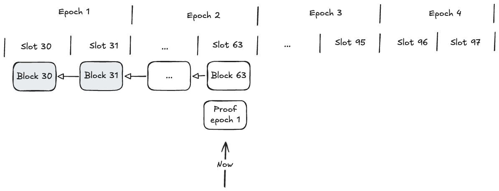
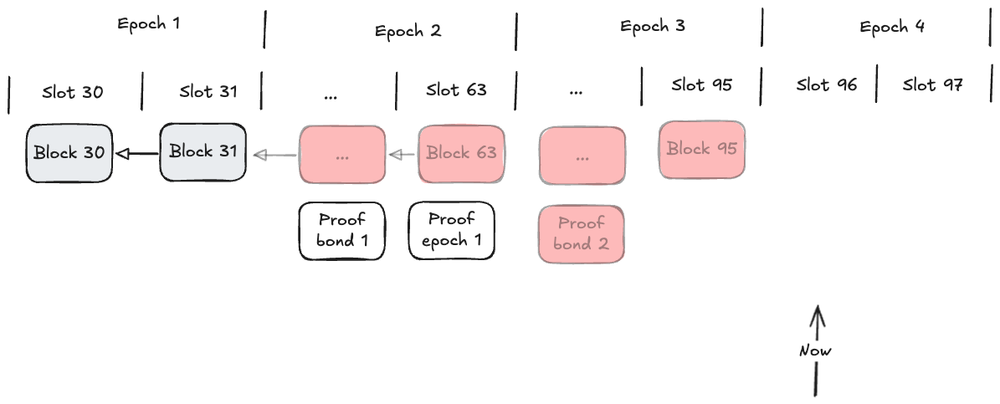
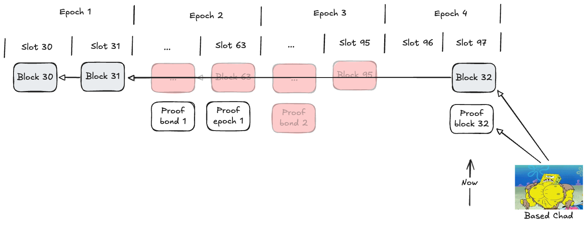
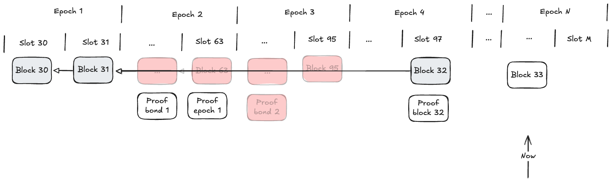

# Based Fallback

|                      |                                   |
| -------------------- | --------------------------------- |
| Issue                | [title](github.com/link/to/issue) |
| Owners               | @LHerskind                        |
| Approvers            | @just-mitch @aminsammara          |
| Target Approval Date | 2024-11-13                        |

## Executive Summary

We propose a method which ensure Ledger Growth, even if the committee is non cooperative.
Based fallback provide us with these guarantees, assuming that the base-layer is accessible.

## Introduction

The Aztec network is a Rollup on Ethereum L1, that have its own consensus layer to support build-ahead.
Since the consensus layer is only there for the ability to have fast ledger growth, e.g., block times that are smaller than proving times, it should not be strictly required for the state of the chain to be progressed.
Therefore, we provide a fallback mechanism to handle the case where the committee fail to perform their duties - allowing anyone to grow the ledger.

The nature in which they could fail to perform their duties varies widely.
It could be an attack to try and censor the network, or it might be that a majority of the network is running a node that corrupts its state the 13 of August every year as an homage to the Aztec empire.

Nevertheless, we need a mechanism to ensure the liveness of the chain, even if slower, in these events.

> Note:  
> While this is not directly dependent on forced inclusions, forced inclusions being ignored are one way that we might enter this fallback.
> Thereby the fallback is practically what will ensure that forced inclusions can be included.

For the fallback, we will define the following:

- How will we enter the based fallback
- How are blocks proposed when in this mode
  - They need proofs along with the proposal
- How do we exit

## Interface

The primary users of the fall back mode will be actors similar to the sequencers (with some expected overlap).
They are block builders that wish to push a block when the chain is otherwise dead, or censored.

Nevertheless, they interact with the system differently, as they have much more limited setup in which they can produce blocks, my expectation is that it is closer to an on-demand node than the usual validator setup.

## Implementation

### Entering Based Fallback

The based fallback is expected to have a significantly worse user experience since proofs must be provided as well, it is therefore less likely that they will happen in quick succession - unless only a single actor will try to extend the chain.

Because of this, we really do not want to enter the fallback too often, but we need to make it happen often enough that it is usable.
For applications that are dependent on users acting based on external data or oracle data, a low bar to enter based mode can be desirable since it will mean that they would be able to keep running more easily.
Lending and trading falls into these categories as they usually depend on external data sources, e.g., prices of CEX'es influence how people use a trading platform and lending platforms mostly use oracles to get prices.

We suggest defining the time where Based fallback can be entered to be $T_{\textsf{fallback}, \textsf{enter}}$ after the last proven block. 
The minimum acceptable value for $T_{\textsf{fallback}, \textsf{enter}}$ should therefore be if a committee fails to performs its proving duties as specified as a full epoch $E$ in https://github.com/AztecProtocol/engineering-designs/pull/22 * 2.

The reason we want $T_{\textsf{fallback}, \textsf{enter}} > 2 E$ is fairly simple, but more easily seen with a drawing.
In the figure, we mark a proven block with a gray background.
We don't have skipped slot in the below diagram as I don't need that kind of complexity right now.
We will be using an epoch length of $32$ slots, e.g., $E = 32$.

As you see from the image above, while the last proven block might be block 31, the time it gets proven could be in slot 63, e.g., 1 epoch later.
If $T_{\textsf{fallback}, \textsf{enter}} > E$, then the minimum $T_{\textsf{fallback}, \textsf{enter}}$ would mean that we could enter based fallback at slot 64, without there even being an option for a missed proof.

Lets say that we use $T_{\textsf{fallback}, \textsf{enter}} = 2E + 1$, and that no more proofs come in - then we will enter the based fallback at slot 96.

Note that this will prune the pending chain!

### Proposing blocks in based mode

When the based fallback have been activated, a new set of rules starts applying for what is seen as a valid block proposal.
Namely, because there are no committee to assure availability or correctness of the transactions, we rely on the proposer's claims until the proof arrives.
For this our solution is simple - we require that he provides the proof along with the proposal.

Note as shown in the diagram below, that the pending (unproven) blocks are pruned from the chain and the bond for epoch 2 is gone.

Beyond the proof being provided at the same time we need to also:

- Allow skipping the sequencer selection - allow anyone to propose.
- Relax the constraint that the slot of the block must be exactly the current slot.

The reason we need to relax the constraint around the slot of the block (and likely its epoch) is fairly simple.
If you are to also prove the block, you will be unable to do that within the slot.
Therefore you will either need to prove something that will happen in the future, or we need to allow you more relaxed constraints on the slot.

In our case, we are already constraining that the block happened `after` the last block, and that it is not in the future so we can just delete the constraint and still be partially sane.
Alternatively, we can take into account the `T_fallback_enter` value such that the slot number cannot be smaller than when we entered the based fallback.

Nevertheless, the proposer of a based block will yield extra power because they have more control over time than the committee members usually world.

### Exiting Based Fallback

Since the based fallback as mentioned earlier (likely) provide a worse experience than the committee, we also want to exit it as soon as possible.

However, this is where we start potentially having some issues.

Say we stopped being in the based fallback when a pending block is proposed:

- In the honest case, the consensus layer is online again, and can start performing their duties
- In the dishonest case, the consensus layer wish to censor the chain, and could propose unprovable blocks, but still exiting the fallback mode.

Another approach might be that we allow a committee to exit the fallback mode if they provide an epoch proof (does not need to include blocks for every slot).

However, this essentially make the committee a participant in the race to propose a block in the based fallback, and as they have the overhead of consensus they would be at a disadvantage.

Furthermore, if they need to build an epoch proof without there being blocks on L1 to point against, we would need to support an extra flow in the node for them.

A separate direction that I would like to entertain, is that we have two ways to "get out" of the based fallback, both based on time, similarly to how we ended up in here.

1. If the last proven block is older than $T_{\textsf{fallback}, \textsf{exit}, \textsf{activity}}$ we allow exiting the based fallback.
2. After $T_{\textsf{fallback}, \textsf{exit}}$ we allow exiting the fallback regardless of when the last proven block were.

Option 1, ensures that we can quickly leave the based fallback if there is no activity, allowing a good experience for the happy path.
Option 2, ensures that we will not be stuck forever in based fallback even if there is a malicious entity pushing blocks once in a while.
As a bonus, they are simple rules so my 🥜🧠 can deal with them.

### Relation to forced inclusion

As mentioned, one of the cases where we enter the based fallback is if the validator set is massively censoring.
If the L1 contract enforce that there is a minimum block size, the committees only option to try and censor will be to entirely stall the rollup.

After $T_{\textsf{fallback}, \textsf{enter}}$ time that would push us into the based fallback.
At this point, anyone can push the blocks with the censored transactions.
Even if the committee is trying to limit the throughput by only pushing the minimum blocks, $T_{\textsf{fallback}, \textsf{exit}}$ can then be picked such that a minimum throughput could be supported over the duration.
The minimum throughput here under the assumption that either they will need to push minimum blocks as fast as they can, or someone else might push a bigger block exiting even more.

### Changes to existing architecture

The changes should mostly be on the L1 contract and the sequencer client, with a minor potential change for the rollup circuit (might simply not be necessary).

- The L1 contract need to deal with the flows as above.
- The sequencer client need to know when fallback is activated such that it does not try to act as it normally would.
  - I believe simply doing nothing is best here, as the fallbacks can be seen as a fully separate type of sequencer then.
- Add a new "fallback" sequencer, which skips a lot of the checks of the current sequencer but mainly build and prove blocks.
- The L1 contract/rollup circuit mix needs to support individual block proofs for this specific mode.
  - This could be taking a single BlockRoot rollup and publishing it.

## Change Set

Fill in bullets for each area that will be affected by this change.

- [ ] Cryptography
- [ ] Noir
- [ ] Aztec.js
- [ ] PXE
- [ ] Aztec.nr
- [ ] Enshrined L2 Contracts
- [ ] Private Kernel Circuits
- [x] Sequencer
- [ ] AVM
- [ ] Public Kernel Circuits
- [x] Rollup Circuits
- [x] L1 Contracts
- [ ] Prover
- [ ] Economics
- [ ] P2P Network
- [ ] DevOps

## Test Plan

- A majority of the tests will be related to the L1 contracts specifically, and the full flow can be tested without requiring an additional node.
- A separate E2E test running the fallback node should be tried
- A network test entering and exiting fallback gracefully.

## Documentation Plan

- The user documentation needs to be extended on how to run this special type of sequencer
- Protocol spec needs to be extended around block building to outline these edge cases

## Rejection Reason

If the design is rejected, include a brief explanation of why.

## Abandonment Reason

If the design is abandoned mid-implementation, include a brief explanation of why.

## Implementation Deviations

If the design is implemented, include a brief explanation of deviations to the original design.

## Disclaimer

The information set out herein is for discussion purposes only and does not represent any binding indication or commitment by Aztec Labs and its employees to take any action whatsoever, including relating to the structure and/or any potential operation of the Aztec protocol or the protocol roadmap. In particular: (i) nothing in these projects, requests, or comments is intended to create any contractual or other form of legal relationship with Aztec Labs or third parties who engage with this AztecProtocol GitHub account (including, without limitation, by responding to a conversation or submitting comments) (ii) by engaging with any conversation or request, the relevant persons are consenting to Aztec Labs’ use and publication of such engagement and related information on an open-source basis (and agree that Aztec Labs will not treat such engagement and related information as confidential), and (iii) Aztec Labs is not under any duty to consider any or all engagements, and that consideration of such engagements and any decision to award grants or other rewards for any such engagement is entirely at Aztec Labs’ sole discretion. Please do not rely on any information on this account for any purpose - the development, release, and timing of any products, features, or functionality remains subject to change and is currently entirely hypothetical. Nothing on this account should be treated as an offer to sell any security or any other asset by Aztec Labs or its affiliates, and you should not rely on any content or comments for advice of any kind, including legal, investment, financial, tax, or other professional advice.
