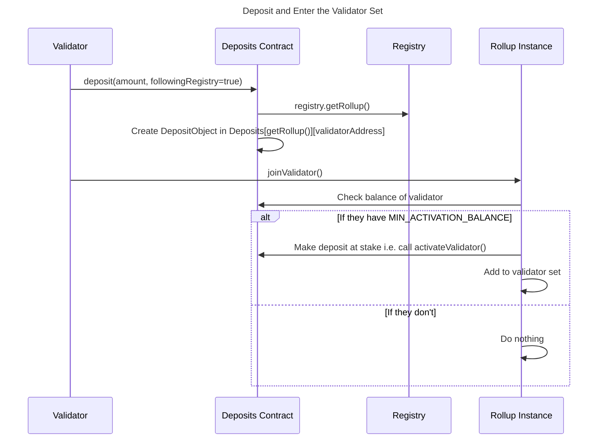

|                      |                                   |
| -------------------- | --------------------------------- |
| Issue                | [title](github.com/link/to/issue) |
| Owners               | @aminsammara                              |
| Approvers            | @LHerskind @just-mitch @joeandrews @Maddiaa0 |
| Target Approval Date | 2024-11-08                        |


# Executive Summary

This design introduces a Staking Mechanism and Proof Of Governance (PoG) for slashing. 

For Staking, we introduce an immutable `Deposit` contract to make stake migrations more seamless.  

For Slashing, the rationale behind using PoG is the use of offchain evidence for voting allows nice properties including:

1) More precision in slashing. Honest node operators should not be slashed but we need offchain evidence to do this. 
2) Provers can appeal to the validator set to unslash them in the case they could not submit their proof on time (i.e. Ethereum congestion, or an attack on proving marketplace nodes)

So we rely on validators to vote to slash dishonest actors. 


# Staking

Validators stake with a `Deposit` contract in order to join the validator set. They do NOT stake with the Rollup contract directly. This is meant to simplify moving stake during/after a governance upgrade. 

### Deposit Contract

The Deposit contract is an immutable contract living on L1, that is owned by the Governance Contract (i.e. Apella). It implements the following simplified interface:

```solidity

interface IDeposit {
  function deposit(address validatorAddress, address withdrawalAddress, uint256 amountToDeposit, bool followRegistryBool, address rollupAddress) external returns(bool);
  function activateValidator(address rollupAddress, address validatorAddress, uint256 amount);
  function widthdraw(address rollupAddress, address validatorAddress) external returns(bool);
  function unstakeValidators(addresss rollupAddress, address validatorAddress) external returns(bool);
  function slashValidator(address rollupAddress, address validatorAddress) external returns(bool);
  function getRollup() internal view returns(address);
}
```

### Deposit Function

* Validators must deposit at least `MIN_DEPOSIT_AMOUNT`.
* A successful call results in an entry in the `Deposits` mapping. This mapping is a `mapping(address rollupAddress => mapping(address validatorAddress => DepositLib.DepositObject))`
* A `DepositObject` contains references to the `withdrawalAddress` and `followingRegistryBool` variables. It is unique per rollupAddress / validatorAddress combination. 
* Therefore validators can have multiple deposits corresponding to different Rollups. But for each Rollup, they can only have one deposited balance, one withdrawal address and one `followingRegistryBool` flag. 
* Once a validator deposit for a particular Rollup meets or exceeds `MIN_ACTIVATION_AMOUNT`, the Rollup instance can add them to the validator set by calling `activateValidator`
* Any amounts specified by `activateValidator` are removed from `Deposits` and accounted for in a different mapping, say `StakedDeposits`.
* Amounts in `StakedDeposits`are now subject to withdrawal delays and slashing requirements. 

### Entering the Validator Set

Each Rollup implements its own logic for how validators join the validator set. I expect standard delays (i.e. 10 epochs) before a validator actually joins the set. 

Once the Rollup instance calls `activateValidator(_rollupAddress, _valAddress, _amount)`, 

```solidity
 // ...
Deposits[_rollupAddress][_valAddress].amount -= _amount
StakedDeposits[_rollupAddress][_valAddress].amount += _amount // if it exists, otherwise create it
 // ...
```
In visual form: 



### Migrating Stake

The `Deposit` contract is owned by the Governance Contract. As such in the event of an upgrade, the Apella can change the `StakedDeposits` mapping so that any `StakeObject` with `followingRegistryBool=true` can be moved to the new Rollup as pointed to by the Registry contract. 

Validators that choose `followingRegistryBool=false`, will have to exit funds and move manually. Note that this does not require block building on the old Rollup instance to be functional. 

In the event of a Migration (i.e. state wipe), a new Deposit contract must be deployed. 

### Withdraw Function

* Validators can call the withdraw function at any time to remove any balance they have in `Deposits` using `withdraw()`.
* Only the Rollup contract may withdraw balances from `stakedDeposits` using the function `unstakeValidator()`.

### Rewards

Any block rewards accruing to validators should be sent to the `withdrawalAddress` specified in `stakedDeposits`.

# Proof Of Governance Slashing

Why do we slash?

We need to make sure the chain is always (eventually) finalizing new blocks. The conditions required for the chain to finalize new blocks are:
1) Sequencers are making valid block proposals
2) More than 2/3 of the committee is attesting on valid block proposals.
3) Provers can obtain timely proof data for txs included in the epoch.
4) Provers post proofs to the L1 on time.

While Based Fallback acts as a backstop that ensures eventual liveness, malicious or permanently offline validators should eventually be kicked out of the validator set otherwise we end up in Based Fallback mode all too often. 

In PoG, validators vote to slash any dishonest validators. To reduce coordination costs, we equip the validator client software with the ability to automatically initiate and respond to votes to slash dishonest validators based on onchain or offchain (i.e. p2p) evidence.

Any validator can initiate a proposal to slash any other validator(s). A proposal to slash must include the offense, epoch/slot information and the validators to be slashed.  

Validators vote by signing the slashing proposal and gossiping back the signed message over the p2p. Anyone can submit a slashing proposal that has gathered enough signatures to the L1 for verification. 

This is more subjective than purely onchain slashing but it enables precision that is not possible with purely onchain slashing. We can adopt Ethereum's principle of "honest validators should not be slashed" at the expense of increased coordination cost.


### Users of PoG Slashing

Validators are the users of the PoG slashing mechanism. Full nodes can contribute data to validators but they should not be able to vote for a slashing proposal. 

### Protocol Defined Constants

1. `MIN_REQUIRED_STAKE_PERCENT` : The minimum % of stake that must sign a slashing / unslashing proposal before it is accepted by the L1 contract. 

## PoG Slashable Offences

These are actions that can and will be slashed using PoG.

### 1. Committee signs off on an invalid state root

Some validators implement a `ALWAYS_EXECUTE` flag which causes them to execute every block regardless of whether they're in the committee or not. Validators who implement this flag are called "Executing Validators". 

After every succesful block proposal, these Executing Validators will retrieve the list of `TxHash` from L1 and attempt to re-execute all transactions in the block. 

In the happy path, the Executing Validators are able to obtain the `TxObjects` and proofs required to do so. If the resulting state root does not match what was published to L1, they read the list of all committee members who signed the invalid block. 

The Executing Validator prepares a payload containing:
1) The offense in question: Invalid state root
2) The slot number of the invalid block.
3) The list of committee members who signed off on the invalid block.

and gossips through to the validator set. 

Validators who receive this proposal first also read the L1 for the list of `TxHash` posted along the block in question. If it does not match what's in the slashing proposal, it discards the slashing proposal. 

If the list of `TxHash` does match, they request all `TxEffects` and proofs from the p2p. As a last resort, they request from the validator who initiated the slashing proposal. They also read the state root posted to L1. 

If they're able to retreive all the required data to re-xecute the block contents and find an invalid state root, they sign the slashing proposal and gossip the signed proposal via the p2p. 

The Executing Validator who initialized the slashing proposal must aggregate signatures and post to L1 for verification once `MIN_REQUIRED_STAKE_PERCENT`of the stake has signed the proposal. 

On the L1, the contract verifies that: 
1) Validators in control of more than `MIN_REQUIRED_STAKE_PERCENT` of stake have signed the slashing proposal.

If the above checks pass, the named committee members are slashed. The L1 contracts pays out a small fee to cover the cost of verifying signatures on the L1. This fee goes to the validator who submitted the successful slashing proposal to the L1. 


**What should the validators do if they can't obtain the necessary data to re-execute the invalid state root?** 

The above scenario describes the "happy path" where a stupid committee coordinates an attack and shares the data with the rest of the validator set. In a sophisticated attack, the committee will plot to withhold the data. 

The question boils down to: Do we punish data withholding attacks given that they cannot be verified by the L1? 

The answer is -> Yes! A majority stake voting incorrectly on a data withholding attack is an even stronger violation of our honest-committee assumption. Honest committee members protect themselves by gossipping the tx data to as many peers possible. 

Therefore the Executing Validators who can't download all `TxObject` and proof data for any given block should initiate a data withholding slashing proposal, which works in exactly the same way as the invalid state root slashing proposal.

**Note on L1 verification of slashing proposals**

This design does not require the L1 to verify any state regarding the slashing proposal. It only requires the L1 to verify that a majority of the stake has signed the slashing proposal. In the future, based on feedback during Testnet, we could extend the L1 verification logic to include checking that:
1. The epoch has indeed re-orged. 
2. The committee members named in the slashing proposal have signed the specific block in question.

**Note on capability of Nodes to investigate slashing proposals**

One question could be that given that the L1 does not verify any state regarding the slashing proposal, why do we require the validator nodes to "investigate" the invalid state root slashing proposal? 

The answer is that we want to make it as easy as possible for validators to slash dishonest validators. Thus in the case of an invalid state root posted to the L1, where data is available to verify, coordination on the forums is unnecessary. 

### 2. Bonded provers don't post proofs on time

A bonded prover who fails to post proofs on time should have their bonds slashed. However we allow for an unslashing period where the prover can plead their case and convince the validators to vote to unslash them. 

Provers may not be able to post proofs if the L1 is congested or is experiencing an inactivity leak. A proving marketplace may come under an attack where their nodes go offline. There could be other valid reasons. 

Instead of automatically and immediatley slashing the bond, the prover's bond sits in escrow (or a separate contract) for $t=4$ weeks. During this period, the prover can plead their case and convince the validators to vote to unslash them. A validator must initiate a vote to unslash the prover and submit to L1 a proposal to unslash the prover that gathers signatures from more than `MIN_REQUIRED_STAKE_PERCENT` of the stake, otherwise the bond gets slashed. 

Proving bond unslashing proposals work differently to the invalid state root slashing proposals. Therefore the validator node software should allow a separate environment variable for voting on unslashing prover proposals. 

Validators should be able to specify that an unslashing proposal for prover with address `0xprover` that they receive over gossipSub should be voted on in a certain manner. They could also specify to always vote yes or always vote no to any unslashing proposal using the same environment variable. 

### 3. Sequencers don't accept EpochProofQuotes

If no EpochProofQuote is accepted within $C=13$ slots and the epoch reorgs, validators check for whether sequencers could have accepted an actionable EpochProofQuote during their turn. 

An actionable quote is one where:
i) The timestamp of receiving it was before the $C=13$th slot of the epoch. 
ii) The epoch information is correct. 
iii) The prover had the required bond in escrow. 
iv) The `basisPointFee` was within the allowable range. 

Nodes do NOT need to auto-respond to this type of slashing proposal. It is expected that such coordination happens offchain. 

The L1 contract verifies that `MIN_REQUIRED_STAKE_PERCENT` of stake has signed the slashing proposal. 


### 4. Inactivity Leak

Upon entering Based Fallback mode, validators can slash the committee members who have not submitted blocks during their slots. Since entering Based Fallback mode requires $T_{\textsf{fallback, enter}}$ time of no activity on the Pending Chain, validators initiate a proposal to slash the inactive committees during that time period. 

Nodes do NOT need to auto-respond to this type of slashing proposal. It is expected that such coordination happens offchain. 

The L1 contract verifies that `MIN_REQUIRED_STAKE_PERCENT` of stake has signed the slashing proposal. 

### Max slashing limits

For the initial version of the slashing implementation, we're opting for not restricting the max slashing limits in the rollup contracts. The reasons being: 

1) In order to utilize the full economic security of the Pending Chain, the entire sum of the validator deposit must be at stake. i.e. it must be possible to get slashed 100%. 
2) Let's say we have a 1% limit for simple offences, and 50% for larger offenses. Then a `MIN_REQUIRED_STAKE_PERCENT` of stake can still vote to slash based on the larger offense. Since L1 verification is not possible for many of these offenses, we're always dependent on the honesty of the staking set anyway.
3) Reduces code complexity. 
4) We could always come back and implement strict limits if we get feedback to do so. 

Note: We're also not limiting the number of validators that can be slashed. If a malicious party acquires `MIN_REQUIRED_STAKE_PERCENT` of the staking set.. it's a Chernobyl scale nuclear event for everybody else.

### Other Slashable Offences 

In addition to PoG, the following offenses can be slashed entirely via the L1 contracts. 

| Actor | Description | Penalty |
| ---- | ----- | ----- |
| Bonded Prover | Fails to produce a proof within the proof submission phase | The bond is escrowed for $t=4$ weeks after which it is completely burned unless validators vote to unslash via PoG |
| Proposer who optimistically commits to the committee | In [Pleistarchus](#github.com/AztecProtocol/aztec-packages/issues/7978) we allow proposers to optimistically calculate the committee by providing some bond | The bond is burned with a small % offered as a reward to the challenger |
| Proposer who posts optimistic signature verification | If we implement optimistic signature verification, the proposer who submits invalid or not enough signatures should be slashed | The bond is burned with a small % offered as a reward to the challenger |

### Exiting Slashed Validators

Slashed validtors should be exited from the validator set in addition to being slashed. The remaining stake of a slashed validator can be withdrawn after `SLASHING_WITHDRAW_DELAY` time. This delay is longer than the exit delay for non-slashed validators. 

Slashed validators can rejoin the validator set at a later time. 

### Changes to existing architecture

The main changes are to the L1 contracts, p2p and the validator clients. 

**Changes to the Validator Client**
1) We introduce a new validtor "mode" called Executing Validator which executes all transactions all the time, even when they are not selected for a committee. 
2) In the case of a invalid state root slashing proposal, validator clients must deduce what data they need to request from L1 and from other nodes when they receive a slashing proposal via the p2p. They must also decide whether to sign the slashing proposal or ignore it based on their view of the L1 and the p2p layer.
3) Validator clients should be equipped with an environment variable to vote on slashing proposals. 
4) Validator clients should be equipped with an environment variable to vote on prover bond unslashing proposals. 
5) Validator clients should be able to send to L1 a slashing proposal for verification. 

**Changes to the P2P**
1) A new `Gossipable` type slashing proposal object. 
2) A new `Gossipable` type prover bond unslashing proposal object. 

**Changes to the L1 Contracts**
1) The L1 contracts must be able to verify that `MIN_REQUIRED_STAKE_PERCENT` of stake has signed a slashing proposal before executing the slash. 
2) The L1 contracts must be able to verify aggregated BLS signatures.
3) The Deposit contract
4) Apella execute logic should also update the Rollup instance which owns 

## Questions to Consider During Review

1. Executing Validators can spam the network with slashing proposals in DOS attack on the p2p. Do we need to make this expensive? i.e. stake some TST then initiate the proposal?
2. Do we really want to want to pay a small fee to cover the cost of verifying the BLS signature on L1? Makes slashing someone free.
3. Does the Deposit contract achieve its intended purpose of making stake migrations easier? 

## Change Set

Fill in bullets for each area that will be affected by this change.

- [ ] Cryptography
- [ ] Noir
- [ ] Aztec.js
- [ ] PXE
- [ ] Aztec.nr
- [ ] Enshrined L2 Contracts
- [ ] Private Kernel Circuits
- [x] Sequencer
- [ ] AVM
- [ ] Public Kernel Circuits
- [ ] Rollup Circuits
- [x] L1 Contracts
- [ ] Prover
- [x] Economics
- [x] P2P Network
- [ ] DevOps

## Test Plan

Outline what unit and e2e tests will be written. Describe the logic they cover and any mock objects used.

## Documentation Plan

Identify changes or additions to the user documentation or protocol spec.

## Rejection Reason

If the design is rejected, include a brief explanation of why.

## Abandonment Reason

If the design is abandoned mid-implementation, include a brief explanation of why.

## Implementation Deviations

If the design is implemented, include a brief explanation of deviations to the original design.

## Disclaimer

The information set out herein is for discussion purposes only and does not represent any binding indication or commitment by Aztec Labs and its employees to take any action whatsoever, including relating to the structure and/or any potential operation of the Aztec protocol or the protocol roadmap. In particular: (i) nothing in these projects, requests, or comments is intended to create any contractual or other form of legal relationship with Aztec Labs or third parties who engage with this AztecProtocol GitHub account (including, without limitation, by responding to a conversation or submitting comments) (ii) by engaging with any conversation or request, the relevant persons are consenting to Aztec Labs’ use and publication of such engagement and related information on an open-source basis (and agree that Aztec Labs will not treat such engagement and related information as confidential), and (iii) Aztec Labs is not under any duty to consider any or all engagements, and that consideration of such engagements and any decision to award grants or other rewards for any such engagement is entirely at Aztec Labs’ sole discretion. Please do not rely on any information on this account for any purpose - the development, release, and timing of any products, features, or functionality remains subject to change and is currently entirely hypothetical. Nothing on this account should be treated as an offer to sell any security or any other asset by Aztec Labs or its affiliates, and you should not rely on any content or comments for advice of any kind, including legal, investment, financial, tax, or other professional advice.
