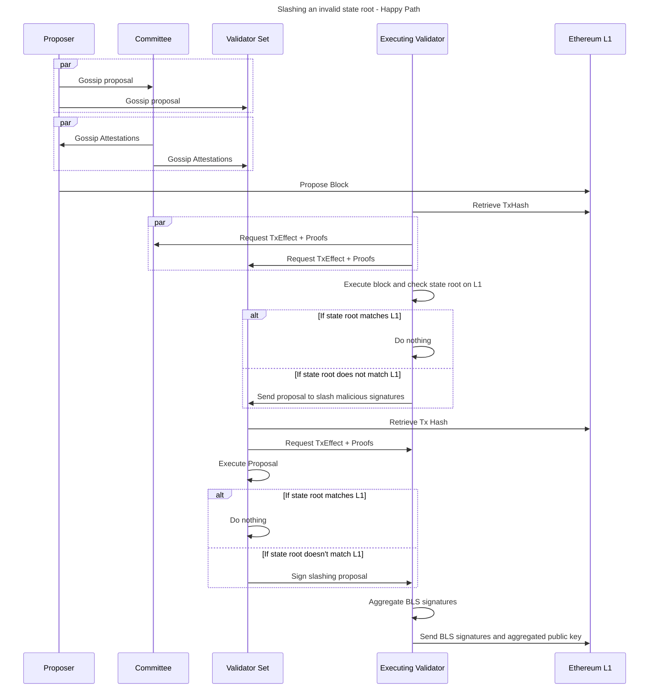

|                      |                                   |
| -------------------- | --------------------------------- |
| Issue                | [title](github.com/link/to/issue) |
| Owners               | @aminsammara                              |
| Approvers            | @LHerskind @just-mitch @JoeAndrews @Maddiaa0 |
| Target Approval Date | 2024-11-07                        |


## Executive Summary

This design introduces Proof Of Governance (PoG) for slashing. The rationale behind using PoG is that the use of offchain evidence for voting allows nice properties including:

1) Precision in slashing. Honest node operators should not be slashed.
2) TxObjects / Proofs are not available onchain so some offenses require the use of the P2P layer to detect wrongdoing.

## Introduction

Why do we slash?

We need to make sure the chain is always (eventually) finalizing new blocks. The conditions required for the chain to finalize new blocks are:
1) Sequencers are making valid block proposals
2) More than 2/3 of the committee is attesting on valid block proposals.
3) Provers can obtain timely proof data for txs included in the epoch.
4) Provers post proofs to the L1 on time.

While Based Fallback acts as a backstop that ensures eventual liveness, malicious or permanently offline validators should eventually be kicked out of the validator set otherwise we end up in Based Fallback mode all too often. 

In PoG, validators vote to slash any dishonest validators. To reduce coordination costs, we equip the validator client software with the ability to automatically initiate and respond to votes to slash dishonest validators based on onchain or offchain (i.e. p2p) evidence.

Any validator can initiate a proposal to slash any other validator(s). A proposal to slash must include the offense, epoch/slot information and the validators to be slashed.  

Validators vote by signing the slashing proposal and gossiping back the signed message over the p2p. Anyone can submit a slashing proposal that has gathered enough signatures to the L1 for verification. 

Based on the offense in question, the rollup contract establishes max slashable stakes. The rollup contract also verifies certain conditions have occured before executing the slash. 

This is more subjective than purely onchain slashing but it enables precision that is not possible with purely onchain slashing. We can adopt Ethereum's principle of "honest validators should not be slashed" at the expense of increased coordination cost.


## Interface

Validators are the users of the PoG slashing mechanism. Full nodes can contribute data to validators but they should not be able to vote for a slashing proposal. 

## Implementation

Define the slashing proposal sent to L1 to be a payload that could look like this:

```solidity
struct SlashingProposal({
  validatorSignature; // BLS signature
  aggregatedPublicKey; // Agg public key of validators who signed the proposal
  offense; // there is a pre-defined list of slashable behaviours
  validatorsToSlash; Optional address[] of validators to be slashed.
  epochNumber; Optional epoch in question
  slotNumbers; Optional uint256[] of slots in question
  calldataPayload; Optional The calldata passed along with the invalid block proposal function call
  calldataProof; Optional The merkle path to the contract storage
  proverAddress; Optional prover address who failed to submit a proof
)}
```
The TS implementation of this but should be similar. The validators who receive a slashing proposal via the p2p must be able to decipher what data is needed to decide how to vote. If they don't have the data, they must request it from peers then determine. 


### PoG Slashable Offences

These are actions that can and will be slashed using PoG.

**1. Committee signs off on an invalid state root**

Some validators implement a `ALWAYS_EXECUTE` flag which causes them to execute every block regardless of whether they're in the committee or not. Validators who implement this flag are called "Executing Validators". 

After every succesful block proposal, these Executing Validators will retrieve the list of `TxHash` from L1 and attempt to re-execute all transactions in the block. 

In the happy path, the Executing Validators are able to obtain the `TxObjects` and proofs required to do so. If the resulting state root does not match what was published to L1, they read the list of all committee members who signed the invalid block. 

The Executing Validator prepares a payload containing:
1) The offense in question: Invalid state root
2) The slot number of the invalid block.
3) The list of committee members who signed off on the invalid block.

and gossips through to the validator set. 

Validators who receive this proposal first also read the L1 for the list of `TxHash` posted along the block in question. If it does not match what's in the slashing proposal, it discards the slashing proposal. 

If the list of `TxHash` does match, they request all `TxEffects` and proofs from the p2p. As a last resort, they request from the validator who initiated the slashing proposal. They also read the state root posted to L1. 

If they're able to retreive all the required data to re-xecute the block contents and find an invalid state root, they sign the slashing proposal and gossip the signed proposal via the p2p. 

The executing validator who initialized the slashing proposal must aggregate signatures and post to L1 for verification once >50% of the stake has signed the proposal. 

On the L1, the contract verifies that: 
1) The epoch has indeed re-orged.
2) The committee members named in the slashing proposal have signed the specific block in question.
3) Validators in control of more than 50% of stake have signed the slashing proposal.

If the above checks pass, the named committee members are slashed. The L1 contracts pays out a small fee to cover the cost of verifying signatures on the L1. 



**What should the validators do if they can't obtain the necessary data to re-execute the invalid state root?** 

The above scenario describes the "happy path" where a stupid committee coordinates an attack and shares the data with the rest of the validator set. In a sophisticated attack, the committee will plot to withhold the data. 

The question boils down to: Do we punish data withholding attacks given that they cannot be verified by the L1? 

The answer is -> Yes! A majority stake voting incorrectly on a data withholding attack is an even stronger violation of our honest-committee assumption. Honest committee members protect themselves by gossipping the tx data to as many peers possible. 

Therefore the Executing Validators who can't download all `TxObject` and proof data for any given block should initiate a data withholding slashing proposal, which works in exactly the same way as the invalid state root slashing proposal.


**2. ETH Congestion**

Provers may not be able to post proofs if the L1 is congested or is experiencing an inactivity leak. Instead of automatic slashing of the prover bond, the validator set can vote to "unslash" the provers. 

The prover's bond sits in escrow (or a separate contract) for $t=4$ weeks. During this period, the prover can plead their case and convince the validators to vote to unslash them. A validator must initiate a vote to unslash the prover and submit to L1 for verification on time, otherwise the bond gets slashed. 

Since "Ethereum was congested" is a subjective statement, two ways we could implement this:

1) Make $t$ larger, giving the prover enough time to convince the validators to manually update their software to vote to unslash the prover. This could be done on the forums or validator community channels for example. 
2) Add an environment variable `max_eth_base_fee` that clients agree to implement. If `base_gas_fee > max_gas_fee` at the proof submission deadline time, then validator nodes automatically sign votes to unslash prover.

They are largely equivalent except that the second requires less coordination.

### PoG Non-slashable offences

We would like to slash the following actions but this would require vast changes to the p2p and/or would still be susceptible to attacks. Still including them here for brevity but these offenses are NOT slashable in the implementation.  

**1. Sequencers don't accept EpochProofQuotes**

If no EpochProofQuote is accepted within $C=13$ slots and the epoch reorgs, validators check for whether sequencers could have accepted an actionable EpochProofQuote during their turn. 

An actionable quote is one where:
i) The timestamp of receiving it was before the $C=13$th slot of the epoch. 
ii) The epoch information is correct. 
iii) The prover had the required bond in escrow. 
iv) The `basisPointFee` was within the allowable range. 

Validators check for whether they saw such an actionable `EpochProofQuote`. If they did, they initiate a proposal to slash all committee members that could've accepted the quote but did not. 

Why is this hard to implement?
- We're designing S&P coordination to be out-of-protocol. The above assumes provers send quotes via the p2p.
- Provers currently can send quotes even without having the necessary bond. 
- Provers could send the quotes to a partition of the network, excluding the proposers who can activate the quote. This leads to timing games.

**2. Inactivity Leak**

Upon entering Based Fallback mode, validators can slash the committee members who have not submitted blocks during their slots. Since entering Based Fallback mode requires $T_{\textsf{fallback, enter}}$ time of no activity on the Pending Chain, validators initiate a proposal to slash the inactive committees during that time period. 

Why is this hard to implement? 
- A malicious committee could abuse the Resp/Req module to send attestations to a partition of the network but not the current proposers. While the validators will then gossip the attestations back to the proposer, they may not make it back on time. Again timing games. 

We could implement an attestation deadline that takes into account time required to propagate the attestations from validators to proposers but this needs further studying.

### Other Slashable Offences 

In addition to PoG, the following offenses can be slashed entirely via the L1 contracts. 

| Actor | Description | Penalty |
| ---- | ----- | ----- |
| Bonded Prover | Fails to produce a proof within the proof submission phase | The bond is escrowed for $t=4$ weeks after which it is completely burned unless validators vote to unslash via PoG |
| Proposer who optimistically commits to the committee | In [Pleistarchus](#github.com/AztecProtocol/aztec-packages/issues/7978) we allow proposers to optimistically calculate the committee by providing some bond | The bond is burned with a small % offered as a reward to the challenger |
| Proposer who posts optimistic signature verification | If we implement optimistic signature verification, the proposer who submits invalid or not enough signatures should be slashed | The bond is burned with a small % offered as a reward to the challenger |

### Exiting Slashed Validators

Slashed validtors should be exited from the validator set in addition to being slashed. The remaining stake of a slashed validator can be withdrawn after `SLASHING_WITHDRAW_DELAY` time. 

Slashed validators can rejoin the validator set at a later time. 


### Changes to existing architecture

The main changes are to the L1 contracts, p2p and the validator clients. 

**Changes to the Validator Client**
1) We introduce a new validtor "mode" called Executing Validator which executes all transactions all the time, even when they are not selected for a committee. 
2) Validators must deduce what data they need to request from L1 and from other nodes when they receive a slashing proposal via the p2p.
3) Validators must decide whether to sign a slashing proposal or ignore it based on their view of the L1 and the p2p layer.
4) Validators should be able to send to L1 a slashing proposal for verification. 

**Changes to the P2P**
1) A new `Gossipable` type slashing proposal object.

**Changes to the L1 Contracts**
1) The L1 contracts must accept a slashing proposal object and verify whether certain conditions have been met.
2) The L1 contracts must be able to slash staked validators within a window commensurate with the validator exit delay.
3) The L1 contracts must be able to verify aggregated BLS signatures. 

## Questions to Consider During Review

1. Executing Validators can spam the network with slashing proposals in DOS attack on the p2p. Do we need to make this expensive? i.e. stake some TST then initiate the proposal?
2. Does a slashing proposal need >50% of the stake? Or >50% of the validators?
3. Do we really want to want to pay a small fee to cover the cost of verifying the BLS signature on L1? Makes slashing someone free.
4. 

## Change Set

Fill in bullets for each area that will be affected by this change.

- [ ] Cryptography
- [ ] Noir
- [ ] Aztec.js
- [ ] PXE
- [ ] Aztec.nr
- [ ] Enshrined L2 Contracts
- [ ] Private Kernel Circuits
- [x] Sequencer
- [ ] AVM
- [ ] Public Kernel Circuits
- [ ] Rollup Circuits
- [x] L1 Contracts
- [ ] Prover
- [x] Economics
- [x] P2P Network
- [ ] DevOps

## Test Plan

Outline what unit and e2e tests will be written. Describe the logic they cover and any mock objects used.

## Documentation Plan

Identify changes or additions to the user documentation or protocol spec.

## Rejection Reason

If the design is rejected, include a brief explanation of why.

## Abandonment Reason

If the design is abandoned mid-implementation, include a brief explanation of why.

## Implementation Deviations

If the design is implemented, include a brief explanation of deviations to the original design.

## Disclaimer

The information set out herein is for discussion purposes only and does not represent any binding indication or commitment by Aztec Labs and its employees to take any action whatsoever, including relating to the structure and/or any potential operation of the Aztec protocol or the protocol roadmap. In particular: (i) nothing in these projects, requests, or comments is intended to create any contractual or other form of legal relationship with Aztec Labs or third parties who engage with this AztecProtocol GitHub account (including, without limitation, by responding to a conversation or submitting comments) (ii) by engaging with any conversation or request, the relevant persons are consenting to Aztec Labs’ use and publication of such engagement and related information on an open-source basis (and agree that Aztec Labs will not treat such engagement and related information as confidential), and (iii) Aztec Labs is not under any duty to consider any or all engagements, and that consideration of such engagements and any decision to award grants or other rewards for any such engagement is entirely at Aztec Labs’ sole discretion. Please do not rely on any information on this account for any purpose - the development, release, and timing of any products, features, or functionality remains subject to change and is currently entirely hypothetical. Nothing on this account should be treated as an offer to sell any security or any other asset by Aztec Labs or its affiliates, and you should not rely on any content or comments for advice of any kind, including legal, investment, financial, tax, or other professional advice.
