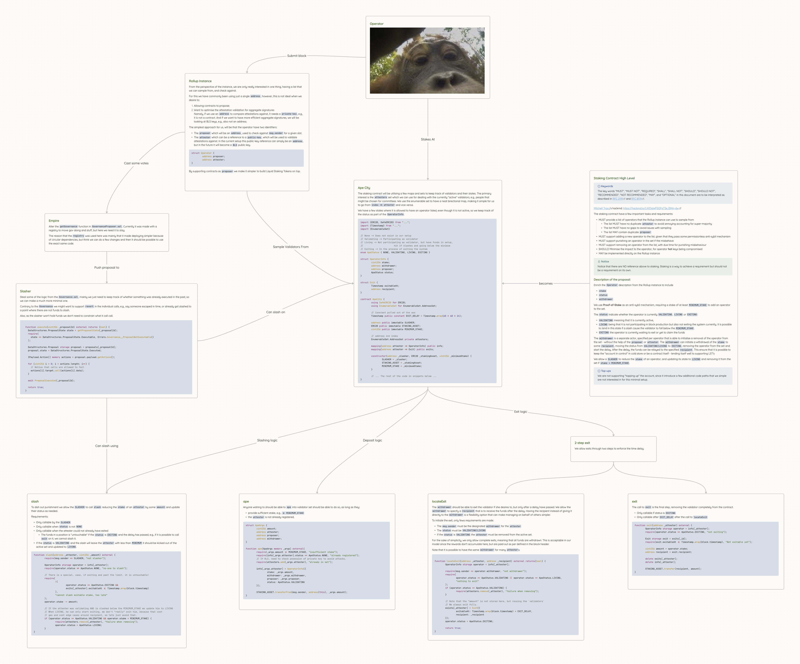
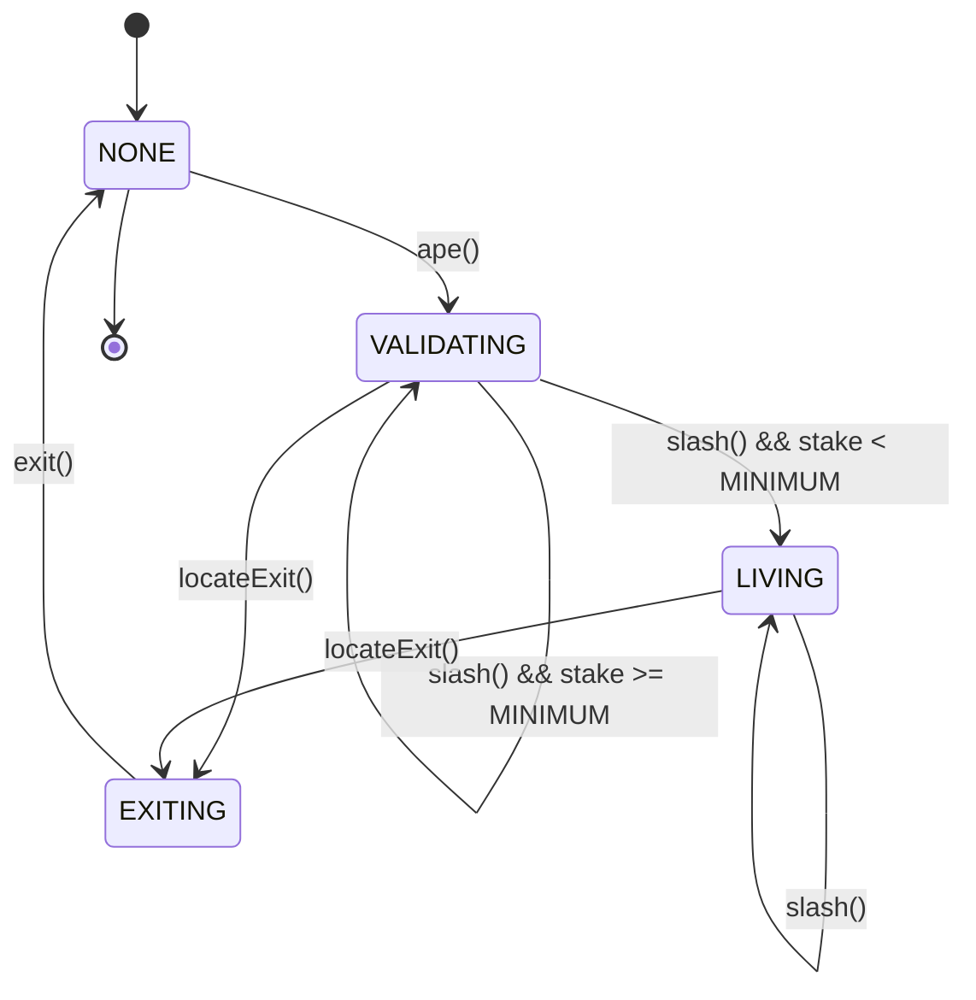

# Staking, Slashing and Delegation

|                      |                                                                      |
| -------------------- | -------------------------------------------------------------------- |
| Issue                | [title](https://github.com/AztecProtocol/aztec-packages/issues/8754) |
| Owners               | @LHerskind                                                           |
| Approvers            | @just-mitch @aminsammara @joeandrews @Maddiaa0                       |
| Target Approval Date | 2024-12-02                                                           |

> [!info] Naming:  
> My 🥜🧠 have a hard time with names and concentration, and I like monkeys, so bear with me making this more enjoyable for me to write.

## Executive Summary

We propose a lightweight staking contract designed to minimize its footprint on L1. This contract integrates staking, slashing, and delegation mechanisms while supporting key separation. This ensures that withdrawal keys can remain in secure, cold storage, while operational keys remain hot for validator operations.

Key features include:

- Slashing is Validator-Governed: The contract delegates slashing decisions entirely to the validators, providing them with the flexibility to determine what is a slashable offense, or what the fitting punishment should be.
- Tiny Footprint: The contract’s design keeps the on-chain complexity minimal, relying on off-chain logic for critical functions like misbehavior detection.
- LST Compatibility: It supports Liquid Staking Tokens (LST) by allowing withdrawer keys to be separate and proposers to be contracts, enabling delegation and advanced setups.

The diagram in section [Diagram](#diagram) provides the same information in a different format, I myself find it a easier approach, so you might consider jumping to it.

## Introduction

Before we really jump into it, we will briefly go over the important part of the rollup instance from the perspective of the staking contract. This is mainly for clarity.

### Context: Rollup Instance

From the perspective of the instance, we are only really interested in one thing, having a list that we can sample from, and check against.

For this we have commonly been using just a single `address`, however, this is not ideal when we desire to:

1. Allowing contracts to propose;
2. Want to optimise the attestation validation for aggregate signatures
   Namely, if we use an `address` to compare attestations against, it needs a `private-key`, e.g., it is not a contract. And if we want to have more efficient aggregate signatures, we will be looking at BLS keys, e.g., also not an address.

The simplest approach for us, will be that the operator have two identifiers:

- The `proposer` which will be an `address`, used to check against `msg.sender` for a given slot.
- The `attester` which can be a reference to a `public-key`, which will be used to validate attestations against. In the current setup this public-key reference can simply be an `address`, but in the future it will become a `BLS` public key.

```solidity
struct Operator {
	address proposer;
	address attester;
}
```

By supporting contracts as `proposer` we make it simpler to build Liquid Staking Tokens on top.

### Staking

> [!info] Keywords  
> The key words “MUST”, “MUST NOT”, “REQUIRED”, “SHALL”, “SHALL NOT”, “SHOULD”, “SHOULD NOT”, “RECOMMENDED”, “NOT RECOMMENDED”, “MAY”, and “OPTIONAL” in this document are to be interpreted as described in [RFC 2119](https://datatracker.ietf.org/doc/html/rfc2119) and [RFC 8174](https://datatracker.ietf.org/doc/html/rfc8174).

The staking contract have a few important tasks and requirements:

- MUST provide a list of operators that the Rollup instance can use to sample from
  - The list MUST have no duplicate `attester` to avoid annoying accounting for super-majority
  - The list MUST have no gaps to avoid issues with sampling
  - The list MAY contain duplicate `proposer`
- MUST support adding a new operator to the list, given that they pass some permissionless anti-sybil mechanism
- MUST support punishing an operator in the set if the misbehave
- MUST support removing an operator from the list, with due time for punishing misbehaviour
- SHOULD Minimise the impact to the operator, for operator **hot** keys being compromised
- MAY be implemented directly on the Rollup instance

> [!important] Notice
> Notice that there are NO reference above to staking. Staking is a way to achieve a requirement but should not be a requirement on its own.

## High level description

Enrich the `Operator` description from the Rollup instance to include

- `stake`
- `status`
- `withdrawer`

We use **Proof-of-Stake** as an anti-sybil mechanism, requiring a stake of at least `MINIMUM_STAKE` to add an operator to the set.

The `status` indicate whether the operator is currently `VALIDATING`, `LIVING` or `EXITING`:

- `VALIDATING` meaning that it is currently active,
- `LIVING` being that it is not participating in block production but also not exiting the system currently. It is possible to land in this state if a slash cause the validator to fall below the `MINIMUM_STAKE`.
- `EXITING` the operator is currently waiting to exit or yet to claim the funds

The `withdrawer` is a separate actor, specified per operator that is able to initialise a removal of the operator from the set - without the help of the `proposer` or `attester`. The `withdrawer` can initiate a withdrawal of the `stake` to some `recipient`, moving the status from `VALIDATING|LIVING` to `EXITING`, removing the operator from the set and start the delay. After the delay, the funds can be relayed to the specified `recipient`. This ensure that it is possible to keep the "account in control" in cold store or be a contract itself - lending itself well to supporting LST's

We allow a `SLASHER` to reduce the `stake` of an operator, and updating its state to `LIVING` and removing it from the set if `stake < MINIMUM_STAKE`.

The `SLASHER` can then be implemented as a variant of the `Governance.sol` contract, that skips the wider vote and allow direct execution of the payload if the validators agree. In this manner, the node software itself can be responsible for detecting misbehaviour and submitting slashing proposals, giving us a lot of flexibility as it is mainly off-chain code.

> [!info] Top-ups  
> We are not supporting "topping up" the account, since it introduce a few additional code paths that we simple are not interested in for this minimal setup.

## Users and Interaction

The users of the staking contract are:

- The rollup instance, to sample from the set
- The slasher, to slash operators
- Actors that wish to add another operator to the set, exit or vote on slashing

The implementation itself can be made as part of the rollup instance, or as a separate contract, for now we are just going with the same contract as it makes some of the data access slightly simpler as we don't need to provide as many getters.

For users indending to be validators, there is mainly three points of interest:

- Joining the set
- Exiting the set
- Voting on slashing

Joining and exiting is done directly on the contract, likely using a frontend or CLI but connected to a cold-storage wallet. These actions are seldom and deal with value so it is important to keep it safe.

As mentioned, the voting on slashing is to be done by the node itself by "slashing-modules". Essentially a small pieces of code that the node is running that will identify misbehaviour and submit or vote on slashing proposal. Votes are collected in the same manner as the `GovernanceProposer` used for governance proposals, with the caveat that if it is "to be proposed" it will go to the slasher where it becomes executable - it does not need to pass a normal governance vote.

### Delegation

As the `withdrawer` can be a completely separate actor from the operator, it can be used directly as a "poor mans" delegation, or using extra contracts for a more sophisticated delegation.
An example of the latter would be a LST contract where the `withdrawer` is the LST contract itself but the operator is some node operator like LIDO.

## Implementation

The staking contract will be utilising a few maps and sets to keep track of validators and their states. The primary interest is the `attesters` set which we can use for dealing with the currently "active" validators, e.g., people that might be chosen for committees. We use the enumerable set to have a neat birectional map, making it simple for us to go from `index => attester` and vice versa.

We have a few states where it is allowed to have an operator listed, even though it is not active, so we keep track of the status as part of the `OperatorInfo`.

```solidity
import {ERC20, SafeERC20} from "...";
import {Timestamp} from "...";
import {EnumerableSet}

// None -> Does not exist in our setup
// Validating -> Participating as validator
// Living -> Not participating as validator, but have funds in setup,
// 			 hit if slashes and going below the minimum
// Exiting -> In the process of exiting the system
enum ApeStatus { NONE, VALIDATING, LIVING, EXITING }

struct OperatorInfo {
	uint256 stake;
	address withdrawer;
	address proposer;
	ApeStatus status;
}

struct Exit {
	Timestamp exitableAt;
	address recipient;
}

contract ApeCity {
	using SafeERC20 for ERC20;
	using EnumerableSet for EnumerableSet.AddressSet;

	// Constant pulled out of the ass
	Timestamp public constant EXIT_DELAY = Timestamp.wrap(60 * 60 * 24);

	address public immutable SLASHER;
	ERC20 public immutable STAKING_ASSET;
	uint256 public immutable MINIMUM_STAKE;

	// address <=> index
	EnumerableSet.AddressSet private attesters;

	mapping(address attester => OperatorInfo) public info;
	mapping(address attester => Exit) public exits;

	constructor(address _slasher, ERC20 _stakingAsset, uint256 _minimumStake) {
		SLASHER = _slasher;
		STAKING_ASSET = _stakingAsset;
		MINIMUM_STAKE = _minimumStake;
	}

	// ... The rest of the code in snippets below ...
}
```

### Joining the set

Anyone wishing to should be able to `ape` into validator set should be able to do so, as long as they:

- provide sufficient stake, e.g., `>= MINIMUM_STAKE`
- the `attester` is not already registered,

```solidity
struct ApeArgs {
	uint256 amount;
	address attester;
	address proposer;
	address withdrawer;
}

function ape(ApeArgs memory _args) external{
	require(_args.amount >= MINIMUM_STAKE, "insufficient stake");
	require(info[_args.attester].status == ApeStatus.NONE, "already registered");
	// If BLS, need to check posession of private key to avoid attacks.
	require(attesters.add(_args.attester), "already in set");

	info[_args.attester] = OperatorInfo({
		stake: _args.amount,
		withdrawer: _args.withdrawer,
		proposer: _args.proposer,
		status: ApeStatus.VALIDATING
	});

	STAKING_ASSET.transferFrom(msg.sender, address(this), _args.amount);
}
```

### Exiting the set

To enforce a delay between the initiation and actual exit we use a two step process, first `locateExit` and then `exit`.

#### locateExit

The `withdrawer` should be able to exit the validator if she desires to, but only after a delay have passed. We allow the `withdrawer` to specify a `recipient` that is to receive the funds after the delay. Having the recipient instead of giving it directly to the `withdrawer` is a flexibility option that can make managing on behalf of others simpler.

To initiate the exit, only fews requirements are made:

- The `msg.sender` must be the designated `withdrawer` for the `attester`
- The `status` must be `VALIDATING|LIVING`
- If the `status` is `VALIDATING` the `attester` must be removed from the active set.

For the sake of simplicity, we only allow complete exits, meaning that all funds are withdrawn. This is acceptable in our model since the rewards don't accumulate here, but are paid out as per defined in the block header.

Note that it is possible to have the same `withdrawer` for many `attester`s.

```solidity

function locateExit(address _attester, address _recipient) external returns(bool) {
	OperatorInfo storage operator = info[_attester];

	require(msg.sender == operator.withdrawer, "not withdrawer");
	require(
		operator.status == ApeStatus.VALIDATING || operator.status == ApeStatus.LIVING,
		"nothing to exit"
	);
	if (operator.status == ApeStatus.VALIDATING) {
		require(attesters.remove(_attester), "failure when removing");
	}

	// Note that the "amount" is not stored here, but reusing the `validators`
	// We always exit fully.
	exists[_attester] = Exit({
		exitableAt: Timestamp.wrap(block.timestamp) + EXIT_DELAY,
		recipient: _recipient
	});
	operator.status = ApeStatus.EXITING;

	return true;
}
```

#### exit

The call to `exit` is the final step, removing the validator completely from the contract.

- Only callable if status is `EXITING`
- Only callable after `EXIT_DELAY` after the call to `locateExit`

```solidity
function exit(address _attester) external {
	OperatorInfo storage operator = info[_attester];
	require(operator.status == ApeStatus.EXITING, "not exiting");

	Exit storage exit = exits[_id];
	require(exit.exitableAt <= Timestamp.wrap(block.timestamp), "Not exitable yet");

	uint256 amount = operator.stake;
	address recipient = exit.recipient;

	delete exits[_attester];
	delete info[_attester];

	STAKING_ASSET.transfer(recipient, amount);
}
```

### The Slashing

To dish out punishment we allow the `SLASHER` to call `slash` reducing the `stake` of an `attester` by some `amount` and update their status as needed.

Requirements:

- Only callable by the `SLASHER`
- Only callable when `status` is not `NONE`
- Only callable when the attester could not already have exited
  - The funds in a position is "untouchable" if the `status` is `EXITING` and the delay has passed, e.g., if it is possible to call `exit` on it, we cannot slash it.
- If the `status` is `VALIDATING` and the slash will leave the `attester` with less than `MINIMUM` it should be kicked out of the active set and updated to `LIVING`.

```solidity
function slash(address _attester, uint256 _amount) external {
	require(msg.sender == SLASHER, "not slasher");

	OperatorInfo storage operator = info[_attester];
	require(operator.status != ApeStatus.NONE, "no-one to slash");

	// There is a special, case, if exiting and past the limit, it is untouchable!
	require(
		!(
			operator.status == ApeStatus.EXITING &&
			exits[_attester].exitableAt <= Timestamp.wrap(block.timestamp)
		),
		"cannot slash exitable stake, too late"
	);
	operator.stake -= amount;

	// If the attester was validating AND is slashed below the MINIMUM_STAKE we update him to LIVING
	// When LIVING, he can only start exiting, we don't "really" exit him, because that cost
	// gas and cost edge cases around recipient, so lets just avoid that.
	if (operator.status == ApeStatus.VALIDATING && operator.stake < MINIMUM_STAKE) {
		require(attesters.remove(_attester), "failure when removing");
		operator.status = ApeStatus.LIVING;
	}
}
```

The model allows for the `SLASHER` to be any kind of contract or even EOA, but we suggest utilising contract similar to the `Governance` and `GovernanceProposer` such that the slashing proposal is voted on by the validators, but then allowing direct execution without having to go through the usual governance vote afterwards.

#### Slasher

Steal some of the logic from the `Governance.sol`, mainly we just need to keep track of whether something was already executed in the past, so we can make a much more minimal one.

Contrary to the `Governance` we might want to support `revert` in the individual calls, e.g., say someone escaped in time, or already got slashed to a point where there are not funds to slash.

Also, as the slasher won't hold funds we don't need to constrain what it calls.

```solidity

  function execute(uint256 _proposalId) external returns (bool) {
    DataStructures.ProposalState state = getProposalState(_proposalId);
    require(
      state == DataStructures.ProposalState.Executable, Errors.Governance__ProposalNotExecutable()
    );

    DataStructures.Proposal storage proposal = proposals[_proposalId];
    proposal.state = DataStructures.ProposalState.Executed;

    IPayload.Action[] memory actions = proposal.payload.getActions();

    for (uint256 i = 0; i < actions.length; i++) {
      // Notice that calls are allowed to fail
      actions[i].target.call(actions[i].data);
    }

    emit ProposalExecuted(_proposalId);

    return true;
  }
```

The proposer for the Slasher would then be an altered version of the `GovernanceProposer`, where the `getGovernance` function is altered such that it is not following along, namely to ensure stability of slashing across new deployments.

The reason that the `registry` was used here was mainly that it made deploying simpler because of circular dependencies, but think we can do a few changes and then it should be possible to use the exact same code.

## Diagram

Since I find it easier to get the overview from a diagram, I have added one below.



### Status State Diagram

The following diagram shows the possible state transitions for a validator status more explicitly.



State transitions:

- `NONE` → `VALIDATING`: When a new validator joins with sufficient stake
- `VALIDATING` → `VALIDATING`: When slashed but maintains stake above MINIMUM_STAKE
- `VALIDATING` → `LIVING`: When slashed below MINIMUM_STAKE
- `VALIDATING` → `EXITING`: When withdrawal is initiated by withdrawer
- `LIVING` → `LIVING`: When slashed further while already below MINIMUM_STAKE
- `LIVING` → `EXITING`: When withdrawal is initiated by withdrawer
- `EXITING` → `NONE`: When exit is completed after delay period

Note: Once in `EXITING` state, no further slashing is possible if the exit delay has passed.

## Change Set

Fill in bullets for each area that will be affected by this change.

- [ ] Cryptography
- [ ] Noir
- [ ] Aztec.js
- [ ] PXE
- [ ] Aztec.nr
- [ ] Enshrined L2 Contracts
- [ ] Private Kernel Circuits
- [x] Sequencer
- [ ] AVM
- [ ] Public Kernel Circuits
- [ ] Rollup Circuits
- [x] L1 Contracts
- [ ] Prover
- [x] Economics
- [ ] P2P Network
- [x] DevOps

## Test Plan

Similarly to the governance contracts we will be writing branching tree tests for the slashing and periphery contracts to check them in depth, and the network e2e tests adding sequencers will updated to also stake.

## Documentation Plan

Identify changes or additions to the user documentation or protocol spec.

## Rejection Reason

If the design is rejected, include a brief explanation of why.

## Abandonment Reason

If the design is abandoned mid-implementation, include a brief explanation of why.

## Implementation Deviations

If the design is implemented, include a brief explanation of deviations to the original design.

## Disclaimer

The information set out herein is for discussion purposes only and does not represent any binding indication or commitment by Aztec Labs and its employees to take any action whatsoever, including relating to the structure and/or any potential operation of the Aztec protocol or the protocol roadmap. In particular: (i) nothing in these projects, requests, or comments is intended to create any contractual or other form of legal relationship with Aztec Labs or third parties who engage with this AztecProtocol GitHub account (including, without limitation, by responding to a conversation or submitting comments) (ii) by engaging with any conversation or request, the relevant persons are consenting to Aztec Labs’ use and publication of such engagement and related information on an open-source basis (and agree that Aztec Labs will not treat such engagement and related information as confidential), and (iii) Aztec Labs is not under any duty to consider any or all engagements, and that consideration of such engagements and any decision to award grants or other rewards for any such engagement is entirely at Aztec Labs’ sole discretion. Please do not rely on any information on this account for any purpose - the development, release, and timing of any products, features, or functionality remains subject to change and is currently entirely hypothetical. Nothing on this account should be treated as an offer to sell any security or any other asset by Aztec Labs or its affiliates, and you should not rely on any content or comments for advice of any kind, including legal, investment, financial, tax, or other professional advice.
