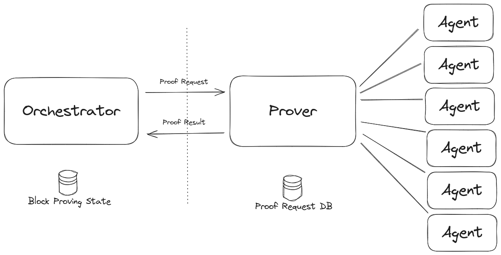
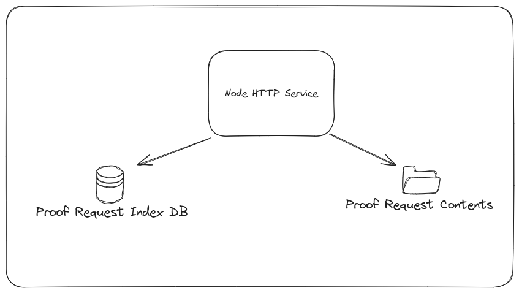

|                      |                                                                                               |
| -------------------- | --------------------------------------------------------------------------------------------- |
| Owners               | @PhilWindle                                                                                   |
| Approvers            | @just-mitch @alexghr @spalladino                                                              |
| Target Approval Date | 2024-08-23                                                                                    |


## Executive Summary

This design attempts to solve the problem of scaling proof generation without the introduction of any new technologies or dependencies


## Introduction

We need to prove blocks of transactions in a timely fashion. These blocks will likely consist of 10s of thousands of proofs of varying computational complexity. We will likely need to orchestrate the proving across 1000's of machines to achieve the timeliness requirements. To achieve this, we would ideally like to not introduce any further technological dependencies.


## Overall Architecture

The overall architecture of the proving subsystem is given in the following diagram. The orchestrator understands the process of proving a full block and distills the proving process into a stream of individual proof requests. These requests can be thought of as 'jobs' pushed to a queueing abstraction. Then, once a proof has been produced a callback is invoked notifying the orchestrator that the proof is available. The dotted line represents this abstraction, an interface behind which we want to encourage the development of alternative methods of distributing these jobs. In this diagram the 'Prover' is an entity responsible for taking the requests and further distributing them to a set of individual proving agents.

In this architecture it is important to understand the separation of concerns around state. The orchestrator must maintain a persisted store describing the overall proving state of the block such that if it needs to restart it can continue where it left off and doesn't need to restart the block from scratch. This state however will not include the in-progress state of every outstanding proving job. This is the responsibility of the state managed by the prover. This necessitates that once the `Proof Request` has been accepted by the prover, the information backing that request has been persisted. Likewise, the `Proof Result` acknowledgment must be persisted before completion of the callback. This ensures no proving jobs can be lost in the cracks. It is always possible that a crash can occur for example after the `Proof Result` is accepted and before it has been removed from the prover's store. For this reason, duplicate requests in either direction must be idempotent.



### A Simple but Sufficient Prover Implementation

Frankly, there are many ways in which the `Prover` component can be built. It is a common pattern within Web 2 and many technologies exist to help. Ideally however we would like to reduce our dependencies as much as possible, so a solution relying solely on existing dependencies would be desirable. First, let us look at our high level requirements:

1. Proving a single block of 11520 transactions (10 TPS for 32 blocks where each block is 3 ethereum blocks)
2. 3 public functions per transaction results in the other of 100,000 proof requests.
3. Depending on timeliness requirements and proof computational complexity, we should expect the number of prover agents to be up to 10,000.

### Other Possibilities Considered

We considered using RabbitMQ. This is a well supported persisted message queue implementation. However, like most queueing implementations, it's priorities are related to resilience, scalability and capacity. It can distribute a large number of jobs across a large number of clients very quickly. It also offers redundant setups etc. Also like most queueing implementations, it lacks flexibility. For example, it's possible that proving agents won't be homogenous. A prover may have access to a variety of machines with differing hardware capabilities meaning greater flexibility is needed when it comes to retrieving jobs and distributing them. This type of flexibility isn't generally supported by off the shelf queueing implementations.

### LMDB Backed Proof Request Store

We propose creating a proving job broker as a Node.js server using an LMDB database as it's persistent store. Crucially, we will make a number of compromises to achieve this.

#### Broker Architecture and Implementation

The broker exists as an HTTP service using an LMDB DB to store an index of proving jobs. The index is a mapping from the job id to the job's metadata. The job metadata can be summarised by the following:

``` TS
type Metadata = {
  proofType: PROOF_TYPE; //(BASE_ROLLUP etc...)
  epochNumber: number;
  status: // (IN_PROGRESS or COMPLETED)
}

```

Proving request data, such as input witness and recursive proofs are stored in a directory labelled with the job's id residing on an NFS share/S3 bucket or similar. This is an optimisation, as prover agents can access the data independently, without requiring the broker to transfer large amounts of data to them. If it turns out that this is not required then the proof requests will reside on a disk local to the broker and will be transferred over the network from the broker. Maybe this should be a configurable aspect of the system.



The entire proof request index DB is loaded into memory upon service start.

Prover agents periodically poll the broker to either request more work or to update the broker that they are still working on a specific job. As there are a large number of clients we will need to limit the frequency of that polling to, perhaps every 10 seconds.

This gives an overall job flow that looks as follows:

1. The broker receives a `Proof Request` for job id #4567 from the orchestrator.
2. The broker persists the proof's input data to disk and then inserts an entry into the index DB. Finally it creates an entry in the in-memory cache of jobs.
3. An agent polls for new work. A query is performed on the in-memory cache based on the capabilities of the prover and ordered to prioritise earlier epochs, discounting all jobs that are already being proven.
4. The query returns the job #4567. 
5. The broker stores the prover agent id and the current time against the job as `Start Time`.
6. The broker returns the job details to the agent.

Later, the agent polls again:

1. The agent polls the broker with the job id and job start time
2. The broker finds the job in the in-memory cache
3. If the job is being worked on by another agent then the start time against the job is compared to the start time in the agent's request. The earlier time wins and the cache is updated if necessary with the winner's details. If the polling agent loses then the agent is told to stop working on the job and is given a new job.
4. The broker adds the current time to the job as `Last Update Time`

Later, the agent polls to say the job is completed:

1. The agent has completed the job and immediately polls with the result.
2. The results are stored and the job is updated as completed, probably moved to a different in memory cache.

The reason for the start time negotiation around agents is that we need to consider a broker crash/restart.

Upon restart, the broker should:

1. Re-build the in-memory cache from the index.
2. Start accepting new job requests from agents.

The above means that a job that is already being worked could be given to another agent after a restart. All of the data around current proving jobs is only in memory so is lost upon process termination. By negotiating based on start time, soon after restart the system will revert to how it was without too much duplicated effort. Of course, for small proofs, it is still possible that a proof could be completed twice. This seems an acceptable trade-off.

Finally, the broker periodically checks all current jobs to see if their `Last Update Time` is beyond a certain window. If so, the details of the agent proving the job are removed, so they become available again.

The described interactions should mean that we maintain a queue of jobs, prioritised in whatever way we need, queryable by however we require whilst only using a simple LMDB store and directory structure. By doing all of this in memory we drastically reduce the amount of DB access required at the expense of potentially some duplicated effort and negotiation upon broker restart (something we hope is a rare occurence). Even if we consider a worst case scenario of ~200,000 outstanding proof requests, this should not require more than a few 10's MB of memory to cache. One potential concern is performance. There will be a large number of prover agents querying for work and these queries will need to be very efficient, but this will be the case with any system.

The last step is that the broker pushes all completed jobs back to the orchestrator, shortly after they have been completed but asynchronously to the completion message from the agent. The job is removed from both the directory listing and the index DB. When the queue is empty, a check is performed that the proof request directory is empty. Any remaining data is deleted.
