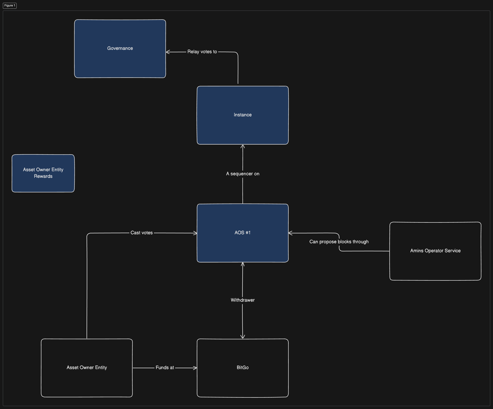
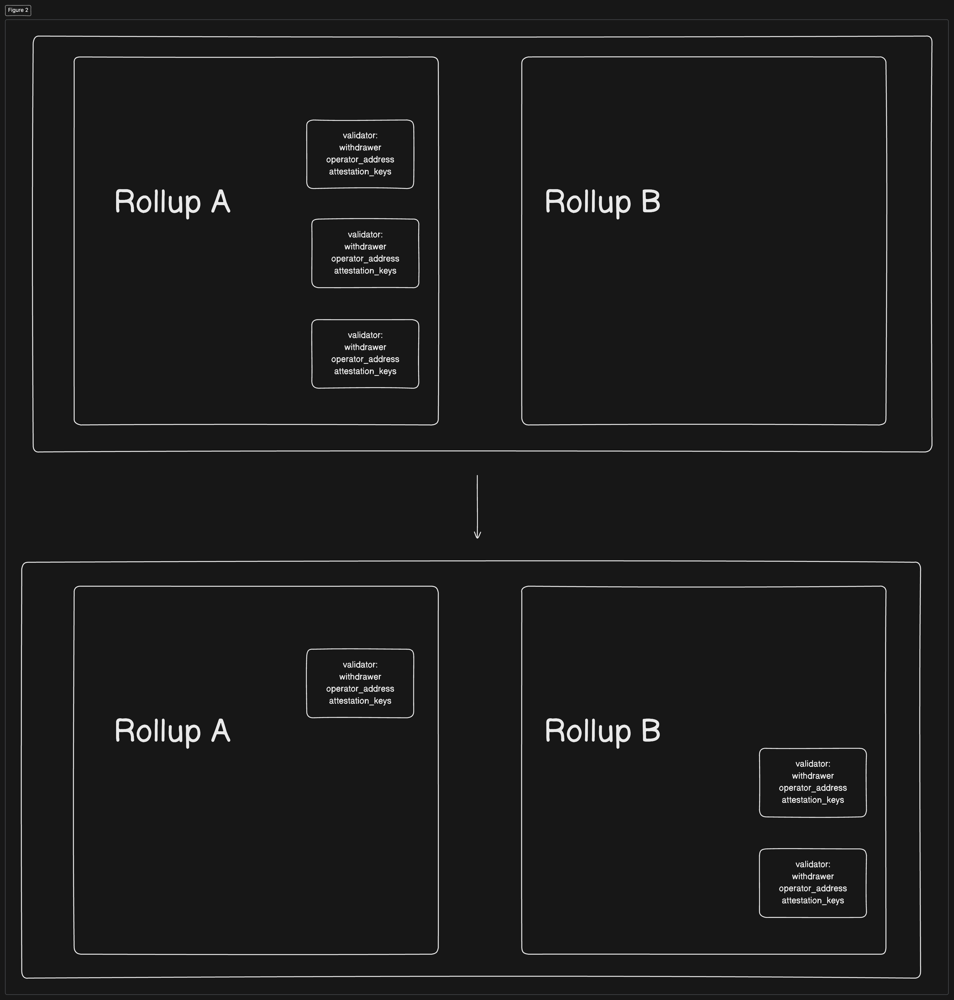
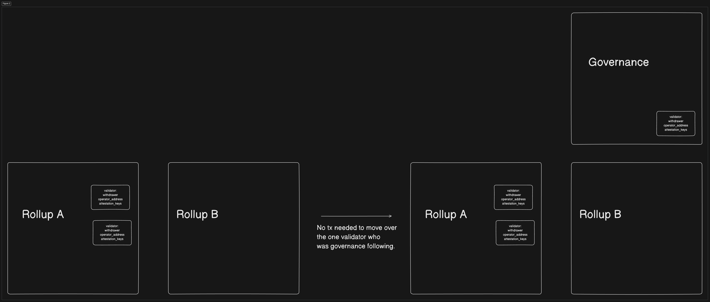
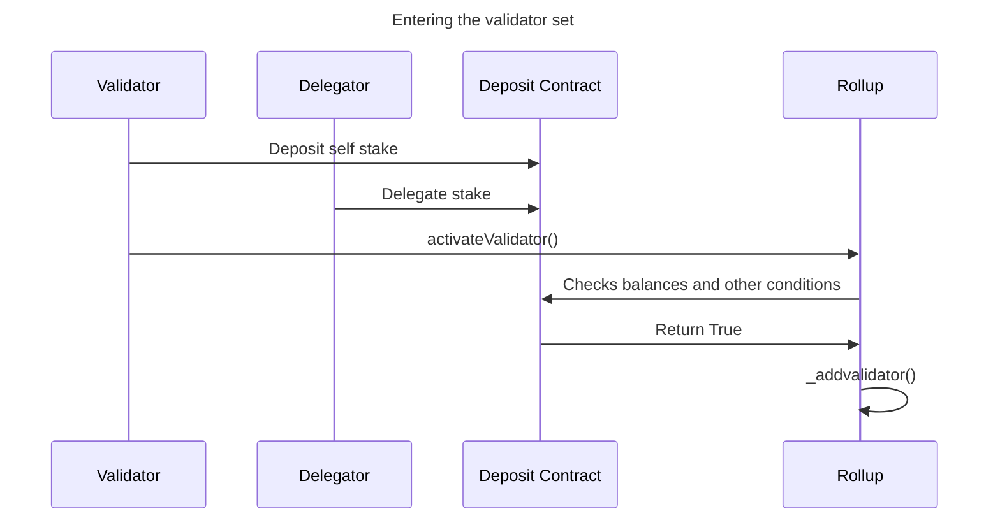
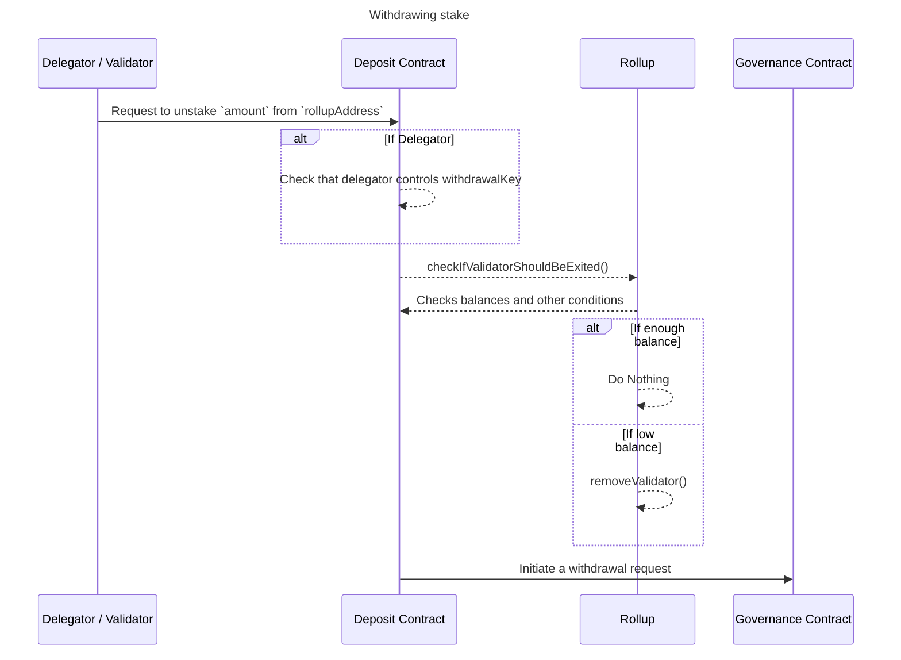

# Staking


## Update

Went through this document with Lasse, this is the feedback that emerged:

1. On Delegation

The proposal below asks for completely separating the following credentials:
1) Signing Credentials: Expected to be owned by the node operator. 
2) Withdrwal Credentials: Expected to be owned by the Asset Holder. 

and have it such that the withdrawal credential can rotate the signing address (i.e. to delegate to different to validators for example) but the operator cannot rotate the withdrawal key. 

Lasse's suggestion: Don't enshrine "delegation" in the protocol. Allow for designs that enable smart contracts to perform that function. 




Lasse's approach involves more minimal changes to the protocol and is probably better from a sense of let's build and then optimize. It misses features I considered nice to haves such as delegators being able to override the vote of the validator they're delegating to and some rather important features such as the withdrawal key being able to rotate the operator credentials without a withdrawal delay. 

I think all of the previous functionality can be accomplished by smart contracts but this still deserves a conversation on whether we want to enshrine stake delegation in the protocol versus fallback to smart contracts to achieve these benefits.

2. On Moving Stake

The proposal asks to "prioritize security over liveness" but also to make moving stake seamless and not subject to undue delays. 

Lasse's feedback: A Schrödinger attack is possible: As everybody is moving, a malicious validator who is not following governance can make a last minute attack on the old rollup. Since (most) validators move along they won't be able to slash the perpetrator who now possibly controls the governance of the old rollup. The only way out of this is to have all withdraws (including moving stake) be subject to delays long enough to slash any malicious actors. 

My rebuttal: Moving stake is only possible AFTER a rollup becomes canonical so the new chain is not grieved by attacks on the old rollup. You still need a malicious committee to grief the canonical chain at all times. So I think moving stake AFTER a new chain has become canonical is okay. The following caveats:

1. The Rollup should only start producing blocks after a certain number of validators / stake has registered. 

3. On How We Move Stake

The proposal suggests a Deposit contract that stores a mapping `StakedDeposits[rollupAddress][validatorAddress]`. It is only possible to move stake of validators who opted in to follow governance. 

This looks like this:



Lasse suggestion: Instead of recording governance following validator stake in the mapping object, implement a different structure that by definition records the assets of validators who are governance following (and thus does not need to be "moved").



In my approach the transaction that moves over stake also calls the Rollup to register the new validators, so that it is aware of its validator set. Lasse's approach moves the validatorSet to the Deposit Contract so now Leonidas has to query the Deposit Contract to figure out what the validator set is and to shuffle them to compute the committee. 

I don't see an obvious problem so agreed to this change as well. 

4. On rewards

The proposal suggests we record a separate `rewardsAddress` in the Deposit Contract. 

Lasse suggestion: This is already covered by GlobalVariables.coinbase so we agreed to drop the `rewardAddress` from this proposal.  

## Requirements

>Note: Any implementation detail in this design document, such as pseudo-code or implied data structures, is strictly for purposes of illustrating requirements. 

**General**
1. Validators MUST stake to join the validator set. 
2. We must support two types of delegations:
    * Peer-to-Peer: A large member of the Aztec Governance can negotiate with and delegate to institutional operators directly. 
    * Peer-to-Pool-Peer: A small retail user can delegate to a non-custodial staking provider which can then delegate to an institutional validator. 
4. Moving stake between Rollup instances should not be subject to delays. 
5. Moving delegations between different validators should not be subject to delays. 
10. We prioritize security over liveness. Upgrades should not degrade the security of the new canonical Pending Chain, even if momentarily. 

**Delegation**

1. Validators must be able to receive delegations from users who want to put funds "at-stake" but don't want to run the validator node themselves. 
3. Staked validators and their delegators must be able to vote for proposals put up for voting by the Governance contracts. Only staked validators can nominate proposals to the GovernanceProposer contract. 
4. Delegators must be able to override the vote of the validators they delegate to if they choose to vote directly. Otherwise they inherit the vote of the validator to which they've delegated tokens to. 
5. It must legally or otherwise mathematically be possible to enforce profit sharing between delegators and validators. 
6. Delegators MUST also get slashed if the validator they delegate to gets slashed. 
7. It should be possible to show onchain how much self-stake a validator has (i.e. non-delegated stake). 

**Validator Keys**
1. There should be clear separation of the various keys associated with a validator:
    i. The Signing Key: The key that generates the validator's L1 public key. (different from BLS key / could be different from the key that signs attestations and block proposals).
    ii. The Withdrawal Key: The key that generates the public key of the L1 withdrawal address. 
2. In the case of a retail user delegating to a large institutional validator like say Chorus One: the validator would be in control of the Signing Key and the retail user in control of the Withdrawal Key. 
3. The Withdrawal Key should be able to rotate "Signing Keys" but not the other way around i.e. The Signing Key cannot rotate the Withdrawal Key. 
4. The only way to change a Withdrawal Key is to exit and deposit again. No key rotation on the Withdrawal Key. 
5. The Withdrawal Key can "initiate" a withdrawal. 
6. No rotation of the BLS public keys either. 

> Note: The objective here is that as a user, I can generate my own Withdrawal Key, and then name the public key / address of a validator operator as the Signing Key. This is in essence what the "delegation" flow looks like. Self delegation can be something where the two keys are one and the same. 


### Deposit Contract

Validators stake with a `Deposit` contract in order to join the validator set. This `Deposit` contract can be thought of as an auxillary sidecar that Rollup instances could choose to use for stake management. 

If a Rollup is using the `Deposit` contract, validators do NOT stake with the Rollup contract directly. This is meant to simplify moving stake during/after a governance upgrade. 

The Deposit contract is an immutable contract living on L1, that is owned by the Governance Contract (i.e. Apella). It implements the following simplified interface:

```solidity

interface IDeposit {
  function deposit(address validatorAddress, address rollupAddress, uint256 amountToDeposit, address withdrawalAddress, address rewardsAddress, bool followRegistryBool, bytes pubKey, bytes signature) external returns(bool);
  function activateValidator(address rollupAddress, address validatorAddress, uint256 amount); external returns(bool);
  function moveStake(address rollupAddress, calldata address[] validatorAddressList) external returns(bool);
  function editDeposits(address rollupAddress, address withdrawalAddress, address rewardAddress, address followsRegistryBool):
  function widthdraw(address rollupAddress, address validatorAddress) external returns(bool);
  function unstakeValidators(addresss rollupAddress, address validatorAddress) external returns(bool);
  function slashValidator(address rollupAddress, address validatorAddress) external returns(bool);
}
```

### Deposit Function

* Validators must deposit at least `MIN_DEPOSIT_AMOUNT`. This is the minimum amount you need to deposit to create a new entry in the `Deposits` mapping.  It is completely separate from what Rollup instances dictate to be the minimum staking requirement to join their validator sets. 

>**Why have this?**

To prevent cluttering the Deposit objects with dust deposits. I see this as the equivalent of Ethereum's 1 gwei minimum deposit. 

* Calling the deposit function should create an entry in the `Deposits` mapping. This mapping is a `mapping(address rollupAddress => mapping(address validatorAddress => DepositLib.DepositObject))`
* A `DepositObject` contains references to the `withdrawalAddress` , `rewardsAddress`, `rollupAddress`, `pubKey` and `followingRegistryBool` variables. It is unique per rollupAddress / validatorAddress combination. 
* Therefore validators can have multiple deposits corresponding to different Rollups. But for each Rollup, they can only have one deposited balance, one `withdrawalAddrss` one `rewardsAddress`, one `pubKey` and one `followingRegistryBool` flag. 
* The signature field is such that "A validator can send to a delegator a request for stake, the delegator signs with the withdrawal address only iff the , sends it back to the validator or deposits it themselves"

>Note: A first time deposit creates a new `DepositObject` and populates it with fields passed into `deposit()`. A `deposit()` function call referencing an existing `DepositObject` should ONLY ever increase the `DepositObject.balance` attribute and do nothing else. Said differently, a validator cannot change `followRegistryBool` or `pubKey` by calling `deposit()` with different parameters.  


```python
## High level psuedocode for deposit()
function deposit(validatorAddress, rollupAddress, amountToDeposit, withdrawalAddress, rewardsAddress, followRegistryBool, pubKey, signatures)
    # Step 1: Check minimum deposit requirement
    if amountToDeposit < MIN_DEPOSIT_AMOUNT:
        return False  # or throw an error indicating insufficient deposit amount
    
    # Step 2: Check signature
    ## ...

    # Step 2: Check if a DepositObject already exists for this rollup and validator address
    if Deposits[rollupAddress][validatorAddress] exists:
        # Add the deposited amount to the existing DepositObject
        Deposits[rollupAddress][validatorAddress].balance += amountToDeposit
        # Transfer the ASSET from (msg.sender)
    else:
        # Step 3: If no deposit exists, create a new DepositObject
        newDeposit = DepositLib.DepositObject(
            withdrawalAddress=withdrawalAddress,
            rewardsAddress=rewardsAddress,
            followRegistryBool=followRegistryBool,
            pubKey=pubKey,
            balance=amountToDeposit,
        )

        # Step 4: Store the new DepositObject in the Deposits mapping
        Deposits[rollupAddress][validatorAddress] = newDeposit
        # Transfer the ASSET from msg.sender

    # Step 5: Emit a Deposit event to record the deposit action
    emit Deposit(validatorAddress, rollupAddress, amountToDeposit)

    return True
```
>Note: Sorry I seem to have made up my own language writing these pseudo-code snippets. It's on you @LHerskind

### Entering the Validator Set

* A Rollup instance can direct funds to be at stake by calling `activateValidator`. 
* Only the Rollup with address `rollupAddress` can place balances in `Deposits[rollupAddress][validatorAddress]` to be under stake. 
* Any amounts specified by `activateValidator` are removed from `Deposits` and accounted for in a different mapping, `StakedDeposits` which is the same mapping as `Deposits` with the exception that balances in `StakedDeposits` can be slashed by the Rollup. 

```python
function activateValidator(validatorAddress, amount):
    ## Checks
    if Deposits[msg.sender][validatorAddress] does not exist:
        return False
    
    require(amount <= Deposits[msg.sender][validatorAddress].balance)
    ##  Effects
    Deposits[msg.sender][validatorAddress].balance -= amount

    newStakedDeposit = DepositLib.StakedObject(
            withdrawalAddress = Deposits[msg.sender][validatorAddress].withdrawalAddress,
            rewardsAddress=Deposits[msg.sender][validatorAddress].rewardsAddress,
            balance=amount,
            followRegistryBool=Deposits[msg.sender][validatorAddress].followRegistryBool
    )
    StakedDeposits[msg.sender][validatorAddress] = newStakedDeposit
    return True
```


### Moving Stake

 One external function that anyone could call to change the `rollupAddress` of any entry in `StakedDeposits` with `followRegistryBool=true`. The new rollupAddress can only be derived from the Registry / Governance contracts. 

```python
function moveStake(address rollupAddress, validatorAddressList):
    ## Maybe limit the size of validatorAddressList so that someone can only move i.e. 500 validators at a time.
    for validatorAddress in validatorAddressList:
        if Deposits[rollupAddress][validatorAddress] does not exist:
            return False
        if StakedDeposits[rollupAddress][validatorAddress] does not exist:
            return False
        if StakedDeposits[rollupAddress][validatorAddress].followRegistryBool != true:
            return False
        
        newRollup = this.getRollup()
        balanceToMove = StakedDeposits[rollupAddress][validatorAddress].balance
        ## moves over all of it
        StakedDeposits[rollupAddress][validatorAddress].balance = 0

        newStakedDeposit = DepositLib.StakedObject(
            withdrawalAddress = StakedDeposits[rollupAddress][validatorAddress].withdrawalAddress,
            rewardsAddress= StakedDeposits[msg.sender][validatorAddress].rewardsAddress,
            pubKey = StakedDeposits[msg.sender][validatorAddress].pubKey,
            followRegistryBool= true,
            balance = balanceToMove
        )
        StakedDeposits[newRollup][validatorAddres] = newStakedDeposit
```

>Note: The specific requirement  here is that it should be quick to mass move stake once a rollup becomes "canonical", in a way that is not on the critical path. To be more specific, we should minimize the time between a rollup becoming "canonical" and a rollup having "sufficient" stake. One way to do this is a "Registry.nextUp" flag on the Registry os the above flow can be replicated "before" a rollup becomes canonical. Another is for Rollups to limit block building until it registers a certain amount of stake / validators. 

**What about the old Rollup**

If anyone can move stake, then the old Rollup will not know that it has lost a validator. This can be dealt with if someone on the old Rollup notifies it to check balances again. We don't necessarily have to explicitly bake this into the Deposit contract. 

>Note: See `checkIfValidatorShouldBeExited()` in the mermaid diagram below. 

### withdraw and unstakeValidator functions

* Holders of the `validatorAddress` keys MUST be able to withdraw balances from the `Deposits` mapping. This withdraws any funds to the `withdrawalAddress`. 
* Holders of the `withdrawalAddress` keys MUST be able to withdraw balances from the `Deposits` mapping. This withdraws any funds to the `withdrawalAddress`. 

* To withdraw balances from `stakedDeposits` the Deposit contract must interact with the Rollup contract.

* The requirement is that both validators and delegators can unstake and withdraw funds to the `withdrawalAddress` after waiting an exit delay.
* While delegators can "re-delegate" to another validator without waiting for a withdrawal delay. 

To achieve this, I propose that we change the "unstaking" workflow such that the entrypoint becomes the Deposit contract. 


> Note this assumes that Deposit Contract deposits stake with the Governance Contract so that validators / delegators may vote. The requirement to have delegators be able to override the votes of validators they delegated to will probably involve changing the Governance contract. 

### Moving Delegations

A delegator could change which validators they have delegated to in much the same way as the unstake action. 


### BLS Signatures

Every validator submits a BLS public key associated with their `validatorAddress` (Note: they have nothing to do with each other, but they're a "set" of keys rather). Those public keys are kept in an Enumerable Set on the Rollup contract. Everytime the committee is calculated, the aggregate public key for all validators in the committee is also computed and stored. Let's call this `COMMITTEE_AGGREGATED`

Sequencer aggregates public keys and signatures of committee members. Sequencer reads off L1 the ordered committee array. Instead of sending to L1 an array of signatures, it sends:

1) Binary array of 0,1. The indices on this array match those of the computed committee array. `BIT_ARRAY[i] = 1` if `committee[i]` signed and 0 otherwise. 
2) The aggregated public key of all validators who signed the proposal. 


The L1 contract knows the public keys of everyone in the committee. For every `0` in the `BIT_ARRAY` it adds (in a group addition sense) the inverse of that validator's public key to `COMMITTEE_AGGREGATED`. Once its gone through the committee array, the resulting aggregate public key computed by the L1 should match the aggregated public key sent by the proposer. 

No rotating BLS keys is allowed. A validator must exit first and then re-stake with a different BLS key. 

### Rewards

Any block rewards accruing to validators should be sent to the `rewardsAddress` specified in `StakedDeposits`.


### Questions

**Should we do stake-weighted PoS? i.e. a validator with 1% of the total stake should propose 1% of all blocks?**
-> We don't need to imo. Validators can generate a new Signing Key as needed and instruct clients to delegate to that key. 
-> Any obvious objections to this? 

**Can the accounting for votes happen in the Deposit contract?**
-> Basically the only requirement here is that validators AND delegators be able to vote. Delegators don't need to be able to vote at GovernanceProposer. Delegators vote inherit the vote of the validator by default, but delegators can chose to override this if they participate directly. 
-> Based on this description, where should accounting for voting happen? Should ASSETs still be locked within Governance? 

**Proof of Possession**
-> The deposit function is probably missing another signature which is the signature of pubKey using the associated BLS private key. 