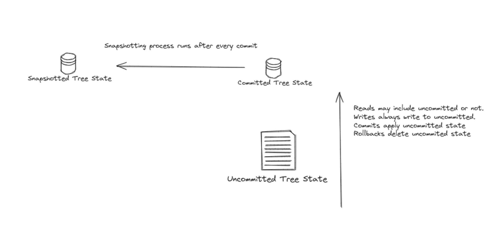

|                      |                                                                                               |
| -------------------- | --------------------------------------------------------------------------------------------- |
| Owners               | @PhilWindle                                                                                   |
| Approvers            | @just-mitch @alexghr @palla                                                                   |
| Target Approval Date | 2024-07-25                                                                                    |


## Executive Summary

This design attempts to create a comprehensive solution to a number of problems around management of Merkle Tree state in an Aztec node. 


## Introduction

This design builds on the [Native Merkle Trees](./0003-native-merkle-trees.md) design. The development of Native Merkle Trees provides much higher performance both in terms of the speed of individual operations on the trees and opportunities to execute multiple operations concurrently. The work undertaken until now however only focuses on optimising the existing world state implementation. 
This has a number of shortfalls.

### Snapshotting

The current snapshot implementation provides 2 options. Either a node only offers `current` state or it offers both `current` state and **all** historical state. The intention being that only full archive nodes would need to offer historical state. This has turned out to be an invalid assumption as most nodes will probably want to provide a short history of snapshotted state leaving archive nodes to provide the full history. We will therefore need to provide the ability to configure a window of blocks for which state is available, up the current latest block number. Currently, it is very hard to prune historical state.

### Inability to Handle Chain Re-Orgs

As we are moving away from a model of sequencing and proving a single block at a time to one of producing more frequent, smaller blocks to be later proven, we must embrace the ability of the L2 chain to re-org. That is to say that a number of block's worth of chain state can be removed from the world state.

## Current Implementation 

In order to understand the changes being presented in this design, it is necessary to understand the current implementations and how they fail to meet our requirements. We will not describe the operations of append only or indexed tress here, that is covered in our documentation. We will however look at how they are implemented at a high level in our world state.

Every tree instance is represented by 3 stores of state,

1. Committed state - the latest value of every populated node in the tree, structured to enable fast random access. This state is persisted as a key/value store of node index to value.
2. Uncommitted state - an in-memory cache of updated nodes overlaying the committed store also referenced by node index.
3. Snapshotted state - the historical values of every populated node, structured to minimize space consumption at the expense of node retrieval speed. Reading this tree requires 'walking' down from the root at a given block number.

The idea behind this structure is that sequencers are the only actor interested in uncommitted state. It represents the state of their pending block and they update the uncommitted state as part of building that block. Once a block has been published to L1, its state is committed and the uncommmitted state is destroyed. After each block is committed, the historical tree is traversed in a BFS manner checking for differences in each node. If a node is the same as previously, the search does not continue to its children. Modified nodes are updated in the snapshot tree.

Clients only read committed or snapshotted state, they have no need to read uncommitted state.



This structure only facilitates the rolling back of the block currently being built, should that block become invalid for example. The committed state offers no ability to revert to any prior state.

### Snapshot Tree Structure

Snapshot trees are structured as content addressed key value stores. The key of each node is the hash value of that node and the value is a concatenation of the 2 hashes of its children. With each block the store is extended to only store the new values of updated nodes. Finally an index of block number to root key is updated with each block.

The following diagram illustrates how the store changes with three blocks. Each node has been given a 2 byte value as an example. Note how each node's key is part of the value stored at its parent node.

1. Block 1 appends 2 new nodes. We store every node that has changed as its value and the keys of its children.
2. Block 2 appends a 3rd node. New nodes are added to the store along with new values for nodes that have changed. In this case, the root and the left child of the root have been updated.
3. Block 3 updates leaf 0 causing 4 new nodes to be created up the left hand side of the tree.


Reading the sibling path for leaf 3 at block 2 is performed by traversing the tree from root to leaf, starting from the root node as located in the index. Taking the block 2 update as the starting point as that contains the appropriate root value, we can walk down the tree using the values stored at each node to determine the correct child node. In this diagram, the orange nodes are empty and are indicated as such by the absence of part of the value in the parent's key value pair. Crucially, node with value 0x6195 is found despite being written during the update of block 1, and remaining constant during block 2's update.


This system of content addressing is used for snapshotting both append-only and indexed trees. Block 3 updated leaf 0, which could only happen in an indexed tree and it should be clear that the same method of hash path retrievel works in this case. It enables us to serve merkle membership requests for any block in time whilst only storing the changes that occur with each block.

Despite this method of only storing changes with each block. Historical trees will still require a signifcant amount of data and as it stands there is no ability to prune the history meaning nodes either store all history or no history.

## Updates to Block Building

Though still in the design stages, we are moving towards a system of block-building where there will inevitably be 2 chains. The first being a `finalized` chain that is considered immutable. The second will have less certainty over its finality, meaning we have to consider its state updates to be susceptible to re-org or rolling back. We will refer to this as the `pending` chain. It is likely that the pending chain will become `finalized` in batches as large rollups are produced. That is to say that it it unlikely blocks will be finalized individually but as so-called `epochs` of say 32 blocks.

## Images

Taking the 3-stage (uncommitted, committed, snapshotted) state architecture outlined above, we can make the concept generic and introduce the term `image` representing a cahe of 'pending' state accumulated through a selection of blocks on top of the `finalized` chain state. The world state module will create an `image` for every tree at every block on the pending chain as it is read from L1. Additionally, images can be requested on demand for block-building activities and later destroyed. Images that extend beyond the previous pending epoch will not duplicate the state of that epoch. Instead they will reference the image at the tip of that epoch. All images will reference the `finalized` store.

The process by which data is read and or written is very similar to the current system of committed/uncommitted state. Writes go into the image's cache of updates. Reads will first check the cache before deferring to the finalized store.

The following illustrates this concept with an epoch length of 4 blocks:


The reasoning behind this structure is:

1. A single image at a given block should be very fast to construct. If the image already exists in the world state then we can simply copy the change database to a new image. Otherwise we take a copy of the change database for the block number before it with the further block updates applied over the top.
2. It is assumed that taking a copy of the state changes of the previous block image is overall more efficient than somehow referencing all previous block images using a copy-on-write system (or similar). Accepting the obvious increase in resource usage.
3. The block updates cache could be either in memory or persisted in a database. Based on the configuration of the node and what it is used for.
4. The 'view' of the world state provided by an image is exactly as it was for that block, meaning historic state requests can be served against blocks on the pending chain.
5. Block building participants can request multiple images for the purpose of e.g. simulating multiple different block permutations or proving multiple blocks concurrently if the chosen proving coordination protocol permits.
6. For images extending beyond the previous epoch, the referencing of the tip of the previous epoch is to ensure that the block updates database for any image does not grow larger than 1 epoch and it is effectively 'reset' upon finalization of an epoch.
7. Re-orgs become trivial. The world state simply destroys the current set of images of the pending chain.

## The Commit Process

Taking the example 4 block epoch example above, committing the epoch would look like:

1. Update the snapshot tree for block 65 using the state of image 65.
2. Repeat step 1 for images 66 - 68.
3. Apply all updates in image 68 to the committed store. This becomes the latest `current` state.
4. Destroy images 65 - 68, leaving image 69 containing only block 69 updates. Note, it would no longer reference image 68 for any prior state, it would simply use the committed database.

## Snapshotting

The system of images described above offers a way to provide clients of the world state a mutable version of the state at any block since the last epoch. It also enables us to handle rollbacks easily. We also wish to reduce the amount of storage consumed by the world state, and provide a method by which a node can configure the amount of history it provides. To do this we will propose 2 enhanced methods of snapshotting.

### Snapshotting Indexed Trees

Indexed trees are more complicated than append-only as they support updates anywhere within the tree. To facilitate pruning we propose a method of reference counting on the nodes of the snapshot tree. The following diagrams demonstrate this process. We start with the 3 block example given earlier in this design. The difference is that we append another piece of information to the value of a node, the number of times it is **explicitly** referenced in a snapshot.

1. Block 1 stores 5 nodes as before but each now contains a reference count of 1, representing the number of times that node is explicitly used by a snapshot. This reference count is shown as an additional field in the concatenation of fields in the node's value.
2. Block 2 stores a further 4 nodes, each with a reference count of 1. Crucially however, as part of the snapshotting process the node with value 0x6195 (the green parent) is visited and deemed to not have changed. This node has it's reference count increased to 2. The children of this node are not visited, as that would require traversing the entire tree and is not necessary. The children are said to be **implicitly** referenced by the snapshot at block 2 through their parent. Note, the reference count is increased in block 2, I have left the count as 1 under block 1 in the diagram to demonstrate the change in value but of course there is only 1 copy of the node so it is this value that is increased.
3. Block 3 stores a further 4 nodes. In this update, the leaf at index 1 has its reference count updated to 2.


We now have sufficient information to prune snapshots beyond a configured historical window. We will demonstrate with our 3 block example by only keeping a 2 block history (priuning block 1) and adding a further block. After the update to the tree for block 3, the tree is traversed from the root of block 1 and the following rules applied to each node:

1. Reduce the reference count by 1.
2. If the count is now 0, remove the node and move onto the node's children.
3. For each child, goto step 1.

This results in a node being protected from deletion if it has an **explicit** reference count **or** an **implicit** reference count through its parent. The following diagram illustrates this process and shows the modified reference count values leading to the top 2 nodes of snapshot 1 being deleted as no longer referenced (marked as red). Node 0x6195 has its reference count reduced from 2 to 1 and no further traversal takes place down this branch of the tree, protecting that node and its children from deletion.


We now add block 4, which updates leaf 0 again. Whilst this might not be likely in practice it demonstrates how we correctly maintain the required set of historical nodes to provide a view of the tree at each block. Some things to note as we inserted block 4 and removed block 2.

1. All nodes added during block 2 have been deleted as all of their reference counts are now 0.
2. The nodes added during block 1 and were referenced, either explicitly or implicitly by only block 2 have now been deleted.
3. When block 4 is added the reference count for leaf at index 1 temporarily increases to 3, before being reduced to 2 by the pruning of block 2.
5. The leaf at index 1 is protected from deletion as it is explicitly referenced by both snapshots 3 and 4, hence the final reference count of 2.


### Snapshotting Append Only Trees

We have seperated the snapshotting of append only trees into its own section as we propose a completely different approach. We won't snapshot them at all! By their very nature, simply storing an index of the size of the tree after every additional block, it is possible to reconstruct the state of the tree at any point in its history. We will demonstrate how this works. Consider the following append only tree after 3 blocks of leaves have been added. The index at the bottom shows that the tree was at size 2 after 1 block, size 3 after 2 blocks and size 5 after 3 blocks. We want to query the tree as it was at block 2 so only considering the green leaves, not those coloured yellow.


We are going to exploit a property of the append only tree that sub-trees become immutable once their leaves are fully populated. Therefore, for a given block height, every non-leaf node in the tree is one of 3 states, based on the sub-tree for which it is the root. Every leaf is in one of 2 states, empty or full.

The 3 states of a node are illustrated by nodes 1, 2 and 3 in the above diagram. At block 2:

1. Node 1 is full, its sub-tree is complete and we can easily calculate this by computing the index of the right-most leaf of its sub-tree and confirming it to be <= the tree size after block 2.
2. Node 2 is partially full. Again we can calculate that its left most leaf index is <= the tree size at block 2 and its right most leaf index is > tree size at block 2.
3. Node 3 is empty, its left most leaf index is > the tree size at block 2.

We can now determine the value of any node in the tree at any block height:

``` c++
fr getNodeValue(uint32_t level, index_t index, uint32_t blockHeight) {
  // calculates the node state as above based on the stored index of tree sizes
  State nodeState = getNodeState(level, index, blockheight);

  if (nodeState == State::Empty) {
    // returns pre-computed empty hash for this level
    return getEmptyNodeValue(level);
  } else if (nodeState == State::Full) {
    // reads from current db
    return getCurrentNodeValue(level, index);
  } else {
    // we recurse through each child. each one is guaranteed to enter one of the above conditions at some point
    // because a leaf can only be empty or full
    fr left = getNodeValue(level + 1, (index * 2) - 1);
    fr right = getNodeValue(level + 1, (index * 2));
    return computeNode(left, right);
  }
} 
```

Now that we have a way of computing the value of any node at any previous block height we can serve requests for historic state directly from the `current` state. We are swapping a significant reduction in storage for an increase in compute to regenerate point-in-time state. This trade-off seems benficial however now that the underlying native merkle tree design affords us the ability to perform these operations concurrently across multiple cores.

## Change Set

Fill in bullets for each area that will be affected by this change.

- [ ] L1 Contracts
- [ ] Enshrined L2 Contracts
- [ ] Private Kernel Circuits
- [ ] Public Kernel Circuits
- [ ] Rollup Circuits
- [ ] Aztec.nr
- [ ] Noir
- [ ] AVM
- [x] Sequencer
- [ ] Fees
- [ ] P2P Network
- [ ] Cryptography
- [ ] DevOps

## Test Plan

As the World State is used heavily in all operations, we will gain confidence through the use of:

1. Unit tests within the C++ section of the repo.
2. Further sets of unit tests in TS, comparing the output of the native trees to that of the TS trees.
3. All end to end tests will inherently test the operation of the World State.
